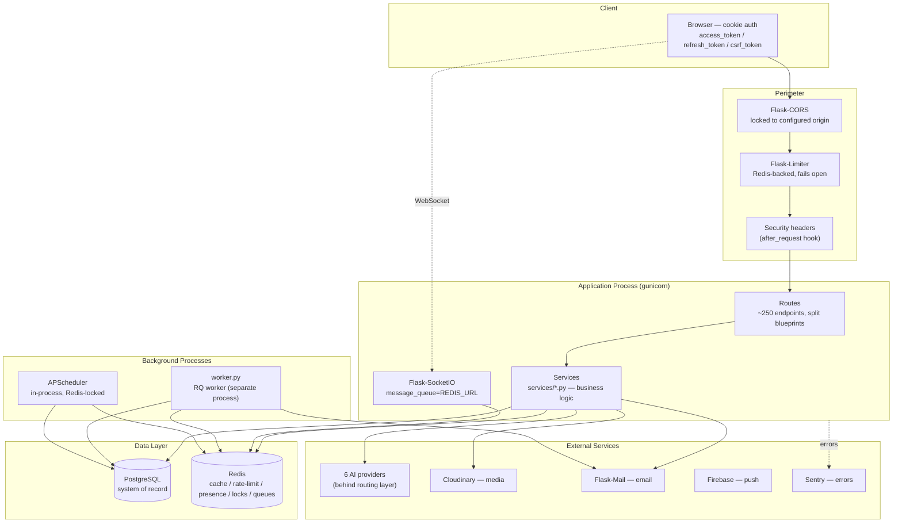
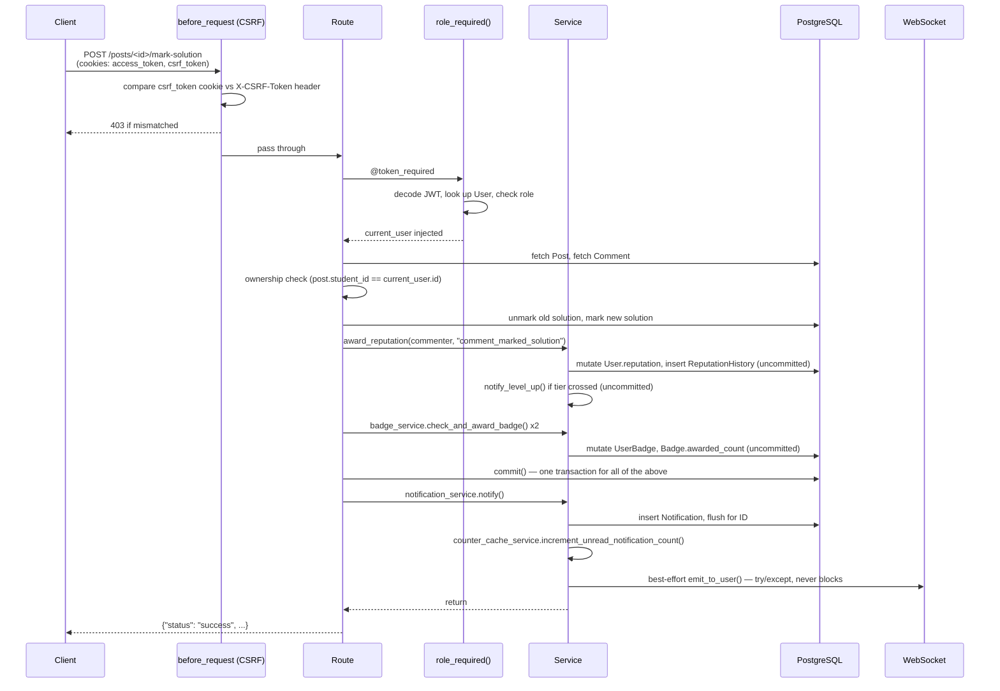
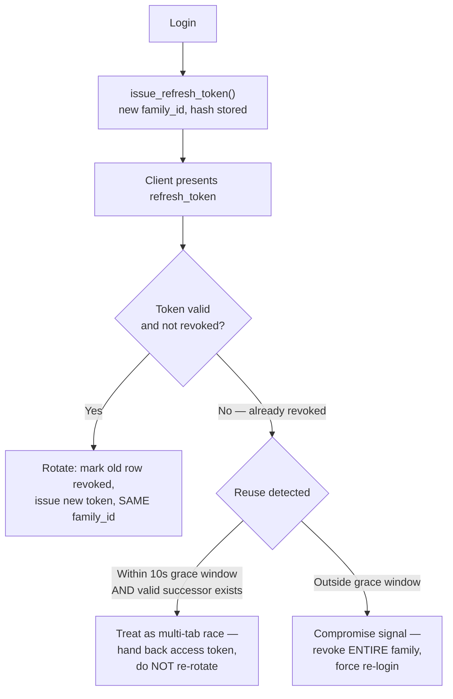
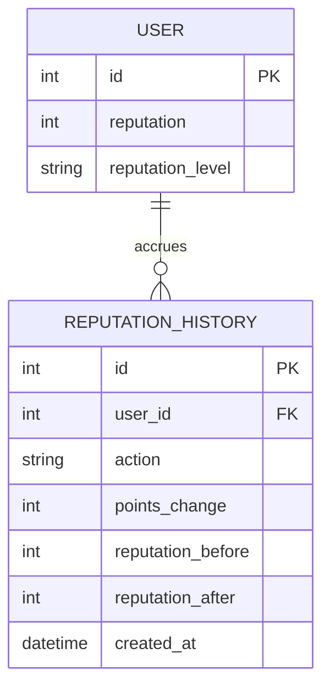
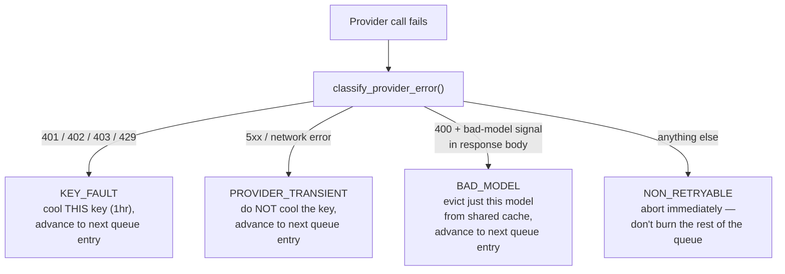
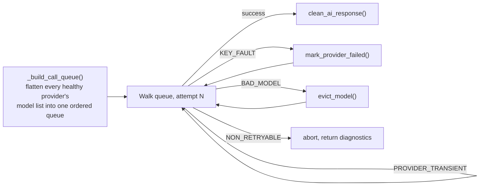
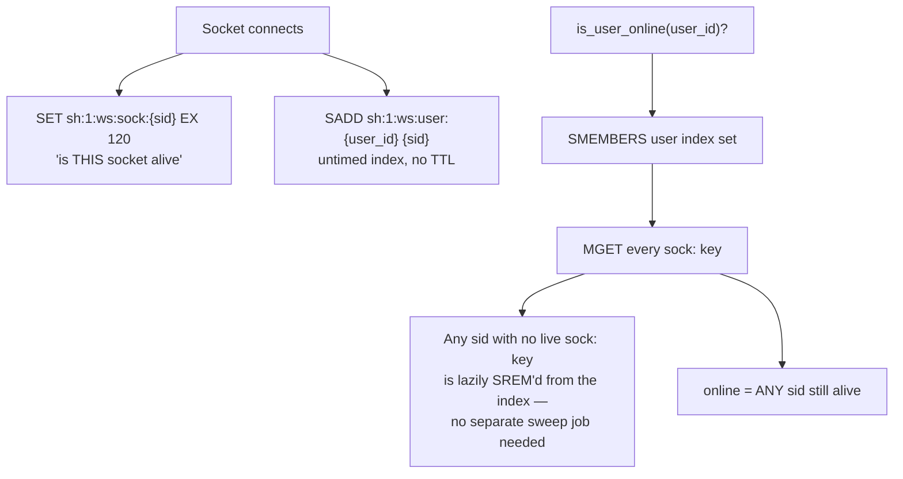
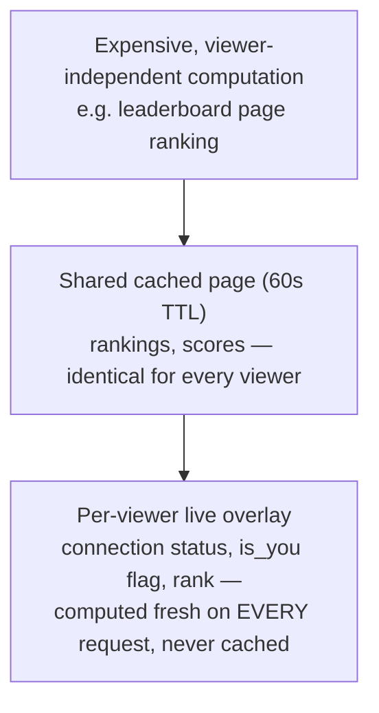

# StudyHub — Architecture

This document describes how StudyHub is actually built: the runtime processes, the request lifecycle, the service/route boundary, the data model, the AI provider layer, and the reliability mechanisms that hold the system together under concurrency and partial failure.

It assumes the reader is an engineer evaluating the codebase, not a general audience. For a product-level explanation, see [PRODUCT_OVERVIEW.md](./PRODUCT_OVERVIEW.md). For the asynchronous/scheduled-job architecture specifically, see [BACKGROUND_JOBS.md](./BACKGROUND_JOBS.md).

---

## 1. System Overview

StudyHub is a Flask monolith — deliberately, not by omission. Every domain (posts, threads, connections, homework, reputation, AI) lives in one codebase and one process family, split internally by a service/route boundary rather than by network boundary. There is no service mesh, no separate microservice per domain, and the documentation below does not pretend otherwise.

What *does* exist is a real multi-process runtime: a WSGI process serving HTTP and WebSocket traffic, a separate RQ worker process for durable background jobs, and an in-process APScheduler for cron-style jobs — all coordinating through PostgreSQL and Redis rather than direct process communication.



*(Reference diagram: `assets/diagrams/system-architecture.png`)*

The three runtime processes are started independently and never assume the others are co-located:

| Process | Entry point | Responsibility |
|---|---|---|
| Web/API | `app.py` (via `gunicorn -w N app:app`) | HTTP routes, WebSocket handlers, in-process scheduler (optional) |
| Worker | `worker.py` | Durable RQ jobs (email sends, maintenance jobs) — see [BACKGROUND_JOBS.md](./BACKGROUND_JOBS.md) |
| Combined | `start-all.py` | All three in one process tree, for single-VM deployments — explicitly documented as *not* the multi-instance production shape |

`start-all.py` is worth calling out because of what it had to get right: RQ's default `Worker` forks the process to run jobs, which is unsafe inside a thread of an already-multithreaded WSGI process. The combined entry point uses RQ's `SimpleWorker` instead — an in-thread, non-forking executor — specifically to avoid corrupting Flask-SocketIO's own background threads. That distinction (`Worker` vs `SimpleWorker`, and *why*) is the kind of detail that's easy to get wrong silently.

---

## 2. Application Layers

```
routes/*.py       → HTTP-only: request parsing, auth decorators, response envelopes
services/*.py     → business logic: no Flask, no request/session/g
models.py         → SQLAlchemy ORM layer
extensions.py     → shared singletons (db, mail, redis_client)
```

This isn't an aspirational diagram — it's enforced. `scripts/check_layering.py` parses the AST of every file under `services/` and fails CI if a service file imports `flask.request`, `flask.session`, `flask.g`, `jsonify`, `abort`, or anything from `routes/`. `current_app` is deliberately exempted (reading config values doesn't require a request context), but the request-scoped objects are hard-blocked.

```python
# scripts/check_layering.py (excerpt)
DISALLOWED_FLASK_IMPORTS = {"request", "session", "g", "jsonify", "abort"}
...
if module.startswith("routes"):
    violations.append(f"... services/ must not import from '{module}' ...")
if module == "flask":
    bad = imported_names & DISALLOWED_FLASK_IMPORTS
    if bad:
        violations.append(f"... must not import request-scoped Flask symbols {sorted(bad)} ...")
```

**Why this matters in practice, not just in theory:** it's what makes `services/ai_provider_service.py`'s `call_ai_response()` callable identically from an HTTP route (`posts/ai.py`), a WebSocket handler (`websocket_threads.py`'s background AI dispatch), and — the actual test — a unit test with no Flask app context at all (`tests/unit/`). A service that secretly reached into `flask.request` would only fail in the third case, which is exactly the case that's easy to skip writing.

The transaction-boundary convention follows the same discipline: services mutate `db.session` (`add`, attribute assignment, `delete`) but do not call `commit()`. The calling route commits once, so a route that does three things — award reputation, check a badge, create a notification — either persists all three or none of them. This is documented as a *convention*, and the codebase is honest about the two places it's deliberately broken:

- `badge_service.check_and_award_badge(commit=True by default)` — evaluating up to 18 badges per action is one atomic unit of work in its own right, not a step in a larger transaction.
- `leaderboard_service.take_snapshot()` — a full-platform ranking snapshot is its own unit of work.

Two more functions commit early for a different reason — atomicity, not batching. `auth_service.consume_password_reset_token()` and `consume_email_verification_token()` commit the moment a token is marked used, independent of whatever the route does with the password afterward. The reasoning is explicit in the code: "mark this token used" must be atomic with the row write, or a crash between marking-used and the route's own commit leaves a reusable token.

---

## 3. Request Lifecycle

A representative mutating request — marking a comment as a solution — touches every layer:



Three things about this flow are worth noting because they're not obvious from reading any single file:

1. **CSRF enforcement is blueprint-wide, not per-route.** `routes/student/__init__.py` registers `enforce_csrf()` as a `before_request` hook on the entire `student_bp` blueprint, with an explicit exemption list (`CSRF_EXEMPT_PATHS`) for pre-auth routes. New routes are protected by default; a route author has to actively remember to *exempt* something, not to *protect* it.
2. **The WebSocket push is structurally incapable of failing the request.** `notification_service._broadcast()` wraps the emit in its own try/except and only logs. The notification row already exists in Postgres by that point — a dead Redis pub/sub channel degrades the feature to "shows up on next poll," never to a 500.
3. **Reputation and badges share one commit with the route's own writes**, not their own. This is why `award_reputation()` had its internal `commit()` removed during the service extraction — two call sites (`mark_comment_helpful`, `award_reputation_endpoint`) were quietly relying on that internal commit and would have silently stopped persisting reputation changes if the removal hadn't been paired with adding an explicit commit at each call site. That's documented in `reputation_service.py`'s own module docstring, not something I'm asserting after the fact.

---

## 4. Authentication & Authorization

### 4.1 Token model

Two JWTs, deliberately asymmetric:

| Token | Lifetime | Storage | Purpose |
|---|---|---|---|
| `access_token` | 30 min | Cookie (httpOnly configurable via `ACCESS_TOKEN_HTTPONLY`) | Bearer credential for API + WebSocket handshake |
| `refresh_token` | 7 days | Cookie, always httpOnly | Mints new access tokens |
| `csrf_token` | Matches access token | Cookie, **not** httpOnly | Double-submit CSRF defense |

`ACCESS_TOKEN_HTTPONLY` is a runtime config flag, not a code branch removed after rollout. While `False`, the app behaves exactly like the pre-hardening version (no CSRF cookie issued at all). While `True`, `set_auth_cookies()` also issues `csrf_token`, and `enforce_csrf()` starts comparing it against the `X-CSRF-Token` header on every mutating request. The flag exists so the security posture can flip without a deploy.

### 4.2 Refresh token rotation and reuse detection

This is the part of the auth system that goes well past "issue a JWT and check it later." Refresh tokens are **not** stateless JWTs — they're opaque random values, stored as a SHA-256 hash (never the raw value) in a `RefreshToken` table, grouped by `family_id`.



*(Reference diagram: `assets/diagrams/refresh-token-rotation.png`)*

The grace window exists to fix a real false positive, not a hypothetical one: two browser tabs holding the same refresh cookie, both refreshing around the same access-token expiry, will race. Without the grace window, the second tab's refresh looks identical to a stolen-token replay and both tabs get logged out. The fix distinguishes the two by asking: is this reuse of the token *immediately* prior in the chain, and did it happen within 10 seconds of the legitimate rotation? If yes, it's almost certainly the same user's other tab; if no, it's treated as theft and the whole family — every session descended from that login — is revoked.

### 4.3 Role gating

`role_required(*roles)` is a decorator factory, not a single hardcoded check. `token_required = role_required("student")` is kept as a plain alias specifically so ~250 existing `@token_required` call sites needed zero changes when the admin-role system was introduced. `admin_required = role_required("admin", "system")` is the same mechanism applied to a different role set.

This factory approach fixed a real bug, not a hypothetical one: `badges.py`'s and `reputation.py`'s admin-award endpoints had an inline `if current_user.role not in ("admin", "system")` check — but `token_required` (before the factory existed) *hardcoded* a student-only role gate ahead of it. No account could ever pass both checks, meaning the endpoints were unreachable dead code protecting nothing, silently, until someone read both checks side by side.

### 4.4 Resource ownership

There's no generic ACL system. Ownership is checked inline, consistently, per resource: `post.student_id != current_user.id`, `thread.creator_id != current_user.id`, `assignment.user_id != current_user.id`. For threads specifically, this was extracted into one shared function (`services/thread_authorization.py::require_moderator_or_creator`) used identically by the REST layer and the WebSocket layer — closing a real divergence where the two had implemented "is this a moderator" as two separate, and subtly different, checks.

---

## 5. Data Architecture

### 5.1 Reputation — an append-only ledger, not a mutable counter

`User.reputation` is a plain integer column, but it is never written directly anywhere in the codebase except inside `award_reputation()`. Every change also writes an immutable `ReputationHistory` row carrying `points_change`, `reputation_before`, and `reputation_after`.



The point of this isn't audit theater — it's that `User.reputation` is reconstructible from `SUM(ReputationHistory.points_change)` at any time. A profile's "+189 gained / -0 lost / 189 net" tiles (see screenshot below) are computed by summing history rows, not read from a cached total, so a bug in the running total can never silently diverge from the ledger without also being visible in the ledger itself.


Reputation tiers went through a real consolidation worth naming: the same five-tier table (`Newbie → Learner → Contributor → Expert → Master`) previously existed **four times** — three copies in different route files plus a fourth, subtly different implementation baked into `User.update_reputation_level()` that used strict `<` comparisons instead of the inclusive `min <= x <= max` ranges the other three used. At exactly 1000 points, one code path said "Expert" and another said "Master" for the same user. `services/reputation_levels.py` is now the single source; everything else imports from it.

### 5.2 Connections — one table, one column closing a real ambiguity bug

Blocking used to be encoded by *swapping* `requester_id`/`receiver_id` on the connection row so `receiver_id` always meant "the blocker." This corrupted the original request history and disagreed with other, independently-written "is this pair blocked" checks elsewhere in the codebase that didn't know about the swap convention. The fix is an explicit `blocked_by_id` column — `requester_id`/`receiver_id` are never mutated to express blocking again, and `services/connection_service.py::is_user_blocked()` is now the single implementation every call site uses.

A second, more subtle fix lives at the database level: a `Connection` row is unique per (`requester_id`, `receiver_id`), but nothing prevented a *reverse-direction* duplicate — user A requesting B, and B requesting A, racing at the same instant, both passing the same-direction uniqueness check and both inserting. The fix is a Postgres-only functional unique index on the **normalized, unordered pair**:

```sql
CREATE UNIQUE INDEX IF NOT EXISTS uq_connections_pair
ON connections (LEAST(requester_id, receiver_id), GREATEST(requester_id, receiver_id));
```

Registered via SQLAlchemy's `event.listen(..., "after_create", ddl.execute_if(dialect="postgresql"))` — not a plain `db.Index()`, because `LEAST`/`GREATEST` have no SQLite equivalent and a naive index definition would break local development on SQLite. Every route that creates a connection catches the resulting `IntegrityError` and folds the race into the same "already connected" response the normal existing-row check produces, so a losing request looks identical to a request that simply arrived a moment later.

### 5.3 Indexing matched to query shape, not just foreign keys

A sample of the more deliberate indexes:

| Index | Table | Why |
|---|---|---|
| `idx_tm_status` (partial) | `thread_messages` | Indexes only rows where `status != 'read'` — most messages settle into the terminal "read" state, so indexing them is pure bloat |
| `idx_tm_thread_unread` (partial) | `thread_messages` | `(thread_id, sender_id, is_deleted, sent_at) WHERE is_deleted = FALSE` — matches the exact shape of the per-thread unread-count query |
| `idx_rep_history_date_user` **and** `idx_rep_history_user_date` | `reputation_history` | Both orderings kept as separate indexes on purpose — "platform-wide recent activity" and "one user's full history" are genuinely different access patterns |
| `idx_posts_tags_gin` / `idx_users_skills_gin` | `posts`, `users` | GIN indexes on JSONB columns, Postgres-only (`postgresql_using="gin"`), for tag/skill containment queries |

### 5.4 Cleanup that ORM cascades don't cover

`Post` declares ORM cascades for comments, reactions, bookmarks, and threads — but `PostView`, `PostFollow`, and `Mention` are cleaned up **manually** inside `delete_post()`. `Mention.mentioned_in_id` is a plain integer, not a real foreign key, because a mention can point at a post, a comment, or a thread message — a genuinely polymorphic reference that can never be a `ForeignKey` and can never be cleaned up by the database automatically. Deleting a post without this manual step leaves orphaned rows referencing a `post_id` that no longer exists.

---

## 6. AI Architecture

This is the most engineered subsystem in the codebase, and it deserves tracing end to end rather than summarizing as "calls an LLM."

### 6.1 The core problem: six providers, ten keys each, and failures that mean different things

`services/ai_provider_service.py` owns a `MultiProviderManager` that loads up to six providers (Gemini, Groq, Cohere, Cloudflare Workers AI, Mistral, OpenRouter), each with up to 10 rotating API keys read from suffixed environment variables (`GEMINI_API_KEY_1` … `_10`, falling back to the unsuffixed var for a single key). This alone isn't unusual. What's unusual is that failures are **classified before the system decides what to do about them**, ported directly from a taxonomy used in a reference Node.js project and re-implemented against real `requests` exception types rather than approximated:



*(Reference diagram: `assets/diagrams/ai-provider-routing.png`)*

The distinction that matters: a provider-wide 503 outage used to cool the specific API key exactly like a genuinely invalid credential would — wasting that key's full hour-long cooldown on a failure that had nothing to do with the key. `classify_provider_error()` is a direct, tested port of the reference taxonomy's four categories, checked against real `status`/`network_error_code`/`parsed_body` fields on a `ProviderCallError` object — never a re-parsed message string.

### 6.2 Cross-instance failure state (this is the part that's easy to skip)

Cooldown state, provider-type blacklist flags, the round-robin rotation index, and the discovered-model cache all live in Redis, not in the `MultiProviderManager` instance's own memory — behind a fail-open kill switch (`AI_PROVIDER_REDIS_STATE_ENABLED`). Before this, each running instance had its own private view of "which keys are currently bad." An instance that saw a key fail had no way to tell any other instance, so under more than one worker process, other instances kept sending live traffic to a key already known to be dead.

Every Redis read/write in this path is wrapped to fail open: a Redis hiccup degrades to "an instance occasionally retries a key another instance already knows is bad" — never to a raised exception that breaks an AI call. The kill switch is the explicit rollback lever: flipping it off reverts every one of these to the original in-memory, single-process behavior with no deploy, because this manager sits behind every AI feature on the platform and a rollback path for the single riskiest change deserves to be that cheap.

### 6.3 The consolidated call path

Four call sites — post Q&A, connection overviews, live-session tutoring, thread meeting notes — each used to hand-roll their own "call provider, on failure rotate, retry N times" loop, with subtly different retry counts and timeouts that had quietly drifted apart. `call_ai_response()` is now the one implementation, built around a flattened provider×model queue:



`_build_call_queue()` reuses the same Redis-backed health checks (`_is_key_cooling`, `_is_provider_type_blacklisted`) that the streaming path uses — a key or provider type that's cooling on *any* instance is correctly excluded here too, with no second implementation of that health check to keep in sync.

### 6.4 Streaming with mid-stream provider recovery

The chat-facing endpoints (`learnora/api/chat`, connection overviews, live-session tutoring) stream via Server-Sent Events rather than blocking JSON. `StudyAssistant.stream_response()` retries across models *within* one provider automatically, and sets `self._provider_exhausted = True` when that provider's entire model fallback chain is spent — the signal the caller uses to rotate providers rather than parsing SSE chunk bodies to guess at failure. A `provider_switch` event is emitted to the client mid-stream, so a failure partway through a response never surfaces as an error to the user; it surfaces as a brief pause and a provider swap.

### 6.5 Response sanitization is a real pipeline, not a `.strip()`

`clean_ai_response()` runs six steps in order: strip whitespace, remove leading `<think>`/`<reasoning>`/`<scratchpad>` blocks some reasoning models emit unprompted, strip stray SSE protocol artifacts that can leak into captured content, unwrap a response a model mistakenly wrapped entirely in a bare code fence (guarded by a heuristic that checks the first line for code-like syntax before unwrapping, so genuine code isn't stripped of its fences), collapse three-or-more blank lines to two, and a final strip. It deliberately does **not** touch real markdown — headers, bold, tagged code blocks — because the frontend renderer depends on that formatting surviving.

### 6.6 Vision handling is provider-aware, not best-effort

Several providers (Mistral in particular) reject the OpenAI-style multimodal content-array format outright unless a real image is present — "Extra inputs are not permitted" is a known Mistral validation error. `StudyAssistant.build_messages()` only constructs the array format when `vision_active` is true; otherwise every content part collapses into a single string, even when a file attachment or referenced-post context is present (which used to trigger the array format under an earlier "array only if more than one part" rule that broke the moment any attachment existed).

### 6.7 Graceful degradation as a designed fallback, not a missing feature

`connections/compatibility.py`'s AI-generated connection overview has a fully-functional, template-based fallback (`generate_fallback_overview()`) built from the *exact same* compatibility-scoring data the AI prompt would have used. If every provider is simultaneously unavailable, the feature still returns a coherent, personalized-feeling answer — not an error state. This is applied as a pattern, not a one-off: build the deterministic version first, let AI enhance it, never let the enhancement become a single point of failure for the feature existing at all.


---

## 7. WebSocket & Real-Time Architecture

Two managers exist side by side, on purpose, mid-migration: `services/websocket_events.py` (legacy, general-purpose) still owns non-messaging broadcasts like homework activity-feed pushes; `services/websocket_messages.py` and `services/websocket_threads.py` own all DM and thread real-time delivery, sharing one `SocketIO` instance via `init_socketio()`.

### 7.1 Cross-instance delivery

`SocketIO(app, message_queue=REDIS_URL, ...)` is what makes `socketio.emit(..., room=X)` reach a socket connected to a *different* application instance. This is Flask-SocketIO's own built-in Redis pub/sub mechanism — not a hand-rolled fan-out — deliberately chosen over building custom pub/sub, since the library already solves the exact problem.

### 7.2 Presence that survives multiple tabs and multiple instances



*(Reference diagram: `assets/diagrams/websocket-presence.png`)*

The split into two Redis structures — a TTL'd per-socket key plus an untimed index set — exists because Redis has no per-member TTL within a Set. A user with two open tabs shouldn't flip to "offline" because one tab closed; presence is computed from the *full* sid set, and closing one socket only removes one entry from it. The self-healing prune (removing a dead sid from the index the moment a read notices it's gone) means no separate cleanup job is needed to keep the index from growing stale forever.

`services/websocket_rate_limiter.py::RedisFixedWindowLimiter` applies the identical reasoning to per-user thread-message rate limiting: an in-memory sliding-window counter meant a user who reconnected to a different instance got a fresh, unlinked limit every time, defeating the point of the limit at more than one instance.

### 7.3 Delivery status that only ever upgrades

A thread message's status (`sent → delivered → read`) is computed at send-time from live presence — is the recipient actively viewing this thread, merely online, or offline — and the WebSocket handlers enforce that status can only move forward. Under a genuine race (a `mark_thread_read` event and a `message_delivered` event arriving out of order for the same message), `read` always wins and is treated as terminal, because `read` implies `delivered` — the only ordering that can never produce a status that visibly regresses in the UI.

---

## 8. Caching Architecture

Redis serves four genuinely distinct roles in this codebase, and the documentation is careful not to call all of them "caching":

| Role | Module | Example |
|---|---|---|
| Response/query cache | `services/cache_service.py` | Leaderboard pages, badge progress, popular tags |
| Atomic counters | `services/counter_cache_service.py` | Unread notification/message counts |
| Distributed locks | `services/distributed_lock.py` | Scheduler job execution (fails **closed**, the one deliberate exception) |
| Rate limiting | `services/rate_limit_service.py`, `websocket_rate_limiter.py` | HTTP endpoint limits, WebSocket message limits |

### 8.1 The shared-page + per-viewer-overlay split

The leaderboard is the clearest example of a pattern applied consistently across every ranked/aggregate view (badges, top-earners, rising stars):



*(Reference diagram: `assets/diagrams/cache-split-pattern.png`)*


The discipline here is what makes it correct: a naive per-viewer cache key (`f"leaderboard:{user_id}"`) would mean thousands of near-identical cache entries for a page whose content genuinely doesn't vary by viewer — and caching the *whole* response including `is_you: True` would leak one viewer's identity into every other viewer's response if a cache key ever collided or was misconfigured. The split guarantees that can't happen structurally: the cached blob never contains per-viewer fields at all.

### 8.2 Self-healing counters

Unread notification/message counts are maintained by atomic `INCR`/`DECRBY` at named funnel points (`notify()`, mark-read routes), never by "read the cached count, add one, write it back" — the latter loses increments under concurrent requests. Every counter carries a TTL specifically so a missed decrement anywhere in the codebase (a bug, or a code path not yet migrated to the funnel point) can't silently corrupt the count forever: a cache miss recomputes from a real `COUNT(*)` query and reseeds, bounding the lifetime of any bug to one TTL window regardless of cause.

### 8.3 The one deliberate fail-closed exception

`services/distributed_lock.py` is documented as inverting the fail-open policy everywhere else in the app on purpose. Every other Redis consumer degrades a feature on Redis failure; this one refuses to run the protected operation at all. The reasoning is explicit: this lock exists specifically to prevent duplicate execution where duplicate execution is the actual danger (a leaderboard snapshot job racing itself across instances with no unique constraint backing it up) — failing open here would silently defeat the reason the lock exists.

---

## 9. Reliability Mechanisms

A consolidated list of the mechanisms actually present, since they're scattered across many files individually:

- **Atomic SQL-level counters** — thread member counts use a `CASE`-guarded floor (`CASE WHEN member_count > 1 THEN member_count - 1 ELSE 1 END`) inside a bulk `.update()`, never a Python read-modify-write.
- **Row locking under real contention** — `approve_join_request` and `add_members_to_thread` both use `Thread.query.with_for_update().get(thread_id)` immediately before the capacity check, closing a TOCTOU race where two concurrent joins could both read "not full yet" and together exceed `max_members`.
- **Retry-on-IntegrityError for login streaks** — `record_login_and_commit()` catches the `IntegrityError` from a double-clicked login racing itself on `UserActivity`'s `(user_id, activity_date)` unique constraint, rolls back, and retries once rather than surfacing an error.
- **Reconciliation as a safety net, not a primary mechanism** — `services/reconciliation_service.py` runs weekly, comparing denormalized counters (`comments_count`, `bookmark_count`, `positive_reactions_count`) against a fresh `COUNT(*)`. Display-only counters are silently corrected; **capacity-gating** counters (`Thread.member_count`) are alert-only and never auto-corrected, because auto-correcting a counter that gates admission risks masking a real bug that's actively over-admitting members.
- **Idempotency keys on real-time actions** — thread and DM sends accept an optional `client_temp_id`; a duplicate send (network retry, double-tap) returns the existing message instead of creating a second one.
- **Copyright-safe AI cost bounds** — daily per-user AI message quotas (`AIUsageQuota`), a hard 500-message-per-conversation cap, and a 5-file attachment cap, all enforced server-side regardless of what the frontend already restricts client-side.

*(Reference diagram: `assets/diagrams/reliability-locking-reconciliation.png`)*

---

## 10. Security Mechanisms

- **HTML is stripped, never allow-listed.** Both DM and thread message content go through `bleach.clean(text, tags=[], strip=True)` — every tag removed, not a "safe subset" kept, closing off stored XSS via chat content entirely.
- **File uploads are validated by content, not extension.** `services/upload_validation_service.py` re-encodes images through Pillow (decode → verify → re-encode into a fresh buffer), which structurally rules out an SVG or polyglot payload wearing a `.jpg` extension — the output bytes are freshly generated from decoded pixel data, not a copy of the original file. Non-image documents are checked against a hand-rolled magic-number table rather than trusted by MIME header.
- **Generic failure messages for credential-adjacent state.** A wrong username/password returns the same "Invalid credentials" regardless of which part was wrong, deliberately avoiding user enumeration — while *other* failure states (unverified email, pending approval) get specific messages, since those aren't secrecy-sensitive.
- **OAuth account takeover was a real, fixed vulnerability.** Google login previously logged in any `User` row matching the returned email — including accounts originally created via password registration, which have no relationship to that Google account. The fix requires `google_id` to match (or a legacy row with no real password ever set) before Google auth is allowed to authenticate an existing email.
- **Onboarding write-authorization was a real, fixed vulnerability.** `complete_registration()` used to trust a bare `email` field from the request body with no proof of ownership — anyone who knew a pending account's email could set its username and password. `_is_request_authorized_for_email()` now requires either a matching Google-OAuth session claim or a valid JWT for that exact email.
- **Copyright/child-safety adjacent**: none applicable to this codebase's domain — flagged here only to note the audit considered it and found no relevant surface.

---

## 11. Error Handling

One centralized handler (`app.py::handle_app_error`) catches every subclass of `errors.AppError` (`ValidationError`, `NotFoundError`, `AuthorizationError`, `ConflictError`, `RateLimitedError`, `ExternalServiceError`) and produces the identical `{"status": "error", "message": ...}` envelope a hand-built `error_response()` call would — meaning a route can `raise ValidationError(...)` instead of manually constructing that dict, with zero change to what the frontend receives. 5xx-class errors additionally forward to Sentry from inside the handler.

`errors.py` itself is deliberately dependency-free (no Flask imports) — it's what lets `services/*.py` raise typed exceptions without violating the layering rule described in §2.

---

## 12. Testing

A real `pytest` suite exists under `tests/unit/`, built against a genuinely isolated SQLite-in-memory database (not a shared fixture DB) with `fakeredis` standing in for Redis. Two things in the test infrastructure are worth noting because they document real friction the author hit and solved rather than routed around:

- **The plan's originally-specified SAVEPOINT-splicing transaction-isolation pattern was tried and empirically failed** against the installed SQLAlchemy 2.0.35 / Flask-SQLAlchemy 3.1.1 versions (`AttributeError` on a nonexistent `.nested` attribute, then a `ResourceClosedError` after correcting that). The conftest docstring documents the failure and the simpler replacement (delete all rows at teardown, in FK-safe reverse-declaration order) rather than silently swapping approaches with no record of why.
- **A discovered, unfixed bug in `config.py`**: `TestingConfig` inherits `Config.SQLALCHEMY_ENGINE_OPTIONS` verbatim, which hardcodes Postgres-only `connect_args` (`sslmode=require`, a PgBouncer `statement_timeout` option). Pointed at SQLite, this raises `TypeError: 'sslmode' is an invalid keyword argument` — the test fixture works around it by overriding `SQLALCHEMY_ENGINE_OPTIONS` directly rather than patching `config.py`, and documents the discrepancy rather than silently fixing production config as a side effect of writing tests.

---

## 13. Deployment

Production is a `gunicorn -w N app:app` process plus an independently-scaled `worker.py` process, with `SCHEDULER_ENABLED` togglable per-instance. The scheduler's Redis-backed distributed lock (§9, and see [BACKGROUND_JOBS.md](./BACKGROUND_JOBS.md)) is specifically what makes `N > 1` safe — before that lock existed, the deployment constraint was `-w 1`, because every worker independently running APScheduler would fire the same cron job on the same tick.

WebSocket cross-instance delivery additionally requires `REDIS_URL` to be set; its absence is not a silent degradation — `websocket_messages.py::init_app` logs an explicit `[WS_MESSAGE_QUEUE_DISABLED]` warning at startup so a missed environment variable has a loud, greppable symptom instead of a mystery bug report.

---

## 14. Notable Engineering Decisions

| Decision | Problem | Trade-off accepted |
|---|---|---|
| Services layer has zero Flask dependency, CI-enforced | Business logic embedded in routes couldn't be unit-tested or reused across HTTP/WebSocket/background-job call sites | Some ceremony threading `viewer_id` through functions explicitly instead of reading `current_user` from context |
| Refresh tokens are opaque + hashed, not JWTs | Stateless refresh JWTs can't be revoked or rotated | A DB round-trip on every refresh, versus none for a stateless JWT |
| AI provider failure state moved to Redis, fail-open | Cross-instance AI routing consistency | An in-memory rollback kill switch was kept specifically because this is the highest-blast-radius change in the codebase |
| Reconciliation is alert-only for capacity-gating counters | Auto-correction risks masking a real over-admission bug | Drift in `Thread.member_count` requires manual review instead of self-healing |
| Distributed scheduler lock fails **closed** (the one exception to fail-open) | Duplicate leaderboard snapshot execution is worse than a skipped tick | A Redis outage during a scheduled tick means the job simply doesn't run that cycle |
| Search has one implementation per entity type, not "dedicated" + "unified" duplicates | Two independently-maintained search code paths had already drifted apart | The unified multi-type search endpoint has slightly less bespoke tuning per type than a from-scratch implementation could have |

---

**See also:** [PRODUCT_OVERVIEW.md](./PRODUCT_OVERVIEW.md) for the feature-level walkthrough · [BACKGROUND_JOBS.md](./BACKGROUND_JOBS.md) for the async/scheduled-job architecture · [README.md](./README.md) for setup and quick orientation.
