# StudyHub — System Architecture

**Scope:** Backend architecture reference. Covers runtime topology, request lifecycle, data model, AI infrastructure, background processing, caching, and the horizontal-scaling work that took the app from a single-process assumption to a Redis-coordinated multi-instance one.

**A note on currency:** parts of this document describe subsystems (WebSocket presence, distributed scheduler locking, HTTP rate limiting) that a previous version of this project's own README described as future work or single-process-only. That refactor has since shipped in the code. Where it's relevant, this document says so explicitly rather than silently presenting the new state as if it had always been there — see §20 for the specific before/after.

---

## 1. What StudyHub actually is, architecturally

StudyHub is a Flask monolith — one Python codebase, one PostgreSQL database — that runs as up to three kinds of process:

- An **API process** (Flask + Flask-SocketIO), serving REST endpoints and WebSocket connections.
- **RQ worker processes**, consuming two Redis-backed job queues (email, maintenance) independently of API instance count.
- An **APScheduler instance**, embedded inside the API process, firing five cron-scheduled jobs.

All three can run as one combined process (`start-all.py`, for a single small deployment) or as genuinely separate deployables (`app.py` under Gunicorn + one or more standalone `worker.py` processes) — see §3 for how the code enforces that these two modes don't collide with each other.

It is not a distributed system in the sense of independently-deployable services with their own datastores — there's one Postgres database and one Flask codebase. What makes it more than a typical CRUD monolith is what's layered on top: a self-built multi-provider LLM abstraction with real failover, Redis used for four structurally different purposes (cache, distributed lock, presence tracking, job queue) rather than one, and a horizontal-scaling pass that moved every piece of in-process state that needed to survive multiple instances into Redis, while leaving the state that's safe to keep local exactly where it was.

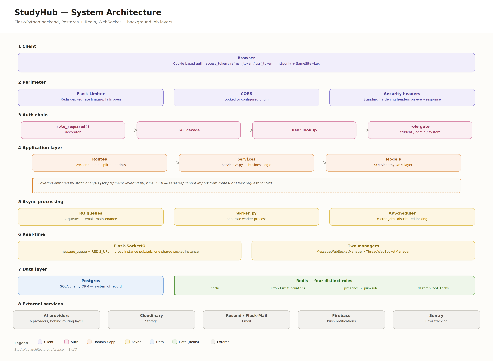

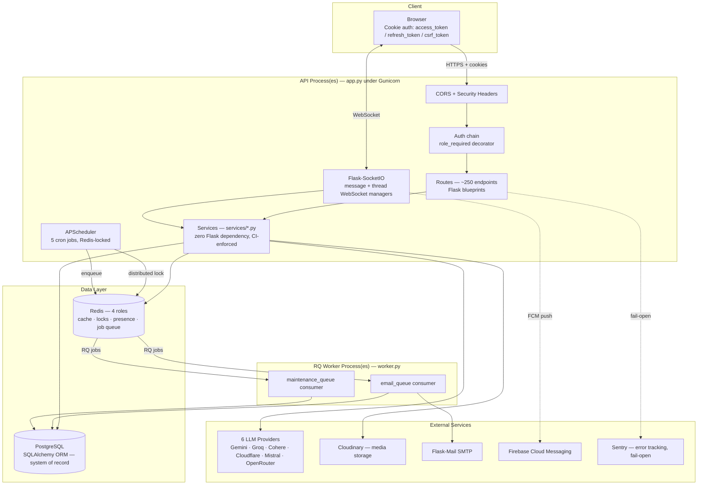
```mermaid
flowchart TB
    subgraph Client["Client"]
        BROWSER[Browser<br/>Cookie auth: access_token / refresh_token / csrf_token]
    end

    subgraph API["API Process(es) — app.py under Gunicorn"]
        CORS[CORS + Security Headers]
        AUTH[Auth chain<br/>role_required decorator]
        ROUTES[Routes — ~250 endpoints<br/>Flask blueprints]
        SERVICES[Services — services/*.py<br/>zero Flask dependency, CI-enforced]
        WS[Flask-SocketIO<br/>message + thread WebSocket managers]
        SCHED[APScheduler<br/>5 cron jobs, Redis-locked]
    end

    subgraph Workers["RQ Worker Process(es) — worker.py"]
        W1[email_queue consumer]
        W2[maintenance_queue consumer]
    end

    subgraph Data["Data Layer"]
        PG[(PostgreSQL<br/>SQLAlchemy ORM — system of record)]
        REDIS[(Redis — 4 roles<br/>cache · locks · presence · job queue)]
    end

    subgraph External["External Services"]
        AI[6 LLM Providers<br/>Gemini · Groq · Cohere · Cloudflare · Mistral · OpenRouter]
        CLOUDINARY[Cloudinary — media storage]
        MAIL[Flask-Mail SMTP]
        FCM[Firebase Cloud Messaging]
        SENTRY[Sentry — error tracking, fail-open]
    end

    BROWSER -->|HTTPS + cookies| CORS --> AUTH --> ROUTES
    BROWSER <-->|WebSocket| WS
    ROUTES --> SERVICES
    SERVICES --> PG
    SERVICES --> REDIS
    SERVICES --> AI
    SERVICES --> CLOUDINARY
    WS --> SERVICES
    SCHED -->|distributed lock| REDIS
    SCHED -->|enqueue| REDIS
    REDIS -->|RQ jobs| W1
    REDIS -->|RQ jobs| W2
    W1 --> MAIL
    W1 --> PG
    W2 --> PG
    ROUTES -.->|fail-open| SENTRY
    WS -.->|FCM push| FCM
```

---

## 2. Runtime architecture — three deployables, one enforced boundary

The production topology is `app.py` (Gunicorn, N workers) plus one or more standalone `worker.py` processes. `start-all.py` exists for the case where running three separate deployables isn't practical (a single small VM, local dev) and combines all three roles into one process tree — but it doesn't replace the separated-process mode; both entry points share the exact same `create_app()` factory and neither modifies the other's behavior.

The interesting engineering here is not that a combined-process mode exists — it's how `start-all.py` avoids two specific footguns that a naive "just run everything in threads" implementation would hit:

**The worker inside `start-all.py` uses RQ's `SimpleWorker`, not the default `Worker`.** RQ's default `Worker` calls `os.fork()` to isolate each job. Forking a multi-threaded process (which this already is, once Flask-SocketIO's own background tasks are running) is a well-documented hazard — only the forking thread survives in the child process, silently corrupting anything else that was running. `SimpleWorker` processes jobs in-thread with no fork, which is correct specifically because this is a combined process; the dedicated `worker.py` entry point still uses the real forking `Worker`, because a dedicated worker process has no conflicting threads to protect.

**`worker.py` refuses to start if the scheduler is enabled in its own environment.** If a worker process also ran APScheduler, it would silently become an additional participant in the scheduler's lock race (§9) for zero benefit — every additional scheduler-enabled process is one more instance losing the lock on every tick. Rather than letting that happen quietly, `worker.py`'s `main()` checks `SCHEDULER_ENABLED` at startup and exits with a nonzero code and a loud log line if it's not explicitly `false`. This is caught at process boot, not discovered later from scheduler logs.

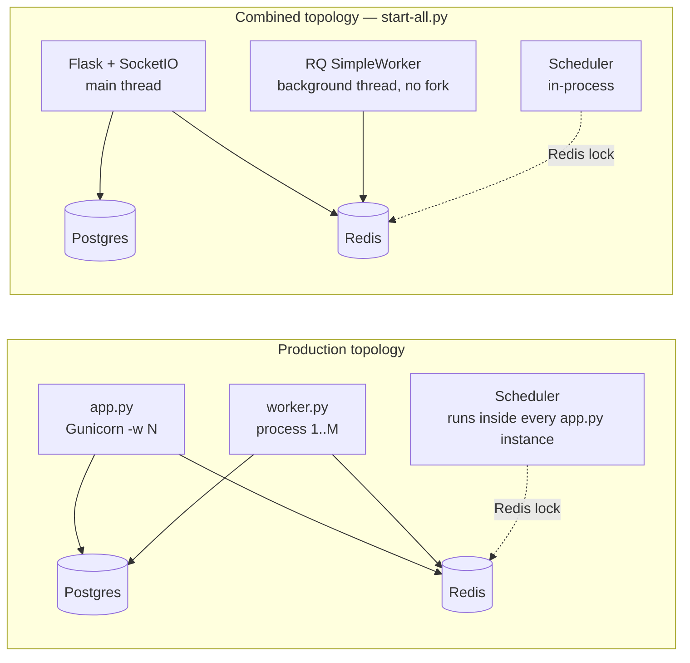
```mermaid
flowchart LR
    subgraph Prod["Production topology"]
        direction TB
        A1[app.py<br/>Gunicorn -w N] --> PG1[(Postgres)]
        A1 --> R1[(Redis)]
        WK1[worker.py<br/>process 1..M] --> R1
        WK1 --> PG1
        SCHED1[Scheduler<br/>runs inside every app.py instance] -.->|Redis lock| R1
    end
    subgraph Combined["Combined topology — start-all.py"]
        direction TB
        A2[Flask + SocketIO<br/>main thread] --> PG2[(Postgres)]
        A2 --> R2[(Redis)]
        WKT[RQ SimpleWorker<br/>background thread, no fork] --> R2
        SCHED2[Scheduler<br/>in-process] -.->|Redis lock| R2
    end
```

---

## 3. Request lifecycle

A representative authenticated write request — say, sending a thread message over REST rather than WebSocket, or creating a post — moves through the layers below. HTTP-layer concerns (auth, rate limiting, request parsing) live in the routes; everything past that is delegated to a service function with zero Flask dependency.

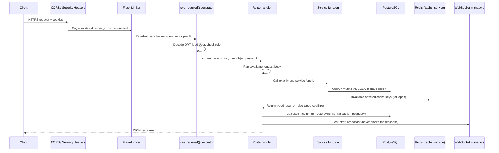
```mermaid
sequenceDiagram
    participant C as Client
    participant CORS as CORS / Security Headers
    participant RL as Flask-Limiter
    participant Auth as role_required() decorator
    participant Route as Route handler
    participant Svc as Service function
    participant DB as PostgreSQL
    participant Cache as Redis (cache_service)
    participant WS as WebSocket managers

    C->>CORS: HTTPS request + cookies
    CORS->>RL: Origin validated, security headers queued
    RL->>Auth: Rate-limit tier checked (per-user or per-IP)
    Auth->>Auth: Decode JWT, load User, check role
    Auth->>Route: g.current_user_id set, user object passed in
    Route->>Route: Parse/validate request body
    Route->>Svc: Call exactly one service function
    Svc->>DB: Query / mutate via SQLAlchemy session
    Svc->>Cache: Invalidate affected cache keys (fail-open)
    Svc-->>Route: Return typed result or raise typed AppError
    Route->>DB: db.session.commit() (route owns the transaction boundary)
    Route->>WS: Best-effort broadcast (never blocks the response)
    Route-->>C: JSON response
```

Three details matter more than the diagram alone shows:

**Services never commit.** By convention (and consistently followed — see the deliberate exceptions noted below), a service function mutates `db.session` but does not call `.commit()`. The calling route owns the transaction boundary, so several service calls inside one route can succeed or fail together as a single atomic unit. The two documented exceptions are `award_reputation()`'s dependents needing the commit split correctly across two known call sites when the commit was removed from the service (see §7), and `auth_service.record_login_and_commit()`, which commits internally because its own IntegrityError-retry logic needs to observe a real commit failure to detect the race it's guarding against.

**Authorization happens once, in one decorator, reused everywhere.** `role_required(*allowed_roles)` decodes the JWT, loads the user, and checks role membership. `token_required` (used by roughly 250 routes) is a plain alias for `role_required("student")`, defined this way specifically so every existing call site kept working unchanged when the role check was generalized — the fix went into how the decorator is *defined*, not into rewriting every route. `admin_required = role_required("admin", "system")` is the parameterized form used by the handful of admin-only routes. The same call also sets `g.current_user_id`, which the rate limiter's `user_or_ip_key()` reads without decoding the token a second time.

**Errors are typed, and there is exactly one place that turns them into HTTP responses.** Services raise `ValidationError`, `NotFoundError`, `AuthorizationError`, `ConflictError`, `RateLimitedError`, or `ExternalServiceError` (all subclasses of `AppError`, `errors.py`) instead of hand-building an error response dict inline. One `@app.errorhandler(AppError)` in `app.py` converts any of them into the same `{"status": "error", "message": ...}` shape the rest of the API already returns, and routes errors ≥500 to Sentry along the way. This means no API consumer can distinguish "a route hand-built this JSON" from "a service raised a typed exception" — the wire contract is identical either way.

---

## 4. Application layers

```
routes/         HTTP concerns only: parse request, call one service, shape response
  student/
    auth.py, posts/, connections/, threads/, homework_system.py, ...
services/       Business logic, zero Flask dependency
  *_service.py — one file per domain concern
models.py       SQLAlchemy ORM layer — the schema
extensions.py   Shared singletons: db, mail, redis_client
config.py       Environment-tiered configuration (Development/Testing/Production)
errors.py       Typed exception hierarchy
scheduler.py    APScheduler cron jobs
worker.py       RQ worker entry point
services/jobs/  RQ job bodies + retry policies
```

**The services → routes boundary is enforced by CI, not by convention.** A static-analysis script (`check_layering.py`, referenced throughout the service-layer docstrings and run in CI) parses every file under `services/` at the AST level and fails the build if a service module imports Flask's `request`/`session`/`g`, or reaches into `routes/`. Every service-layer docstring in this codebase repeats the same line — "no Flask imports, no request/session/g" — because it's a checked invariant, not a style guideline someone might forget. This is what makes it safe for background workers (which have no HTTP request in flight at all) to call the exact same service functions the HTTP routes call: `homework_service.calculate_priority_score()`, `reputation_service.award_reputation()`, `badge_service.check_and_award_badge()` and dozens of others are equally valid to call from a route, a WebSocket handler, or an RQ job body, because none of them assume a Flask request context exists.

Dependency direction is one-way: `routes → services → models`. Services never import from `routes/`. Models never import from `services/` at module scope (one place needs a local, function-scoped import specifically to avoid a circular dependency — see `User.update_reputation_level()`, §7).

---

## 5. Data architecture

The schema has 55 SQLAlchemy models across identity, social graph, content, real-time chat, homework, gamification, AI, and moderation. Rather than one unreadable ER diagram, the domains that matter architecturally are broken out individually below.

### 5.1 Identity & auth

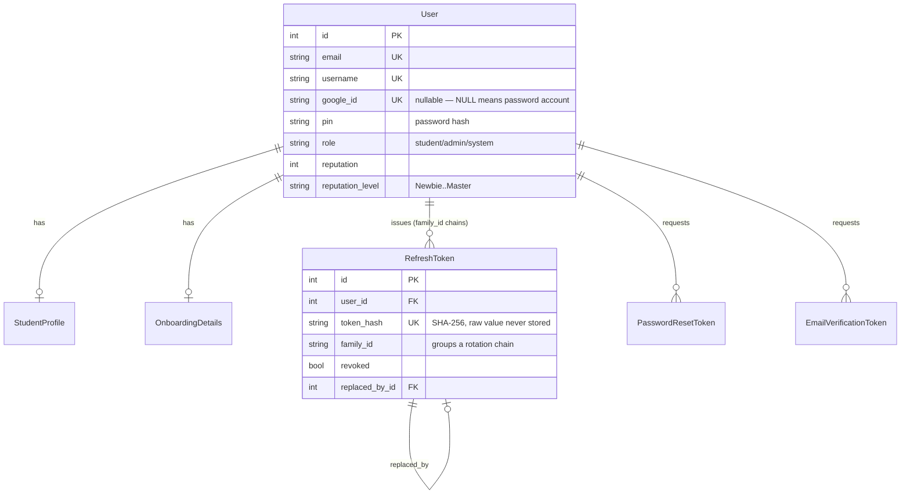
```mermaid
erDiagram
    User ||--o| StudentProfile : has
    User ||--o| OnboardingDetails : has
    User ||--o{ RefreshToken : "issues (family_id chains)"
    User ||--o{ PasswordResetToken : "requests"
    User ||--o{ EmailVerificationToken : "requests"
    RefreshToken ||--o| RefreshToken : "replaced_by"

    User {
        int id PK
        string email UK
        string username UK
        string google_id UK "nullable — NULL means password account"
        string pin "password hash"
        string role "student/admin/system"
        int reputation
        string reputation_level "Newbie..Master"
    }
    RefreshToken {
        int id PK
        int user_id FK
        string token_hash UK "SHA-256, raw value never stored"
        string family_id "groups a rotation chain"
        bool revoked
        int replaced_by_id FK
    }
```

`RefreshToken` is deliberately not a stateless JWT (unlike the access token, which still is). It's a DB-backed, hashed-at-rest, rotate-on-use credential with reuse detection — see §8 for the full mechanics. `google_id` is stored separately from `email` specifically to distinguish "an account already exists for this email, created via Google — safe to log in" from "an account already exists for this email, created via password — do not log in just because Google authenticated the same address," which closes an OAuth account-hijack path that a naive email-match would leave open.

### 5.2 Social graph — connections

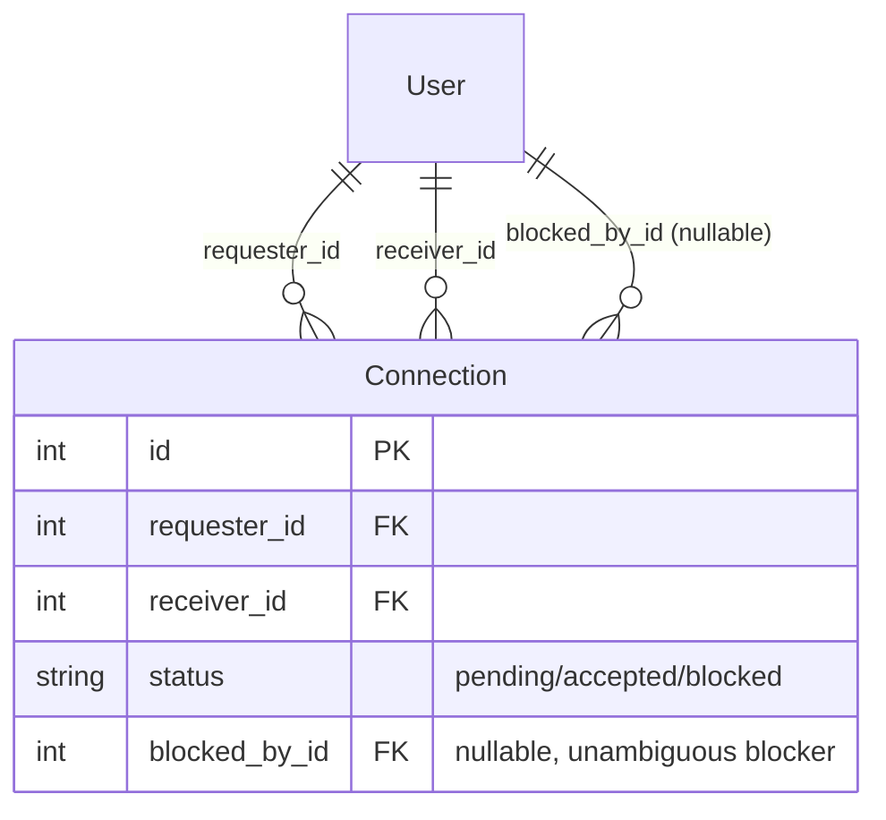
```mermaid
erDiagram
    User ||--o{ Connection : "requester_id"
    User ||--o{ Connection : "receiver_id"
    User ||--o{ Connection : "blocked_by_id (nullable)"

    Connection {
        int id PK
        int requester_id FK
        int receiver_id FK
        string status "pending/accepted/blocked"
        int blocked_by_id FK "nullable, unambiguous blocker"
    }
```

Two Postgres-only expression indexes back this table, both created via raw `DDL` gated with `.execute_if(dialect="postgresql")` rather than `db.Index(postgresql_using=...)`, because the `LEAST()`/`GREATEST()` functions they use have no SQLite equivalent and would otherwise break `db.create_all()` under the test suite's SQLite backend:

- A **non-unique** index on `(LEAST(requester_id, receiver_id), GREATEST(...), status)` — serves every bidirectional "is there a connection between A and B" lookup without needing an `OR` over both column orderings.
- A **unique** index on just the normalized pair (no status column) — makes a reverse-direction duplicate row (`A→B` and `B→A` both existing) impossible to insert at the database level, closing a race where two users sending each other a request in the same instant could both pass the application-level "no existing connection" check and both `INSERT`. The route that creates connection requests catches the resulting `IntegrityError` and returns the same "already connected/pending" message the pre-check path already returns.

`blocked_by_id` is its own column rather than overloading `requester_id`/`receiver_id` to also mean "the blocker." An earlier design swapped those two columns on block to encode who blocked whom, which corrupted the original request history and made "is this blocked" checks elsewhere in the codebase disagree with each other under certain sequences — the explicit column removes the ambiguity by construction.

### 5.3 Threads — group chat

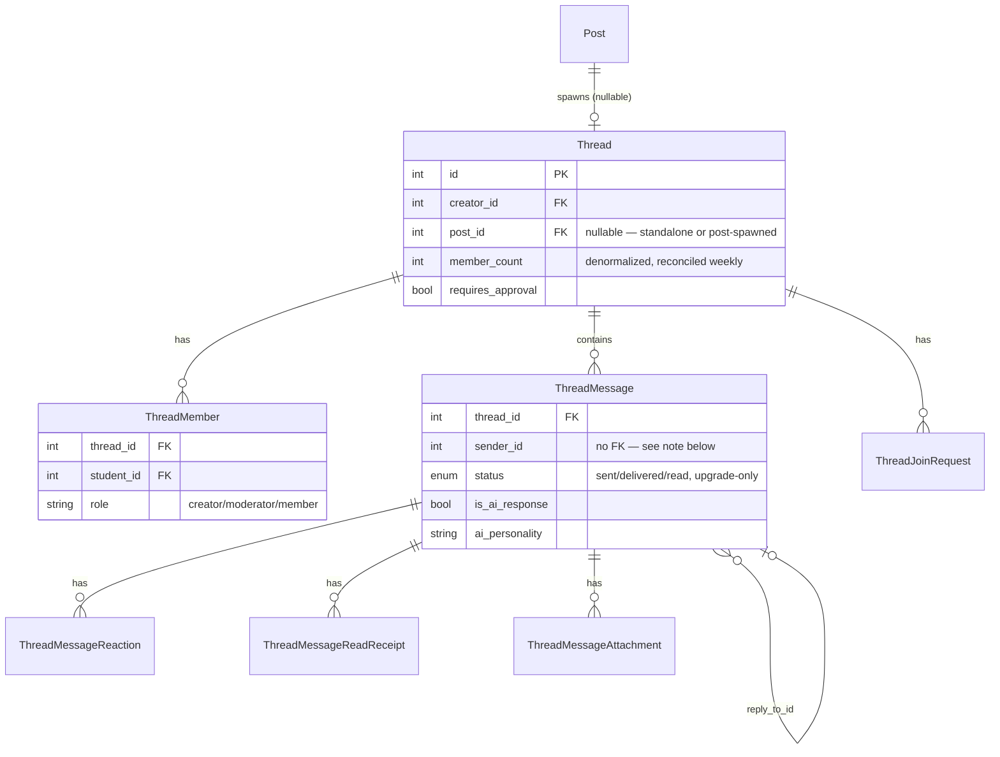
```mermaid
erDiagram
    Thread ||--o{ ThreadMember : has
    Thread ||--o{ ThreadMessage : contains
    Thread ||--o{ ThreadJoinRequest : has
    ThreadMessage ||--o{ ThreadMessageReaction : has
    ThreadMessage ||--o{ ThreadMessageReadReceipt : has
    ThreadMessage ||--o{ ThreadMessageAttachment : has
    ThreadMessage }o--o| ThreadMessage : "reply_to_id"
    Post ||--o| Thread : "spawns (nullable)"

    Thread {
        int id PK
        int creator_id FK
        int post_id FK "nullable — standalone or post-spawned"
        int member_count "denormalized, reconciled weekly"
        bool requires_approval
    }
    ThreadMember {
        int thread_id FK
        int student_id FK
        string role "creator/moderator/member"
    }
    ThreadMessage {
        int thread_id FK
        int sender_id "no FK — see note below"
        enum status "sent/delivered/read, upgrade-only"
        bool is_ai_response
        string ai_personality
    }
```

`ThreadMessage.status` is the three-state delivery indicator visible in the client (single/double/blue tick equivalent). It's computed at send time from live presence data (§10) and is enforced to only ever move forward — `mark_thread_read`'s bulk `UPDATE` is filtered to `status != 'read'`, so a `message_delivered` event racing against a `mark_thread_read` call for the same message can't downgrade a message that's already been marked read back to `delivered`.

`ThreadMessage` carries several partial and composite indexes chosen for the query shapes the code actually runs, not just one per foreign key: a composite `(thread_id, is_deleted, sent_at)` index for the main scroll query; a **partial** index on `status` that only indexes rows where `status != 'read'` (the terminal state most messages eventually settle into, which would otherwise bloat the index for no read-query benefit); a composite partial index scoped to non-deleted rows for the per-thread unread-count query; and a partial index on `ai_personality` that only covers non-null rows, since the overwhelming majority of messages are human, not AI.

### 5.4 Reputation & gamification

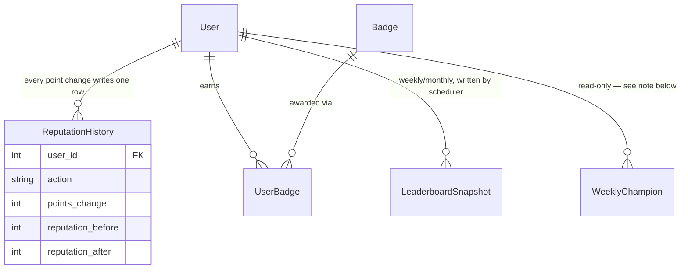
```mermaid
erDiagram
    User ||--o{ ReputationHistory : "every point change writes one row"
    User ||--o{ UserBadge : earns
    Badge ||--o{ UserBadge : "awarded via"
    User ||--o{ LeaderboardSnapshot : "weekly/monthly, written by scheduler"
    User ||--o{ WeeklyChampion : "read-only — see note below"

    ReputationHistory {
        int user_id FK
        string action
        int points_change
        int reputation_before
        int reputation_after
    }
```

`ReputationHistory` is an append-only ledger, not a mutable log alongside a counter. `User.reputation` is the current total, but every change to it is required to go through `award_reputation()` (§7), which writes a `ReputationHistory` row in the same call — meaning the total is always independently reconstructable by summing history rows, not trusted as a bare mutable field that could silently drift from its own audit trail.

`WeeklyChampion` is marked read-only above because, unlike `LeaderboardSnapshot`, it has no write path anywhere in this codebase — no scheduled job, no route, no other service populates it, even though a real UI (`homework_system.get_current_champions`) reads from it and displays a "This Week's Champions" panel. See §5.6 for this alongside the codebase's other honestly-flagged gap.

### 5.5 AI conversations

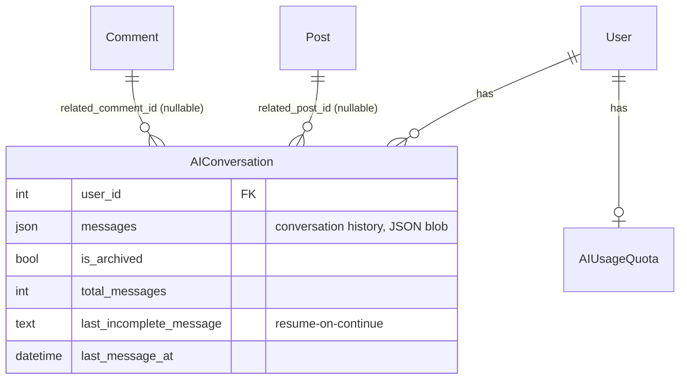
```mermaid
erDiagram
    User ||--o{ AIConversation : has
    Post ||--o{ AIConversation : "related_post_id (nullable)"
    Comment ||--o{ AIConversation : "related_comment_id (nullable)"
    User ||--o| AIUsageQuota : has

    AIConversation {
        int user_id FK
        json messages "conversation history, JSON blob"
        bool is_archived
        int total_messages
        text last_incomplete_message "resume-on-continue"
        datetime last_message_at
    }
```

A composite index on `(user_id, is_archived, last_message_at)` covers the hottest query in this table — the conversation sidebar's "my active conversations, most recent first" load — and, via the leftmost-prefix rule, also serves plain `user_id`-only lookups without needing a second index. `last_incomplete_message` exists because a token-limit-truncated AI response used to rely entirely on the model inferring "continue where you left off" from conversation history; it's now written explicitly and read back as a system instruction when the user hits "continue," so the model is told exactly what it already said rather than guessing.

### 5.6 Two honest gaps: tables that exist but aren't load-bearing

Two models in this schema have a real definition and, in one case, a real UI built around them, but no working data pipeline behind them — worth naming both together, since they're the same class of finding and the pattern matters more than either instance on its own: a table's presence in `models.py` is not the same claim as a table being load-bearing, and this codebase is not free of that gap.

**`SearchIndex`** is defined with a docstring stating it's meant for full-text search. It is never populated and never queried anywhere in the codebase — every search endpoint in `search_service.py` runs unindexed `ILIKE '%term%'` against the live `users`/`posts`/`threads` tables instead. The table hasn't been dropped because doing so is a destructive schema change that needs a real migration and a product decision on whether full-text search is still planned.

**`WeeklyChampion`** is the more interesting of the two, because the read side is genuinely built: `homework_system.get_current_champions()` queries it, and the homework dashboard renders a real "This Week's Champions" panel from whatever rows it finds. But no code anywhere in this codebase — not a scheduled job, not a route, not another service — ever inserts a row into it. It isn't one of the five scheduled jobs documented in `BACKGROUND_JOBS.md` §2.2, despite being exactly the shape of work that belongs there alongside the leaderboard snapshot jobs. The feature is UI-complete and schema-complete; the computation step that would make it live is the missing piece.

Both are flagged here rather than presented as working infrastructure, in keeping with this document's own standard: the goal is to make the real engineering legible, which means being equally direct about what isn't finished yet.

---

## 6. Authentication & authorization architecture

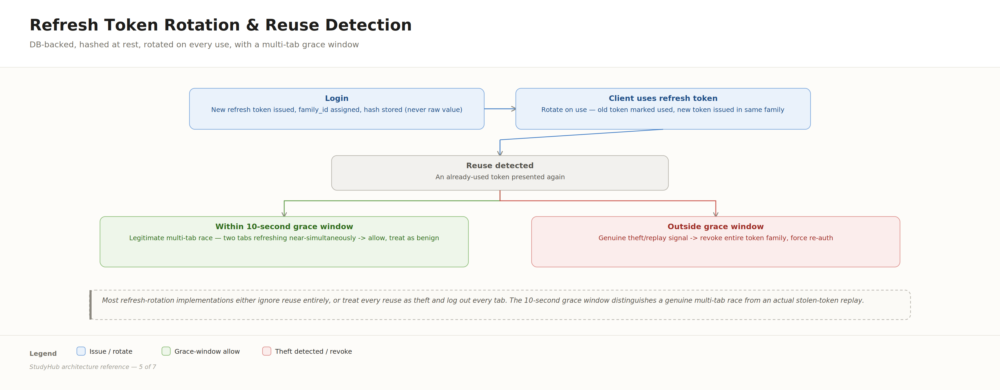

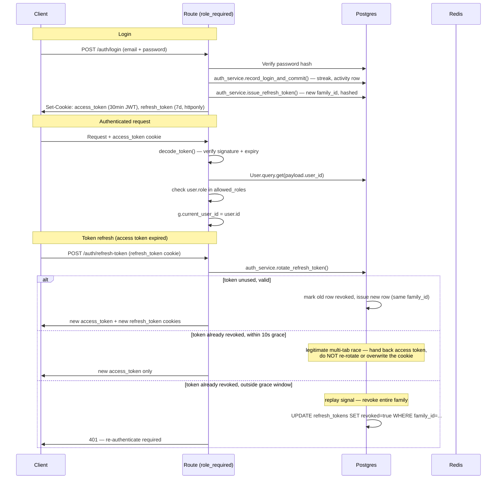
```mermaid
sequenceDiagram
    participant C as Client
    participant R as Route (role_required)
    participant DB as Postgres
    participant Redis as Redis

    Note over C,R: Login
    C->>R: POST /auth/login (email + password)
    R->>DB: Verify password hash
    R->>DB: auth_service.record_login_and_commit() — streak, activity row
    R->>DB: auth_service.issue_refresh_token() — new family_id, hashed
    R->>C: Set-Cookie: access_token (30min JWT), refresh_token (7d, httponly)

    Note over C,R: Authenticated request
    C->>R: Request + access_token cookie
    R->>R: decode_token() — verify signature + expiry
    R->>DB: User.query.get(payload.user_id)
    R->>R: check user.role in allowed_roles
    R->>R: g.current_user_id = user.id

    Note over C,R: Token refresh (access token expired)
    C->>R: POST /auth/refresh-token (refresh_token cookie)
    R->>DB: auth_service.rotate_refresh_token()
    alt token unused, valid
        DB->>DB: mark old row revoked, issue new row (same family_id)
        R->>C: new access_token + new refresh_token cookies
    else token already revoked, within 10s grace
        Note over DB: legitimate multi-tab race — hand back access token,<br/>do NOT re-rotate or overwrite the cookie
        R->>C: new access_token only
    else token already revoked, outside grace window
        Note over DB: replay signal — revoke entire family
        DB->>DB: UPDATE refresh_tokens SET revoked=true WHERE family_id=...
        R->>C: 401 — re-authenticate required
    end
```

**Access tokens** are short-lived (30 minute) stateless JWTs — unchanged in this refactor, since their short lifetime already bounds the exposure window without needing revocation machinery. **Refresh tokens** are the opposite: 7-day-lived bearer credentials, which is exactly the profile where a stateless, unrevocable JWT is the wrong tool. The refresh token is opaque on the wire; only its SHA-256 hash is ever persisted (`RefreshToken.token_hash`), so a database leak doesn't hand out usable long-lived credentials the way storing the raw value would.

**Rotation-on-use with reuse detection.** Every `/refresh-token` call marks the presented token `revoked` and issues a new one in the same `family_id`. If a token that's already `revoked` is presented again, that's either (a) a genuine replay of a stolen token, or (b) two browser tabs racing — Tab A refreshes and rotates first, Tab B (holding the same cookie) presents the now-superseded token moments later. A **10-second grace window** on a revoked token's immediate successor distinguishes the two: within the window, the caller gets a working access token without a new refresh-token rotation (Tab B simply continues using the token Tab A already installed); outside the window, or for anything more than one generation removed, the entire token family is revoked immediately, forcing every session descended from that login to re-authenticate. This is standard refresh-token-rotation reuse detection, with the grace window added specifically because a strict "any reuse kills the family" rule breaks the ordinary multi-tab case, which is common enough to matter.

**Cookies, not headers.** The frontend authenticates via three cookies (`access_token`, `refresh_token`, `csrf_token`) rather than an `Authorization` header — which is why `supports_credentials=True` on the Flask-CORS configuration is load-bearing, not optional: browsers refuse to combine `Access-Control-Allow-Credentials: true` with a wildcard origin, so `CORS_ALLOWED_ORIGINS` must be the real frontend origin(s) in any environment with a cross-origin frontend, or the browser rejects the request before the app's own logic ever runs. `ACCESS_TOKEN_HTTPONLY` (config flag, default off) governs whether `access_token` itself is `httponly` — when it is, a separate JS-readable `csrf_token` cookie is issued alongside it for a double-submit CSRF pattern. Being a config flag rather than a code branch removed after rollout means the switch is instant and reversible without a redeploy.

---

## 7. Reputation system — one write path

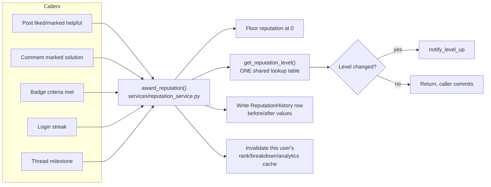
```mermaid
flowchart LR
    subgraph Callers
        A[Post liked/marked helpful]
        B[Comment marked solution]
        C[Badge criteria met]
        D[Login streak]
        E[Thread milestone]
    end
    A & B & C & D & E --> AWARD["award_reputation()<br/>services/reputation_service.py"]
    AWARD --> FLOOR[Floor reputation at 0]
    AWARD --> TIER["get_reputation_level()<br/>ONE shared lookup table"]
    AWARD --> HIST[Write ReputationHistory row<br/>before/after values]
    AWARD --> INVAL["Invalidate this user's<br/>rank/breakdown/analytics cache"]
    TIER --> LEVELUP{Level changed?}
    LEVELUP -->|yes| NOTIFY[notify_level_up]
    LEVELUP -->|no| DONE[Return, caller commits]
```

`award_reputation()` is the only function in the codebase that mutates `User.reputation`. It floors the result at zero, recomputes the user's tier from a single shared lookup table (`services/reputation_levels.py`), and writes an auditable `ReputationHistory` row with the before/after values — all in the same call, so a reputation change and its audit trail can never exist independently of each other.

The reputation-tier lookup used to exist in up to four separate places across the codebase — and they disagreed at boundary values. `User.update_reputation_level()`'s own docstring documents the specific bug this caused: one implementation used strict `<` comparisons for tier boundaries while the shared table used an inclusive min/max range, and the two disagreed at exactly `reputation == 1000`. Consolidating to one table, read by every module that needs it (badges, leaderboard, the reputation service itself), removes the class of bug entirely rather than fixing the one instance that happened to be caught.

The screenshot below shows the ledger in the actual profile UI — the +189 / -0 / 189 totals are not read from a stored field, they're computed live by summing `ReputationHistory` rows, which is what makes the running total independently auditable:


**Cache invalidation is deliberately partial, not total.** `award_reputation()` hard-invalidates the acting user's own point-total, rank, breakdown, and analytics caches immediately — those must never serve stale data for the user whose reputation just changed. It does **not** invalidate the global leaderboard page cache, even though one user's reputation change can, in principle, shift every other user's relative rank. Hard-invalidating a global leaderboard page cache on every single reputation-changing write across the whole platform would defeat the purpose of caching it at all; the 60-second TTL on that cache is the accepted trade-off (§13), and the code contains an explicit comment warning against "fixing" this into fan-out invalidation.

---

## 8. Social & content architecture

Posts, comments, reactions, bookmarks, and mentions follow a conventional shape, with two things worth calling out: **denormalized counters with a reconciliation safety net**, and **priority scoring computed on read, never persisted as a read side effect**.

Post-level counters (`comments_count`, `bookmark_count`, `views_count`, `positive_reactions_count`) are maintained incrementally at write time rather than computed with a `COUNT(*)` on every read. A weekly scheduled job (§12, `reconcile_denormalized_counts()`) recomputes the true count from the underlying rows and compares it against the stored value. What happens on a mismatch depends on what the counter is used for, not just where it lives:

- **Display-only counters** (post comment/bookmark/view/reaction counts, `Thread.message_count`) are auto-corrected — a wrong number here is purely cosmetic.
- **`Thread.member_count`** is treated differently, because it gates a real business rule (`max_members` capacity checks) elsewhere in the codebase. It's **alert-only** — logged as a drift, never silently overwritten — because auto-correcting it risks masking a genuine upstream bug that's actively over-admitting members past capacity. Silently "fixing" the number would hide the actual problem.

Homework assignment priority (`homework_service.calculate_priority_score`) is a pure function of `due_date`, `difficulty`, `status`, and `estimated_hours` — it takes no database session and mutates nothing. It used to be computed and written into `assignment.priority_score` as a side effect of *reading* the assignment list, which meant simply viewing your homework feed could trigger a database write. It's now computed fresh on every read for read-only endpoints, and only explicitly persisted at the three genuine mutation points (create, update, quick-action) that decide to store it.

---

## 9. Messaging & connections gating

A student cannot DM a stranger cold. `connection_service.can_message(sender_id, receiver_id)` requires a mutual-accept `Connection` row with `status == "accepted"` before a direct message can be sent — this is enforced in the service layer the messaging routes call, not only in the UI, so it holds regardless of which client hits the API. Thread membership is explicitly insufficient on its own: being in the same group thread as someone does not grant DM access; connecting does.

High-compatibility connection requests (`compatibility_score >= 70`, computed by `connection_service.calculate_compatibility_score` from shared subjects, complementary skills, schedule overlap, and department match) auto-accept on send — the `send_connection_request` route in `crud.py` creates the `Connection` row directly with `status="accepted"` rather than `"pending"` when the score clears the threshold, and notifies both users of the instant connection. Lower-scoring requests go through the ordinary request → accept flow.

---

## 10. Notification architecture

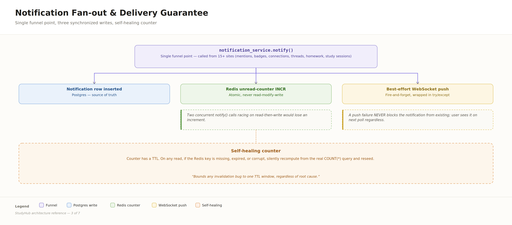

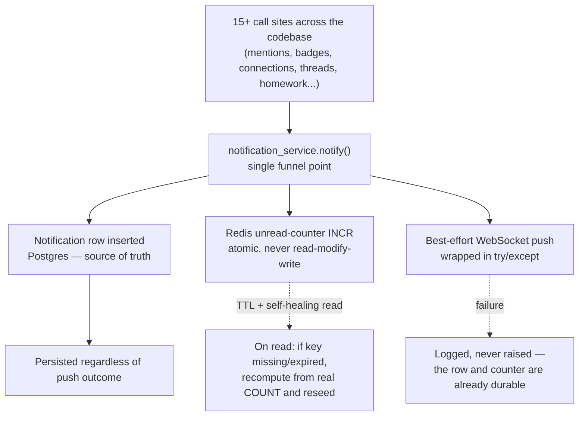
```mermaid
flowchart TB
    CALLER["15+ call sites across the codebase<br/>(mentions, badges, connections, threads, homework...)"]
    NOTIFY["notification_service.notify()<br/>single funnel point"]
    CALLER --> NOTIFY
    NOTIFY --> ROW["Notification row inserted<br/>Postgres — source of truth"]
    NOTIFY --> COUNTER["Redis unread-counter INCR<br/>atomic, never read-modify-write"]
    NOTIFY --> PUSH["Best-effort WebSocket push<br/>wrapped in try/except"]
    ROW --> DONE1[Persisted regardless of push outcome]
    COUNTER -.->|TTL + self-healing read| HEAL["On read: if key missing/expired,<br/>recompute from real COUNT and reseed"]
    PUSH -.->|failure| LOG["Logged, never raised —<br/>the row and counter are already durable"]
```

`notification_service.notify()` is the one funnel every notification-producing call site goes through, which is what makes the three side effects below consistent instead of independently reimplemented per call site:

1. **A `Notification` row is inserted into Postgres** — the durable source of truth. This is what a client sees on the next poll/fetch regardless of whether the real-time push below succeeded.
2. **The Redis unread-counter is incremented atomically** (`counter_cache_service.increment_unread_notification_count`), via a native `INCR`, never a read-then-write. Two concurrent `notify()` calls for the same user racing on a read-modify-write would lose an increment; `INCR` can't.
3. **A WebSocket push is attempted, best-effort.** It's wrapped in its own `try/except` — a push failure is logged but never propagates, because the row already exists and the counter is already incremented regardless of whether the live push landed.

The unread counter itself carries a TTL specifically so it can **self-heal**: on any read, if the Redis key is missing, expired, or otherwise unreadable, the counter is silently recomputed from a real `COUNT(*)` query and reseeded rather than trusted blindly or left broken. This bounds the lifetime of any invalidation bug — a missed decrement, a bad deploy that skipped an update path — to at most one TTL window, regardless of what actually caused the drift.

---

## 11. AI architecture

This is the most substantial subsystem in the codebase, so it gets the most space. The short version: **one classified retry/fallback engine, five distinct entry points that all funnel into it, and Redis-shared cross-instance health state with a kill switch back to the old per-process behavior.**

### 11.1 Entry points

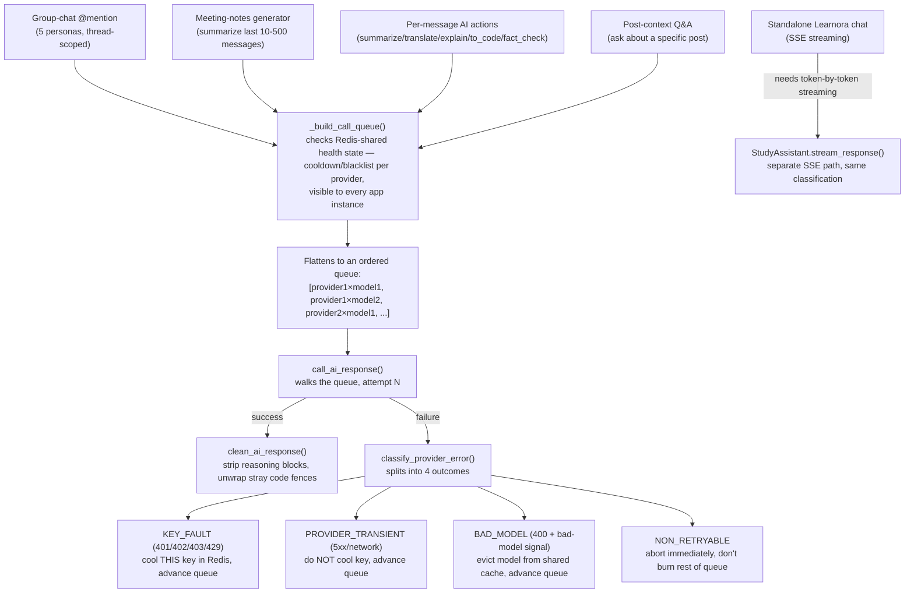
```mermaid
flowchart TB
    E1["Group-chat @mention<br/>(5 personas, thread-scoped)"]
    E2["Meeting-notes generator<br/>(summarize last 10-500 messages)"]
    E3["Per-message AI actions<br/>(summarize/translate/explain/to_code/fact_check)"]
    E4["Standalone Learnora chat<br/>(SSE streaming)"]
    E5["Post-context Q&A<br/>(ask about a specific post)"]

    E1 & E2 & E3 & E5 --> QUEUE["_build_call_queue()<br/>checks Redis-shared health state — cooldown/blacklist per provider,<br/>visible to every app instance"]
    QUEUE --> FLAT["Flattens to an ordered queue:<br/>[provider1×model1, provider1×model2, provider2×model1, ...]"]
    FLAT --> CALL["call_ai_response()<br/>walks the queue, attempt N"]
    CALL -->|success| CLEAN["clean_ai_response()<br/>strip reasoning blocks, unwrap stray code fences"]
    CALL -->|failure| CLASSIFY["classify_provider_error()<br/>splits into 4 outcomes"]

    CLASSIFY --> KF["KEY_FAULT (401/402/403/429)<br/>cool THIS key in Redis, advance queue"]
    CLASSIFY --> PT["PROVIDER_TRANSIENT (5xx/network)<br/>do NOT cool key, advance queue"]
    CLASSIFY --> BM["BAD_MODEL (400 + bad-model signal)<br/>evict model from shared cache, advance queue"]
    CLASSIFY --> NR["NON_RETRYABLE<br/>abort immediately, don't burn rest of queue"]

    E4 -->|"needs token-by-token streaming"| STREAM["StudyAssistant.stream_response()<br/>separate SSE path, same classification"]
```

Five distinct product surfaces — a thread `@mention`, the meeting-notes generator, the per-message AI action menu, the standalone Learnora chat, and post Q&A — used to each hand-roll their own retry loop, with retry counts and timeouts that had quietly drifted apart from each other across the four non-streaming call sites. They now funnel into one consolidated engine.

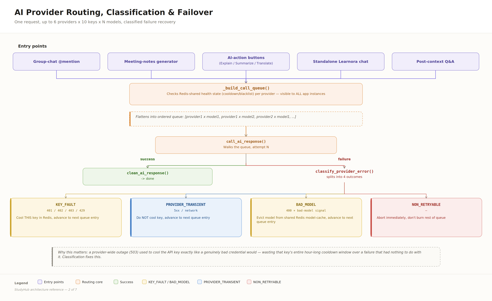

### 11.2 Failure classification: the actual mechanism

The core design decision is that **not every provider failure means the same thing, and treating them identically wastes a resource that costs real money and has a real recovery time.** `classify_provider_error()` looks at the real structured failure data — an HTTP status code, the provider's own parsed JSON error body, a network-level exception type — never a re-parsed message string, and sorts every failure into exactly one of four categories:

| Category | Trigger | Action |
|---|---|---|
| `KEY_FAULT` | 401 / 402 / 403 / 429 | Cool *this specific key* for an hour, advance to the next queue entry |
| `PROVIDER_TRANSIENT` | 5xx / network-level failure | Advance to the next queue entry — **do not** cool the key, since the key did nothing wrong |
| `BAD_MODEL` | 400 + a structured "model not found/invalid/decommissioned" signal in the error body | Evict just that model from the shared model cache, advance to the next queue entry |
| `NON_RETRYABLE` | Anything not explicitly matched above | Stop the fallback chain immediately — don't burn through every remaining provider on a request that will never succeed anywhere |

The distinction that matters most in practice is `KEY_FAULT` vs. `PROVIDER_TRANSIENT`: before this classification existed, a provider-wide outage (a 503) was cooling the API key exactly like a genuinely bad credential would, wasting that key's entire hour-long cooldown window over a failure that had nothing to do with the key itself. Splitting the two means a transient provider outage no longer costs an hour of that key's availability once the provider recovers.

The `BAD_MODEL` detection (`_is_bad_model_signal`) is itself narrow by design — it checks a provider's structured `error.type` / `error.code` / `error.message` fields for a model-related pattern, not an arbitrary substring match against the full response body, which keeps it from misfiring on unrelated 400s that happen to mention the word "model" somewhere in an unrelated context.

### 11.3 Cross-instance provider health state

Cooldown state, provider-type blacklist status, round-robin rotation index, and the discovered-model cache all live in Redis (`ai_provider_service.MultiProviderManager`), gated behind a fail-open kill switch, `AI_PROVIDER_REDIS_STATE_ENABLED` (default on). This exists because the naive in-process version has a real correctness gap under more than one API instance: if instance A marks a key as failed, instance B has no way to know and keeps sending traffic to a key A already knows is dead.

Every Redis read/write in this path is fail-open — a Redis hiccup degrades to an instance occasionally retrying a key another instance already knows is bad, which is a worse-but-survivable outcome, never a raised exception that breaks an AI call. Flipping the kill switch back to `false` reverts every one of these to the original per-process, in-memory behavior with no code deploy required, which matters because this manager sits behind every AI-touching feature on the platform — it's the highest-value rollback lever available for a change this central.

Provider-**type** blacklisting is a separate, coarser mechanism from per-key cooldown: if a provider type (not just one key) fails three or more times inside a 5-minute window, the whole provider type is blacklisted platform-wide for 30 minutes, so a genuinely down provider doesn't get hammered with every remaining key across every instance while it's recovering.

### 11.4 Model discovery, done once, shared everywhere

On startup, a background daemon thread queries each provider's live model catalogue and re-ranks the static priority list, folding in newly-available models the hardcoded config doesn't know about. It checks the shared Redis cache first — on a hit, it applies the cached ranked list with zero HTTP calls, closing a real gap where two instances could otherwise independently discover slightly different model lists from a transiently-inconsistent provider response and route two requests for the same feature to two different underlying models.

This discovery call is deliberately *not* triggered from `MultiProviderManager.__init__`. An earlier version started the discovery thread — which makes live network calls — as a side effect of merely importing the module, which broke running the test suite without network access. It's now an explicit `warm_model_discovery()` call made once from `create_app()`, after blueprint registration.

### 11.5 Response reliability

Every AI response is sanitized (`clean_ai_response`) before it's stored or shown: stripping leading `<think>`/`<reasoning>` blocks some reasoning models emit, removing stray SSE protocol artifacts, and unwrapping a response a model mistakenly wrapped entirely in a bare code fence — with a heuristic specifically designed to avoid unwrapping *genuine* fenced code the model intended to show, while leaving real markdown formatting untouched since the frontend renderer depends on it surviving.

Vision handling is provider-aware, not one-size-fits-all. Image attachments are base64-encoded and sent as `image_url` parts only when the currently-selected model actually supports vision; otherwise the image is replaced with an explicit text placeholder describing that an image was attached but can't be shown, rather than being silently dropped or causing the request to fail. Several providers — Mistral in particular, and apparently Groq's non-vision models — reject the multimodal array-of-parts message format outright unless a real image is present in it, so the message builder collapses to a plain string body whenever there's no image to embed, which is a provider-compatibility detail that only becomes visible once multiple providers are actually being run against the same code path.

Conversation history longer than 10 messages is automatically summarized before being sent to a provider — older turns condensed into a short digest, the 5 most recent messages kept verbatim — so prompt size stays bounded without losing all prior context.

### 11.6 Streaming with mid-stream recovery

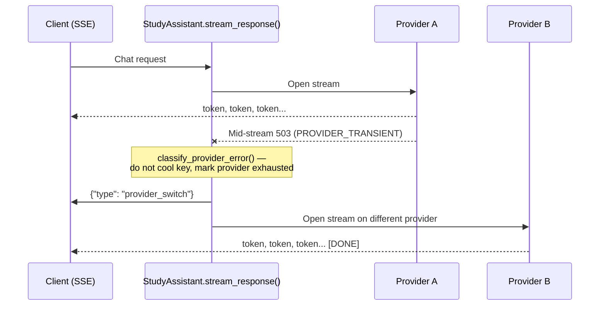
```mermaid
sequenceDiagram
    participant C as Client (SSE)
    participant SA as StudyAssistant.stream_response()
    participant P1 as Provider A
    participant P2 as Provider B

    C->>SA: Chat request
    SA->>P1: Open stream
    P1-->>C: token, token, token...
    P1--xSA: Mid-stream 503 (PROVIDER_TRANSIENT)
    Note over SA: classify_provider_error() —<br/>do not cool key, mark provider exhausted
    SA->>C: {"type": "provider_switch"}
    SA->>P2: Open stream on different provider
    P2-->>C: token, token, token... [DONE]
```

AI chat, connection overviews, and live-session tutoring are all delivered as Server-Sent Event streams, not blocking JSON responses. If a provider fails partway through an already-open stream, the system switches providers **mid-stream** and emits an explicit `provider_switch` event to the client rather than failing the whole request outright — the user never has to notice the failure or resubmit. Header-stage failures (a non-2xx status before any tokens arrive, a timeout) are classified through the same four-category taxonomy described in §11.2, so a `KEY_FAULT` encountered mid-stream cools the key exactly the way a non-streaming `KEY_FAULT` does; a mid-stream error signaled *inside* an already-200 SSE body (some providers report errors this way, after headers are already sent) has no HTTP status to classify against and keeps its own narrower rate-limit/generic-error handling instead.

### 11.7 Graceful degradation, not just failover

One AI feature — the personalized "why should we connect" overview shown between two users — has a fully-functional, template-based fallback built from the *exact same* compatibility-scoring data the AI prompt itself would have used. If every provider is unavailable simultaneously, the feature still returns a coherent, auditable answer instead of an error screen. This is a deliberate pattern in the codebase rather than a one-off: build the deterministic version first, let AI enhance it when available, and never let the AI layer become a single point of failure for a feature that has a reasonable non-AI answer.

### 11.8 What's still process-local, and why

Not everything moved to Redis in the horizontal-scaling pass, and one of the two things left as-is is a genuinely deferred migration, not a "no correctness gap here" case like the other:

- **Typing-indicator dedup bookkeeping** (`TypingStatusManager`) stays local by design. It only suppresses a redundant re-emit of an event the client already has — the actual broadcast already reaches every instance once `message_queue` is wired into Flask-SocketIO's Redis pub/sub, so there's no cross-instance correctness gap to close here.
- **`_auto_reply_buckets`** — the sliding-window limiter gating Learnora's auto-reply-without-`@mention` behavior (§9.2 in `PRODUCT_OVERVIEW.md`) — is explicitly named in the module's own migration notes as the one item that's genuinely still deferred, not a deliberate "doesn't need it" case. It's a real, working, process-local rate limiter; under multiple instances, a user's cap on triggering unprompted auto-replies resets whenever their socket connection happens to land on a different instance, the same class of gap the thread-message and AI-action limiters closed. It wasn't folded into that same fix because it needed its own migration rather than being dead code that could be replaced outright — see the next point.

Worth being precise about the AI-action rate limiter specifically, since it's easy to describe imprecisely: `_ai_action_buckets` (gating the per-message Explain/Summarize/Translate/To Code/Fact Check actions) wasn't a working in-memory limiter that got upgraded to Redis. Per the module's own audit notes, it was **declared but never actually read or written anywhere** — meaning thread-level AI actions had no rate limit at all before this fix. The Redis-backed `RedisFixedWindowLimiter` that now backs it replaced dead code, not a functioning single-process mechanism.

AI provider failover state (§11.3) is the one of these that's fully migrated and Redis-backed; the equivalent decision for typing indicators was made deliberately, not by omission, because the two have genuinely different correctness requirements. `_auto_reply_buckets` sits between the two — real and working, but explicitly acknowledged in the code as unfinished business.

---

## 12. Background processing

Covered in full detail in [`BACKGROUND_JOBS.md`](BACKGROUND_JOBS.md). In summary: five APScheduler cron jobs, each wrapped in a Redis distributed lock so exactly one instance executes on any given tick regardless of how many scheduler-enabled processes are running; two of those jobs enqueue work onto RQ queues rather than running inline, while the other three (which already have their own idempotency guards and bounded runtime) execute directly inside the locked tick.

---

## 13. Redis architecture — four distinct roles

Redis is used for four structurally different purposes in this codebase, each with a different failure posture. Conflating them under a single "caching layer" label would understate what's actually happening.

| Role | Module | Failure posture | Why |
|---|---|---|---|
| **Response/query cache** | `cache_service.py` | **Fail-open** | A cache miss just means recomputing — never worth breaking a request over |
| **Distributed lock** | `distributed_lock.py` | **Fail-closed** (deliberate exception) | Duplicate scheduler execution is a real correctness bug; skipping a tick is cheap |
| **Presence / pub-sub** | `presence_service.py`, Flask-SocketIO `message_queue` | **Fail-open** | Presence being briefly wrong is cosmetic, not a security or correctness issue |
| **Durable job queue** | `job_queue.py` (RQ) | N/A — Redis is the queue's actual storage | If Redis is down, jobs simply can't be enqueued or processed; there's no fallback because there's nothing to fall back to |

**Cache** (`cache_service.py`) wraps every Redis call in its own `try/except`; a `get()` failure is treated identically to a cache miss, and a `set()`/`delete()` failure is silently dropped. No caller needs its own error handling — the fail-open boundary is entirely inside this one module. Pattern-based invalidation (`delete_pattern`) uses `SCAN`, not `KEYS`, specifically because `KEYS` is O(N) over the entire keyspace and blocks Redis's single event loop for the duration; `SCAN` is cursor-based and non-blocking.

**Distributed locking** (`distributed_lock.py`) is the one deliberate exception to the fail-open default everywhere else in the app. If Redis is unreachable when a scheduler tick fires, `acquire()` returns "not acquired" and the caller is expected to skip the protected operation entirely for that cycle — never run it unprotected. This is fail-**closed** on purpose: this lock exists specifically to prevent duplicate execution where duplicate execution is the actual danger (two instances both writing a duplicate leaderboard snapshot for the same period), and failing open here would silently defeat the reason the lock exists at all. The lock itself uses an atomic `SET key value NX EX ttl` for acquisition (single round trip, no separate exists-then-set race) and a Lua script for compare-and-delete release — a lock is only ever deleted by the exact `owner_token` that acquired it, generated fresh per acquisition attempt (`host:pid:uuid4`), so a lock whose TTL already expired and was re-acquired by a different instance can never be deleted out from under that new owner by the original, now-late caller's `release()`.

**Presence** (`presence_service.py`) tracks per-socket liveness with TTL'd keys and an untimed per-user index set, cross-checked against each other on every read rather than trusted as one flat structure — see §14 for why. **Rate limiting** on WebSocket thread-message sends and thread-level AI actions is Redis-backed (`RedisFixedWindowLimiter`, `websocket_rate_limiter.py`) for the same reason presence is: a per-user cap enforced against in-memory state resets every time that user's socket happens to reconnect to a different instance, which defeats the point of the cap under more than one process. HTTP-layer rate limiting (`rate_limit_service.py`) uses Flask-Limiter with Redis storage in production, falling back to `memory://` in dev/test, and is configured to fail open on a storage error (`RATELIMIT_SWALLOW_ERRORS=True`, a short 1-second connect timeout so a down Redis fails fast rather than hanging the request).

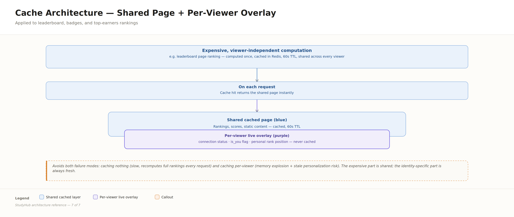

The screenshot below shows this pattern in the actual leaderboard UI — the ranked list and point totals come from the 60-second shared cache; the "Your rank" card, connection status on each row, and highlighted "you are here" position are computed per request and never touch that cache:

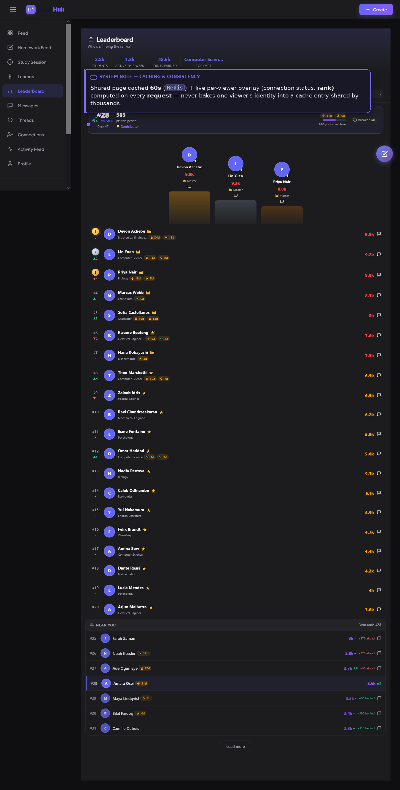

---

## 14. WebSocket presence — multi-device aware

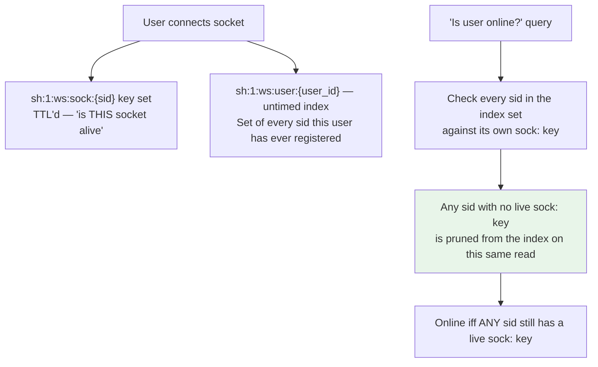
```mermaid
flowchart TB
    CONNECT["User connects socket"] --> SOCK["sh:1:ws:sock:{sid} key set<br/>TTL'd — 'is THIS socket alive'"]
    CONNECT --> INDEX["sh:1:ws:user:{user_id} — untimed index<br/>Set of every sid this user has ever registered"]

    QUERY["'Is user online?' query"] --> CHECK["Check every sid in the index set<br/>against its own sock: key"]
    CHECK --> HEAL["Any sid with no live sock: key<br/>is pruned from the index on this same read"]
    HEAL --> RESULT["Online iff ANY sid still has a live sock: key"]

    style HEAL fill:#e8f5e9
```

Redis has no per-member TTL within a Set — only a whole-key TTL. A user can have multiple simultaneous sockets (several open tabs, or a phone and a laptop at once), so presence can't be a single TTL'd key per user without one device's disconnect incorrectly flipping the user offline while their other devices are still live. The split above — a TTL'd key per socket, cross-checked against an untimed per-user index set — means "is user X online" is answered by checking whether *any* of their indexed sockets still has a live `sock:` key, and the index self-heals (stale entries are removed) on the same read that answers the query, with no separate sweep job required for correctness. A background sweep does exist (each WebSocket manager touches its own locally-held sockets' TTLs roughly every 45 seconds) but it exists to keep live sockets alive, not to clean up dead ones — the read-time pruning handles that.

This same module also tracks which thread a user is *actively viewing* right now (`set_active_thread`/`get_active_thread`), which is what lets a newly-sent thread message get the correct initial delivery status — `read` if the recipient has that thread open right now, `delivered` if they're online but elsewhere, `sent` otherwise — computed from real cross-instance presence data rather than a guess.

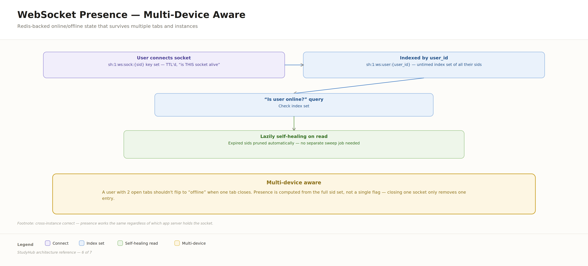

---

## 15. External integrations

| Service | Purpose | Failure handling |
|---|---|---|
| 6 LLM providers | Learnora AI (§11) | Classified retry/fallback across providers and models; graceful non-AI fallback for one feature |
| Cloudinary | Media storage for uploads | — |
| Flask-Mail (SMTP) | Transactional email | Runs inside an RQ job with real retry (§ Background Jobs); raises on failure rather than swallowing it, so RQ's `FailedJobRegistry` actually populates |
| Firebase Cloud Messaging | Push notifications | — |
| Sentry | Error tracking | **Fail-open at every stage** — init failure, missing DSN, or a runtime capture failure all degrade to "no error tracking," never to an app-breaking exception. A `before_send` hook scrubs the three auth cookies and password-hash field names by name before any event leaves the process (`send_default_pii=False` is also explicit, not just the library default) |

---

## 16. Error handling

Covered in §3. The short summary: a typed exception hierarchy (`errors.py`) with six concrete error types, one centralized Flask error handler that converts any of them into the app's existing response envelope, and Sentry capture wired into that same handler for anything ≥500 — with Sentry's own capture call wrapped in a bare `except: pass` so a failure in the *error-reporting path itself* can never become the source of a second, unrelated error.

---

## 17. Reliability mechanisms actually present

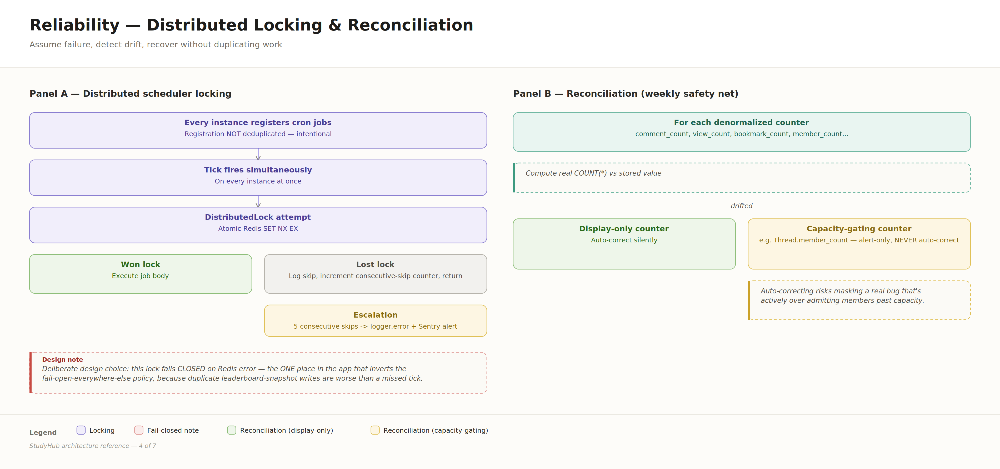

- **Idempotent batch deletes.** `cleanup_expired_activity_feed_job` (§ Background Jobs) deletes expired rows in bounded batches of IDs rather than one unbounded `DELETE ... WHERE`, with one commit per batch. Re-running after a partial failure or a duplicate enqueue simply matches fewer or zero rows on the next batch-select — a correctness no-op, not a special retry path.
- **Atomic counters instead of read-modify-write.** Member counts, message counts, and the unread-notification counter are all updated via SQL-level atomic expressions or Redis `INCR`/`DECR`, never a Python-side read-then-write that would lose updates under concurrent requests.
- **A reconciliation safety net**, not a primary consistency mechanism (§8), running weekly against real `COUNT(*)` queries.
- **Batched queries where N+1 would otherwise creep in.** The connections/leaderboard services batch-load profile data, connection status, and mutual-connection counts via `IN`-clause and `GROUP BY` queries across a whole page of results, rather than querying per-row.
- **Retry policies scoped per job**, not one blanket retry count (§ Background Jobs) — a low-stakes, read-only weekly alert job gets 2 attempts with a fixed 60s backoff; a genuinely important email send gets 3 attempts with escalating backoff.
- **A fail-closed exception, deliberately isolated to one module.** Every Redis consumer in the codebase fails open except `distributed_lock.py` (§13), and that exception is explicitly named and reasoned about rather than left as an inconsistency.

---

## 18. Security

- **Password/credential hashing.** Passwords are hashed via Werkzeug's `generate_password_hash`; refresh tokens are hashed at rest (SHA-256) rather than stored raw.
- **File upload validation goes past extension checking.** `upload_validation_service.validate_and_normalize_image()` opens every image upload with Pillow, structurally verifies it, fully decodes the pixel data (catching truncated/corrupt files a shallow verify alone would miss), and re-encodes it to a fresh buffer before it's ever forwarded to storage — the re-encoding step is what strips any embedded script/metadata/polyglot payload, since the output bytes are freshly generated from decoded pixels rather than a copy of the original file. Non-image documents are checked against a small hand-rolled magic-byte signature table rather than trusted by filename extension.
- **CSRF.** A double-submit cookie pattern (`csrf_token`, JS-readable, reissued alongside `access_token`) is available behind the `ACCESS_TOKEN_HTTPONLY` flag.
- **Rate limiting** at both the HTTP layer (Flask-Limiter, named tiers — see `PRODUCT_OVERVIEW.md`) and the WebSocket layer (per-user thread-message and AI-action caps, Redis-backed for cross-instance correctness).
- **PII scrubbing before it leaves the process.** Sentry's `before_send` hook strips the three named auth cookies and password-hash field names, by name, from any captured event.
- **Security headers** (`X-Content-Type-Options`, `X-Frame-Options`, `X-XSS-Protection`, conditional HSTS) are set on every response via an `after_request` hook, with an explicit guard to skip WebSocket upgrade connections (setting headers on an already-upgraded connection raises an `AssertionError` under threading mode).
- **Content moderation.** Post reporting (`PostReport`), user warnings (`UserWarning`), and an admin-only reconciliation-trigger/scheduler-status/AI-provider-status panel (`admin.py`, gated by `admin_required`) exist as real, wired-up mechanisms, not placeholders.

---

## 19. Testing architecture

The unit suite runs under `pytest` (`pytest.ini`: `testpaths = tests/unit`), with a root-level `conftest.py` that sets placeholder environment variables (`SECRET_KEY`, an in-memory SQLite `DATABASE_NEW_URL`, a Redis URL pointing at a port nothing listens on) before any test module is collected — necessary because `config.py`'s `Config` class reads `SECRET_KEY`/`DATABASE_NEW_URL` and raises `ValueError` at class-definition time, i.e. at import time, so these must exist in the environment before pytest imports anything that touches `config.py`.

Redis-dependent code is tested against `fakeredis` rather than a real Redis instance, with one specific added dependency worth noting: `distributed_lock.py`'s `release()` uses a Lua script (`EVAL`) for its atomic compare-and-delete, and `fakeredis` doesn't support `EVAL` without the `lupa` package providing Lua scripting support underneath it — confirmed necessary empirically while writing the distributed-lock test, not a defensive addition. `freezegun` is used for deterministic time-dependent tests (login streaks, token expiry, cooldown windows). `pytest-cov` and `pytest-mock` round out the standard toolchain.

---

## 20. What changed: the horizontal-scaling refactor

Worth stating plainly, since it's a real before/after in this codebase and matters for anyone evaluating the architecture: this application originally assumed a single process. WebSocket presence and active-thread tracking lived in process-local Python dicts; the scheduler had no cross-process coordination at all; the per-user thread-message rate limit was an in-memory sliding window; HTTP-layer rate limiting had a config variable defined ahead of any code that used it; and — a sharper case than a simple migration — the per-message AI-action rate limiter was declared but never actually wired to anything, so those actions had no rate limit at all.

A dedicated horizontal-scaling pass closed each of these:

| Subsystem | Before | After |
|---|---|---|
| WebSocket presence / active-thread | Process-local dict | Redis, TTL + self-healing index (§14) |
| Thread-message rate limit | In-memory sliding window | `RedisFixedWindowLimiter`, cross-instance |
| Per-message AI-action rate limit | Declared, never read or written — no limit existed | `RedisFixedWindowLimiter`, cross-instance (§11.8) |
| Scheduler job execution | No coordination — every instance fires every job on every tick | Redis distributed lock, fail-closed, exactly one execution per tick (§12) |
| HTTP-layer rate limiting | Config variable defined, unused | Fully wired Flask-Limiter with named tiers, Redis-backed in production, fail-open |
| AI provider failover state | Process-local (separate, earlier migration) | Redis, fail-open, kill-switch reversible |
| Email delivery | In-request `mail.send()` / untracked daemon thread | RQ job with real retry (`email_queue`) |

Two things were left process-local, and they're not the same kind of gap. The actual broadcast mechanics of `broadcast_to_thread`/`notify_user` needed zero changes, because they already just called `socketio.emit(..., room=X)` — that call became cross-instance-correct automatically once `message_queue` was wired into Flask-SocketIO's own Redis pub/sub, with no code change required at the call sites; the same is true of typing-indicator dedup bookkeeping, which only suppresses a redundant client-side re-emit and has no cross-instance correctness requirement to begin with. `_auto_reply_buckets` (§11.8) is different: it's a real, working, process-local rate limiter — gating how often Learnora will reply inside a thread without an explicit `@mention` — that genuinely does have the same cross-instance correctness gap the thread-message and AI-action limiters closed, and is explicitly flagged in the code's own migration notes as the one item still outstanding.

The practical upshot is that `gunicorn -w N app:app` with `N > 1` is now a safe, supported deployment shape, whereas it previously required `-w 1` specifically to avoid the scheduler and presence-tracking bugs above — with the `_auto_reply_buckets` cap being the one narrow exception, since its per-user limit can still be bypassed by an instance change. This is a materially different state from what's described in the project's own README, which still frames these subsystems as single-process limitations — that document predates this refactor landing in the code.

---

*For background job specifics, see [`BACKGROUND_JOBS.md`](BACKGROUND_JOBS.md). For the product surface these systems support, see [`PRODUCT_OVERVIEW.md`](PRODUCT_OVERVIEW.md). For a fast orientation, see [`README.md`](README.md).*
