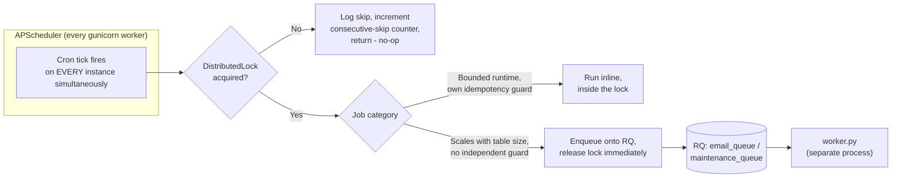
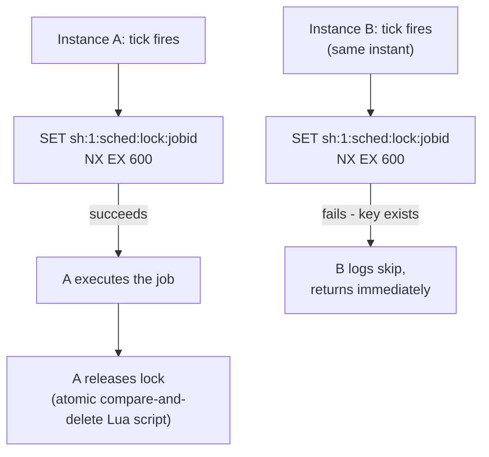

# StudyHub — Background Jobs & Asynchronous Architecture

This document inventories every actual scheduled job, queued job, and background thread in the codebase — what triggers it, what it does, how it fails, and whether it's idempotent. It also draws an explicit line between genuine background processing and the much larger set of synchronous request-time side effects (badge checks, reputation awards) that are *not* background jobs, since conflating the two would misrepresent the architecture.

See [ARCHITECTURE.md](./ARCHITECTURE.md) for how these processes fit into the overall runtime.

---

## 1. Process Model

Three distinct execution contexts run code in this codebase:

| Context | Mechanism | Where |
|---|---|---|
| Scheduled (cron-style) | APScheduler `BackgroundScheduler`, in-process | `scheduler.py`, started from `create_app()` |
| Durable queue | RQ (Redis Queue), separate worker process | `services/job_queue.py`, run by `worker.py` |
| Fire-and-forget thread | Python `threading.Thread(daemon=True)` | AI title generation, Learnora thread replies, email (legacy path) |

These are architecturally different guarantees, and the codebase treats them differently on purpose. A daemon thread has no retry, no persistence, and dies silently if the process restarts mid-job — it's used only where that's an acceptable risk (a nice-to-have AI-generated title; if it's lost, the fallback truncated title is already showing). An RQ job survives a worker restart and retries on failure — it's used for anything where losing the work matters (email delivery, data cleanup). The scheduler sits above both, deciding *when* something runs and, since the horizontal-scaling work, *whether it's safe to run given other running instances*.

---

## 2. Scheduled Jobs (APScheduler)

All five jobs below are registered on **every** scheduler-enabled instance, on the same cron schedule. What makes running more than one instance safe is not deduplicated registration — it's a Redis distributed lock (`services/distributed_lock.py`) wrapped around each job's *body*. On any given tick, every instance attempts the lock; exactly one wins and executes; the rest log a skip and return within milliseconds.

The release is a compare-and-delete Lua script, not a plain `DEL` — a lock whose TTL already expired and was re-acquired by a *different* instance can never be deleted out from under that new owner by the original (now-late) caller's release call.

### 2.1 `weekly_leaderboard_snapshot`

- **Purpose:** Persist a full-platform ranking snapshot so rank-change deltas ("▲3 this week") can be computed later.
- **Trigger:** Cron, every Sunday 00:05 UTC.
- **Processing:** Calls `leaderboard_service.take_snapshot("weekly")` — ranks every approved user by `User.reputation`, computes department rank via a separate two-query pass, bulk-inserts `LeaderboardSnapshot` rows.
- **Database interaction:** Reads `User`, `StudentProfile`; writes `LeaderboardSnapshot`.
- **Idempotency:** `take_snapshot()` itself checks for an existing snapshot of that type for today's date **before** doing any work — a genuine idempotency guard independent of the lock. The lock closes a real TOCTOU race this guard alone can't: two instances could both check "no snapshot today," both find none, and both proceed, since the check has no unique constraint backing it. The lock is what actually prevents duplicate execution; the DB check is defense in depth for when the lock itself is contended.
- **Side effect:** Also warms the single hottest leaderboard cache key (`weekly, no department, page 1`) immediately after the snapshot — deliberately scoped to just that one key, not every period/department combination, since the snapshot job already touches every approved user's row and this is plausibly the single most-requested cache key in the app.
- **Failure handling:** Redis lock unreachable → job skipped this tick, retried next Sunday. `EVENT_JOB_ERROR` listener forwards any exception to Sentry with `scheduler_job_id` tagged.

### 2.2 `monthly_leaderboard_snapshot`

- Identical mechanism to 2.1, `snapshot_type="monthly"`, fires 1st of month 00:10 UTC.

### 2.3 `counter_reconciliation`

- **Purpose:** Safety-net comparison of denormalized counters (`comments_count`, `bookmark_count`, `views_count`, `positive_reactions_count`, `Thread.member_count`, `Thread.message_count`) against a real `COUNT(*)`.
- **Trigger:** Cron, every Sunday 00:20 UTC — offset 15 minutes after the weekly snapshot specifically to avoid DB-load contention in the same window.
- **Processing:** `reconciliation_service.reconcile_denormalized_counts()`. Batch-computes actual counts via `GROUP BY` queries (not per-row `COUNT(*)`).
- **Behavior split — this is the interesting part:** display-only counters are silently corrected via bulk `UPDATE`. `Thread.member_count` — a **capacity-gating** counter, since it's checked against `max_members` elsewhere — is alert-only. A drift is logged at `logger.warning` and never auto-corrected, because auto-correcting a counter that gates admission risks masking a real bug that's actively over-admitting members past capacity. The distinction is explicit in the code, not incidental.
- **Idempotency:** Naturally idempotent — recompute-and-compare produces the same result regardless of how many times it runs.

### 2.4 `activity_feed_cleanup`

- **Purpose:** Delete `ActivityFeed` rows past their documented 24-hour expiry. Before this job existed, expired rows were only ever *filtered out* at read time — nothing ever deleted them, so the table grew unbounded.
- **Trigger:** Cron, daily 03:00 UTC.
- **Processing:** This is the one scheduled job that does **not** run inline inside the lock — it enqueues onto `maintenance_queue` and releases the lock immediately. The reasoning given in the code: this job's cost scales with table size (unlike the snapshot/reconciliation jobs, which are bounded regardless of table size), so it belongs in a durable, retryable queue rather than inside a scheduler tick with a fixed lock TTL.
- **Batching:** Deletes in bounded batches of 5,000, one commit per batch — never one giant `DELETE ... WHERE expires_at < :cutoff` transaction that would scale with total table size. Capped at 200 batches per run (1,000,000 rows) as a safety valve; if more is pending, the *next* scheduled run continues rather than one run monopolizing a worker slot indefinitely.
- **Idempotency:** A re-run after a partial failure simply finds fewer or zero expired rows on its next batch-select — a correctness no-op by construction.
- **Retry:** `Retry(max=3, interval=[30, 300])` — tuned for a DB-connection-blip failure mode, which benefits from more backoff time than a transient SMTP failure would.

### 2.5 `stale_ai_conversation_alert`

- **Purpose:** Surface AI-conversation storage-growth risk (archived conversations with an unbounded `messages` JSON blob) without unilaterally deciding a retention policy.
- **Trigger:** Cron, every Sunday 00:25 UTC.
- **Processing:** Read-only. Counts archived `AIConversation` rows past a 180-day threshold and sums their `total_messages` as a rough storage-size proxy. Logs the result. **Never deletes anything** — mirrors the reconciliation job's "alert vs. auto-correct" split, applied to a genuinely new situation of the same shape.
- **Retry:** `Retry(max=2, interval=[60])` — lowest-stakes job in the system (read-only, weekly, alert-only); the worst-case failure is one log line arriving late.

---

## 3. Durable Queue Jobs (RQ)

Two named queues, defined once in `services/job_queue.py` so no call site constructs its own `Queue(...)`:

| Queue | Timeout | Jobs |
|---|---|---|
| `email_queue` | 30s | `send_email_job` |
| `maintenance_queue` | 600s | `cleanup_expired_activity_feed_job`, `alert_stale_ai_conversations_job` |

### 3.1 `send_email_job`

- **Purpose:** The single unified email-send path, replacing two previously-separate patterns: a direct in-request `mail.send()` call (blocking the HTTP response on SMTP latency) and an untracked daemon-thread pattern for waitlist emails (no retry, no visibility into failure).
- **Trigger:** Enqueued from `utils.py`'s `send_password_reset()`, `send_verification_email()`, and `send_email_now()` — covering password reset, email verification, and waitlist welcome/milestone emails.
- **Input:** Plain strings (`to_email`, `subject`, `html_content`) — never ORM objects, since the job runs in a separate process with its own database session and passing a detached SQLAlchemy instance across that boundary would be a real bug waiting to happen.
- **Processing:** Sends via `flask_mail.Message` inside the worker's own Flask app context.
- **Retry:** `Retry(max=3, interval=[10, 60])`.
- **Idempotency — explicitly, deliberately absent.** The module docstring states this directly: true delivery-exactly-once would require a durable send-ledger, for a codebase whose actual email surface is four low-frequency transactional types, each already protected downstream by its own single-use mechanism (`PasswordResetToken.used`, `User.email_verified`). At-least-once is the accepted, reasoned trade-off — a retried email might send twice, but a retried password-reset link only *works* once regardless, because the token it contains is single-use at the database level. This is a real engineering trade-off explicitly reasoned through, not an oversight.
- **Failure handling:** Raises on failure rather than catching and returning `False` — a deliberate change from the old `send_email_now`'s behavior, specifically so RQ's `FailedJobRegistry` actually populates on genuine failures instead of failures being invisible.

### 3.2 `cleanup_expired_activity_feed_job` / `alert_stale_ai_conversations_job`

- Covered in §2.4 / §2.5 above — these are the RQ job **bodies**; the scheduler entries are the enqueue-triggers.

---

## 4. Fire-and-Forget Background Threads

Not RQ jobs — plain daemon threads, used only where losing the work is genuinely low-stakes.

### 4.1 AI conversation title generation

- **Trigger:** First message in a new `AIConversation`, or explicit reset via `/api/chat/reset-title`.
- **Processing:** An instant, synchronous truncated-fallback title is shown immediately (`"Explain quantum entangl..."`); a background thread then calls the AI provider layer to generate a real descriptive title and updates the row once ready.
- **Why a thread, not RQ:** if the process restarts before the thread completes, the user simply keeps the truncated fallback title — a fully acceptable degradation with no data loss and no user-visible error.

### 4.2 Learnora thread AI dispatch (`@mention`, auto-reply, per-message actions)

- **Trigger:** `@learnora` (or another persona) mentioned in a thread message; a reply to an AI message with no explicit trigger (auto-continue); or one of five AI action buttons (summarize/translate/explain/to_code/fact_check).
- **Processing:** Runs on a bounded `ThreadPoolExecutor(max_workers=8)`, not an unbounded `threading.Thread(...).start()` per call — this cap was added specifically because each in-flight call holds one DB connection from the pool for the duration of an AI provider round trip, and an unbounded number of concurrent AI calls could exhaust the connection pool under load.
- **Rate limiting:** Two independent Redis-backed fixed-window limiters — one for message sends and a separate one for the five AI action buttons (10 per 5 minutes by default) — deliberately not sharing a budget, since triggering an AI action is a materially different cost profile from sending a chat message.
- **Auto-reply-specific limit:** 3 auto-replies per 5 minutes per (user, thread) pair, tracked in a process-local dict — flagged in the code as the one piece of this subsystem *not yet* migrated to Redis, unlike the other two limiters, since it's a real working limiter that needs migrating rather than dead code needing to be built from scratch.
- **Result delivery:** The AI reply is persisted as a `ThreadMessage` (sender = the configured bot user ID) and broadcast to the thread's WebSocket room — not returned via any HTTP response, since the triggering event was itself a WebSocket message.

### 4.3 AI model discovery (startup only, not per-request)

- **Trigger:** Once, explicitly, from `create_app()` after all blueprints are registered — **not** from the provider manager's constructor. This split was a deliberate fix: instantiating the manager used to trigger a live network call as an import-time side effect, which broke running the module (and the test suite) without network access.
- **Processing:** Queries each provider's `/v1/models` endpoint (skipped for providers with self-updating aliases or static lists) and re-ranks the model priority list. Checks the shared Redis cache first — a cache hit applies the ranked list with zero HTTP calls, closing a real cross-instance consistency gap: without the shared cache, two instances could independently discover slightly different model lists from a transiently-inconsistent provider response and route two requests for the same feature to different underlying models.

---

## 5. What Is *Not* a Background Job

Worth stating explicitly, since it's easy to over-claim asynchronicity: badge checking, reputation milestone checking, and daily activity/streak recording all happen **synchronously**, inline, inside the request that triggers them (a like, a login, a marked-helpful comment). They are automated in the sense that no human explicitly asks for them, but they are not queued, not retried independently, and not decoupled from the request — a slow badge-check loop (evaluating all 18 badge criteria in one pass) adds directly to that request's latency. This is a real, current architectural characteristic, not a limitation hidden by generous background-job framing.

---

## 6. Reliability Summary

| Mechanism | Where | Guards against |
|---|---|---|
| Distributed lock, fail-**closed** | Every scheduled job | Duplicate execution across instances (the single fail-closed exception to this app's fail-open default) |
| DB-level idempotency check | `take_snapshot()` | Duplicate snapshot rows even if the lock is somehow bypassed |
| Bounded batch processing | `cleanup_expired_activity_feed_job` | One job run monopolizing a worker on a very large table |
| Retry with backoff | All three RQ job types | Transient DB/SMTP blips |
| Bounded thread pool | Learnora dispatch | Connection-pool exhaustion under concurrent AI usage |
| Redis-backed cross-instance rate limits | Thread messages, AI actions | A limiter that resets every time a user's connection lands on a different instance |
| Consecutive-skip alerting | Scheduler lock wrapper | A stuck/permanently-unreachable Redis silently disabling every scheduled job forever with no signal beyond a per-tick warning log |

---

**See also:** [ARCHITECTURE.md](./ARCHITECTURE.md) for the runtime/process model these jobs execute within · [PRODUCT_OVERVIEW.md](./PRODUCT_OVERVIEW.md) for the user-facing features these jobs support.
