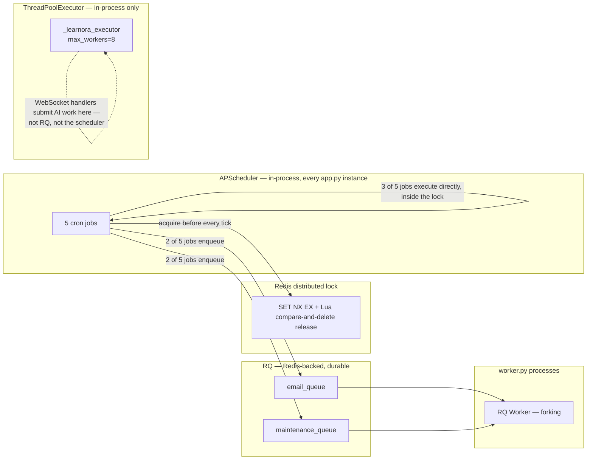
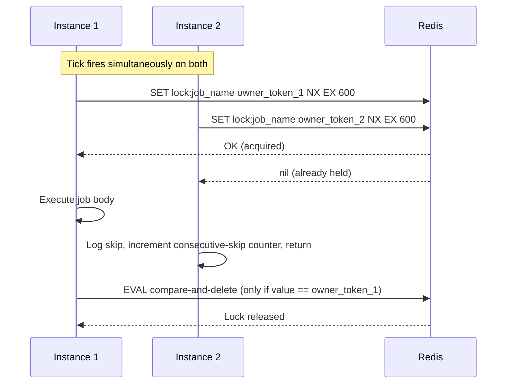
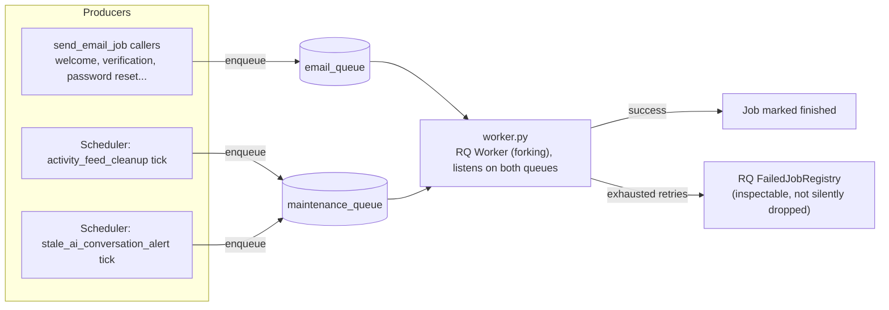
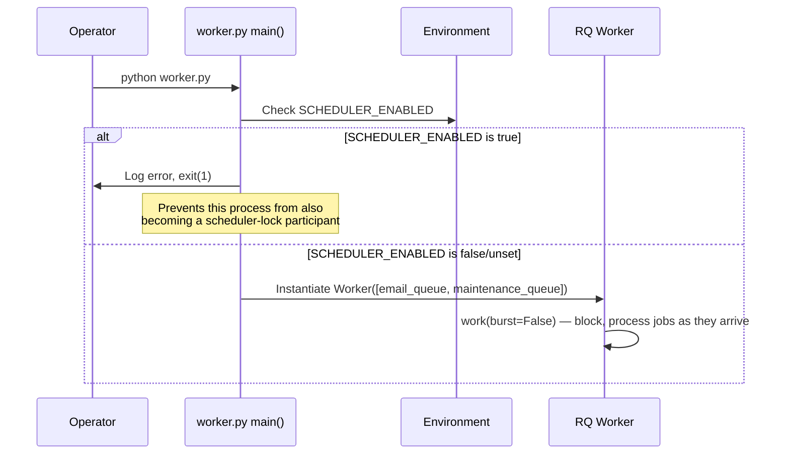

# Background Jobs & Asynchronous Processing

**Scope:** Every scheduled job, queued job, and background thread that actually ships in this codebase — what triggers it, what it touches, how it fails, and whether it's safe to run twice.

**Audience:** Anyone operating, extending, or reviewing this system.

---

## 1. Why this exists as its own document

StudyHub's asynchronous processing isn't one mechanism — it's three, each solving a different problem, and they interact with each other:

- **APScheduler** — five cron-style jobs, one process decides "it's time," and that decision has to be made exactly once across however many processes are running.
- **RQ (Redis Queue)** — two durable queues for work that shouldn't block an HTTP response and needs a real retry policy if it fails.
- **A bounded thread pool** — for a narrower case (thread AI dispatch) where the constraint is "don't block the WebSocket event loop," not "survive a process restart."

None of these are used interchangeably. Which one a given piece of work uses is a real decision, not an accident of what was convenient at the time — see §6 for how the codebase reasons about that choice explicitly.

---

## 2. Scheduled jobs (APScheduler)

All five jobs are registered in `scheduler.py` and run inside every process where `SCHEDULER_ENABLED=true` — which, without the lock described below, would mean every instance fires every job on every tick. The lock is what makes running more than one scheduler-enabled process safe at all.

### 2.1 Distributed locking — the mechanism every job shares

Every job wraps its body in `DistributedLock.acquire()` before doing anything. The lock uses a single atomic `SET key value NX EX ttl` for acquisition — no separate exists-check followed by a set, which would race — and a **Lua script** for release, so the lock is only ever deleted by the exact `owner_token` (`host:pid:uuid4`, fresh per attempt) that acquired it. Without the Lua script, a lock that outlived its TTL and was re-acquired by a different instance could be deleted by the *original* caller's now-late `release()` call, handing the lock to nobody and letting a third instance acquire it mid-tick.

**This is the one deliberate fail-closed exception in an otherwise fail-open codebase.** If Redis is unreachable when `acquire()` is called, it returns "not acquired" and the job is skipped for that cycle — never executed unprotected. The reasoning, stated directly in the code: duplicate leaderboard-snapshot writes or duplicate email sends are worse than a missed tick, so this is the one place the app inverts its "always keep working" default.

Every process that loses the lock race logs the skip and increments a **consecutive-skip counter** for that job. Five consecutive skips triggers a `logger.error` + Sentry alert — the intended signal for "something is wrong with the instance that keeps winning the lock; it may be silently failing to complete its work," rather than a routine "another instance was faster" log line.

### 2.2 The five jobs

#### `weekly_leaderboard_snapshot`
- **Purpose:** Writes weekly `LeaderboardSnapshot` rows (global rank, department rank, score) used for "you moved up 3 places this week" trend indicators.
- **Trigger:** Cron — every Sunday at 00:05 UTC.
- **Processing:** Executes directly inside the lock, calling `leaderboard_service.take_snapshot("weekly")`. This is exactly the job the distributed lock's fail-closed design exists for; a duplicate run produces duplicate snapshot rows for the same period, corrupting the trend calculation that reads "most recent two snapshots" off this table.
- **Idempotency:** Not idempotent by itself — relies entirely on the lock preventing concurrent execution, which is why this lock fails closed rather than open.

#### `monthly_leaderboard_snapshot`
- **Purpose:** The monthly counterpart to the job above — same `take_snapshot()` function, called with `"monthly"` instead of `"weekly"`, writing the monthly trend baseline.
- **Trigger:** Cron — the 1st of each month at 00:10 UTC.
- **Processing / idempotency:** Identical reasoning to `weekly_leaderboard_snapshot` — the job's own docstring says as much rather than duplicating the explanation.

#### `counter_reconciliation`
- **Purpose:** Weekly safety net comparing every denormalized counter (`comment_count`, `view_count`, `bookmark_count`, `Thread.member_count`, etc.) against a real `COUNT(*)` over the underlying rows.
- **Trigger:** Cron — every Sunday at 00:20 UTC, deliberately offset 15 minutes after the weekly snapshot job's 00:05 slot so the two don't contend for database load in the same window.
- **Processing:** Executes directly inside the lock, calling `reconciliation_service.reconcile_denormalized_counts()`.
- **Behavior on drift:** Split by counter type (see `ARCHITECTURE.md` §8) — display-only counters are silently corrected; `Thread.member_count` is **alert-only**, logged but never auto-corrected, because it gates a real capacity check elsewhere and auto-correcting risks masking an active over-admission bug rather than surfacing it.
- **Idempotency — and a distinction worth keeping precise:** the job's own code comments draw a real line between what this lock is doing here versus what it's doing for the snapshot jobs. The reconciliation work is naturally idempotent on its own (recompute, then update only if different), so the lock here isn't closing a correctness gap the way it is for the snapshot jobs — it exists purely to avoid two instances redundantly running the same full-table scan concurrently, not to prevent a duplicate write from corrupting data.

#### `activity_feed_cleanup`
- **Purpose:** Deletes `ActivityFeed` rows past their promised 24-hour `expires_at`. The model's own docstring promises 24-hour expiry, but nothing previously enforced that at the storage layer — the activity feed's read path (`homework_system.get_activity_feed`) only ever filtered expired rows out at read time, meaning expired rows accumulated indefinitely until this job existed.
- **Trigger:** Cron — daily at 03:00 UTC. Fires the locked tick, which then enqueues the real work onto `maintenance_queue` rather than executing inline — see §3.1 for why this one (and the job below) are dispatched to RQ instead of run directly, unlike the three jobs above.
- **Processing:** `cleanup_expired_activity_feed_job` — full detail in §3.1.
- **Idempotency:** Genuinely idempotent, by construction rather than by accident (§3.1).

#### `stale_ai_conversation_alert`
- **Purpose:** A read-only, non-destructive alert — counts archived `AIConversation` rows past a staleness threshold (180 days, explicitly flagged in the code as a default to tune once real growth data exists, not a derived retention policy) and logs both the count and an approximate total-message figure as a storage-growth signal. Deletes nothing.
- **Trigger:** Cron — every Sunday at 00:25 UTC, offset 5 minutes after `counter_reconciliation`'s 00:20 slot for the same load-contention reasoning.
- **Processing:** Fires the locked tick, which enqueues `alert_stale_ai_conversations_job` onto `maintenance_queue` — full detail in §3.2.
- **Design note:** This job deliberately mirrors `reconciliation_service.py`'s own "alert vs. auto-correct" split for capacity-gating counters (§2.2 above), applied to a new situation of the same shape — surfacing a number worth knowing about without the job unilaterally deciding a retention or deletion policy on the application's behalf.

---

## 3. RQ queues

Two named queues, both consumed by the same `worker.py` process (or several, for horizontal scale): `email_queue` and `maintenance_queue`. Separating them by name — rather than one generic queue — means a burst of email sends can't starve maintenance jobs behind it in the same FIFO line, and vice versa.

### 3.1 `send_email_job`

- **Purpose:** Delivers transactional email (welcome, email verification, password reset, and other notification emails) off the request path.
- **Trigger:** Any code path calling `utils.send_email_now(..., async_send=True)` — which is the default and the path essentially every caller in the codebase uses. `auth.py`'s registration and password-reset flows, and the general notification email helpers, all funnel through this rather than each hand-rolling its own send.
- **Input:** Recipient address, subject, rendered HTML body.
- **Processing:** Calls `Flask-Mail`'s `mail.send()` inside an app context established by the job body (RQ jobs run outside any request context, so the app context has to be created explicitly).
- **Retry policy:** Configured via `job_specs.py` — per-job retry counts and backoff live in one place rather than being hardcoded at each `enqueue()` call site, so the policy for "how hard should we retry an email send" is visible and adjustable without hunting through call sites.
- **Failure handling:** The job body **raises** on failure rather than catching and swallowing the exception — this is deliberate: if `send_email_job` caught its own exceptions, RQ would see every attempt as "succeeded" and the job would never land in RQ's `FailedJobRegistry`, silently discarding a failed email send with no operational visibility. Letting the exception propagate is what makes exhausted retries actually observable.
- **Idempotency:** Not inherently idempotent — a retried send can, in principle, deliver a duplicate email if the first attempt actually succeeded but failed to report success (e.g., a network drop after the SMTP transaction completed). This is an accepted trade-off for transactional email, where a duplicate is a minor annoyance and a lost password-reset email is a real support problem.

### 3.2 `cleanup_expired_activity_feed_job`

- **Purpose:** The RQ-side body of the scheduled `activity_feed_cleanup` tick (§2.2). Deletes `ActivityFeed` rows whose `expires_at` has passed — making the model's own documented 24-hour-expiry promise actually true at the storage layer, rather than only enforced by the read path filtering expired rows out.
- **Trigger:** Enqueued by the daily scheduler tick, not run inline inside the locked tick.
- **Why this one is dispatched to RQ instead of executed directly, unlike the three scheduled jobs that run inline:** deleting an unbounded number of expired rows in one transaction is exactly the kind of open-ended, potentially-slow operation the scheduler's lock is a bad place to hold — the lock has a fixed TTL, and a genuinely large backlog of expired rows could, in principle, run long enough to threaten that TTL. Handing it to RQ moves the actual deletion work off the time-boxed scheduler tick and onto a queue with no such constraint.
- **Processing:** Deletes in **bounded batches** of 5,000 IDs at a time rather than one unbounded `DELETE ... WHERE expires_at < now()`, committing once per batch. A second safety valve caps the whole job run at 200 batches (1,000,000 rows) — if more than that is pending, the job stops and logs a warning rather than monopolizing a worker slot indefinitely, deliberately leaving the remainder for the next scheduled run.
- **Idempotency:** Genuinely idempotent, by construction rather than by accident — each batch selects rows still matching the expiry condition and deletes exactly those; re-running after a partial failure (a crash mid-batch, a duplicate enqueue) simply finds fewer or zero matching rows on the next pass. There's no "have I already processed this row" bookkeeping to get wrong, because the deletion condition itself is the idempotency check.

### 3.3 `alert_stale_ai_conversations_job`

- **Purpose:** A read-only storage-growth signal, not a cleanup job — it counts archived `AIConversation` rows whose `last_message_at` is older than a 180-day threshold, plus an approximate total-message count across those rows (used as a cheap proxy for the size of the unbounded JSON `messages` blob each conversation stores, without computing real byte sizes in SQL), and logs both. **It never deletes anything.**
- **Trigger:** Enqueued by the weekly `stale_ai_conversation_alert` scheduler tick.
- **Why this exists as an alert rather than an auto-cleanup job:** the code deliberately mirrors the same "alert vs. auto-correct" split `reconciliation_service.py` applies to capacity-gating counters (§2.2) — deciding a retention/deletion policy for archived AI conversation history is a product decision, not something a maintenance job should make unilaterally on the application's behalf. The 180-day threshold itself is explicitly flagged in the code as a default to tune once real growth data exists, not a value derived from a stated retention policy.
- **Processing:** Two aggregate queries (a `COUNT` and a `SUM`) against `AIConversation`, filtered on a composite index (`idx_ai_conv_archived_last_msg`) added specifically alongside this job — neither filtered column had an index before.
- **Idempotency:** Trivially idempotent — it's a read-only aggregate query with no side effect to duplicate.

### 3.4 Retry configuration (`job_specs.py`)

Retry policy is scoped per job, not a single blanket setting applied to every queue. A low-stakes, easily-repeated job and a user-facing email send don't warrant the same number of attempts or the same backoff curve, and `job_specs.py` exists specifically so that distinction is visible in one place rather than buried at each individual `enqueue()` call:

| Job | Attempts | Backoff |
|---|---|---|
| `send_email_job` | 3 | `[10, 60]` — escalating |
| `cleanup_expired_activity_feed_job` | 3 | `[30, 300]` — escalating |
| `alert_stale_ai_conversations_job` | 2 | `[60]` — fixed |

The email job's tighter initial backoff (10s) reflects that a transient SMTP hiccup is often gone within seconds; the cleanup job's wider spread (30s → 300s) gives more room for whatever caused a batch delete to fail — a lock contention, a transient connection drop — to clear before retrying a heavier operation.

---

## 4. `worker.py` — the RQ worker process

`worker.py` is meant to run as an independent, horizontally-scalable deployable, separate from the API process. Its one notable piece of defensive engineering: **it refuses to start if its own environment has `SCHEDULER_ENABLED` set to true.** A worker process running the scheduler alongside its normal job-processing duties would silently join the distributed-lock race described in §2.1 for zero benefit — every additional scheduler-enabled process is one more instance that can win a given tick's lock and then do nothing useful with it, while adding one more competitor for every other legitimate scheduler instance. Rather than let this happen quietly and get discovered later from scheduler logs, `worker.py`'s startup path checks this explicitly and exits immediately with a clear log line if the guard trips — the failure mode is "the process won't start," not "the process starts and something's subtly wrong."

The worker uses RQ's default forking `Worker` (not `SimpleWorker`) — appropriate here because a dedicated worker process has no other in-process threads whose state a fork could corrupt, unlike the combined-process mode described below.

---

## 5. Combined-process mode (`start-all.py`)

For deployments where running three separate processes (API, worker, and — implicitly — the in-process scheduler) isn't practical, `start-all.py` runs all three inside one process tree: the Flask/SocketIO app on the main thread (identical to running `app.py` directly), an RQ worker on a background thread, and the scheduler in-process exactly as it already runs whenever `SCHEDULER_ENABLED=true`.

This does not replace the separated-process deployment — both entry points share the same `create_app()` factory unmodified, and choosing one doesn't change the other's behavior. Two things make the combined mode correct rather than a naive "just spawn a thread" hack:

**It uses RQ's `SimpleWorker`, not the default `Worker`, specifically because it runs inside a thread of an already-multi-threaded process.** The default `Worker` forks (`os.fork()`) to isolate each job — safe in a dedicated, otherwise-single-purpose process, but a well-documented hazard inside a process that already has other threads running (only the forking thread survives in the forked child; every other thread's state is silently gone). `SimpleWorker` runs jobs in-thread with no fork, which is the correct trade-off specifically for this combined-process case.

**RQ's signal handling is deliberately disabled on the worker thread.** `SimpleWorker.work()` calls `_install_signal_handlers()` internally, and `signal.signal()` only works from the main thread of the main interpreter — calling it from a background thread raises `ValueError` before a single job is processed. `start-all.py` subclasses `SimpleWorker` to override that method into a no-op, and installs its own `SIGINT`/`SIGTERM` handlers on the actual main thread instead, which then defer to `socketio.run()`'s own shutdown path. The worker thread itself runs as a daemon thread, so process exit is never blocked waiting on it.

`SCHEDULER_ENABLED` is set to default `true` specifically for this entry point (via `os.environ.setdefault`, before any app modules are imported — `config.py` reads this at class-definition/import time) — this is the one context where a worker-like process and the scheduler are meant to coexist, which is exactly the combination `worker.py`'s own startup guard (§4) exists to prevent in the separated-process deployment.

---

## 6. The narrower case: `_learnora_executor` (not RQ, not the scheduler)

Thread AI dispatch (`@mention` triggers, meeting-notes generation, per-message AI actions — see `ARCHITECTURE.md` §11) runs on a dedicated, bounded `ThreadPoolExecutor(max_workers=8)`, not RQ and not raw unbounded `threading.Thread` calls.

This is a genuinely different problem from the RQ jobs above, and the codebase treats it as such rather than reaching for the same tool by default. AI dispatch from a WebSocket handler needs to **not block the event loop** handling that WebSocket connection — an inline, synchronous AI call would freeze message delivery for every other user sharing that connection's event loop while the AI call is in flight. It does not need queue durability across a process restart, since a lost mid-flight AI reply is a bounded, low-stakes UX gap (the user can just re-send the trigger), not a lost transactional email or a duplicated database write. A bounded thread pool solves the actual constraint (don't block the loop) without the operational overhead RQ would add for a job that doesn't need to survive a crash — and `max_workers=8` caps the concurrent AI call count so a burst of simultaneous `@mention`s across many threads can't spawn unbounded concurrent outbound HTTP calls to the AI providers.

---

## 7. What's explicitly not idempotent, and why that's an accepted trade-off

Not every job here is idempotent, and the ones that aren't are exceptions worth naming rather than hiding:

- **`weekly_leaderboard_snapshot`** and **`monthly_leaderboard_snapshot`** rely entirely on the distributed lock to prevent concurrent/duplicate execution — a duplicate run would write duplicate snapshot rows for the same period and corrupt the "moved up N places" trend read off the two most recent snapshots. This is precisely why the lock fails closed instead of open.
- **`send_email_job`** can, in a narrow failure window (the SMTP transaction succeeds but the success signal is lost before RQ records it), deliver a duplicate email on retry. Accepted trade-off: a duplicate transactional email is a minor annoyance; a silently-dropped password-reset email is a real support burden.

Everything else in this document — `counter_reconciliation`, `cleanup_expired_activity_feed_job`, `alert_stale_ai_conversations_job` — is idempotent by construction: each is either a comparison-and-correct pass, a batched deletion keyed off a condition rather than a "have I done this yet" flag, or a read-only query with no side effect to duplicate in the first place.

---

*For the Redis roles these jobs depend on (distributed lock, cache, presence), see [`ARCHITECTURE.md`](ARCHITECTURE.md) §13. For the AI dispatch these background systems support, see [`ARCHITECTURE.md`](ARCHITECTURE.md) §11.*
