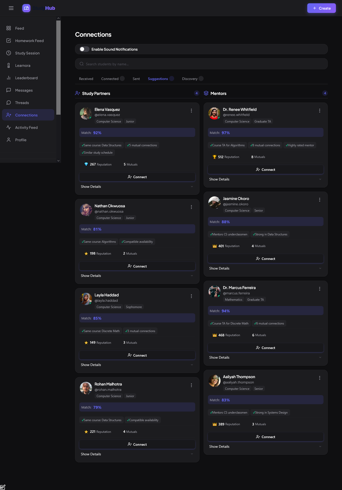
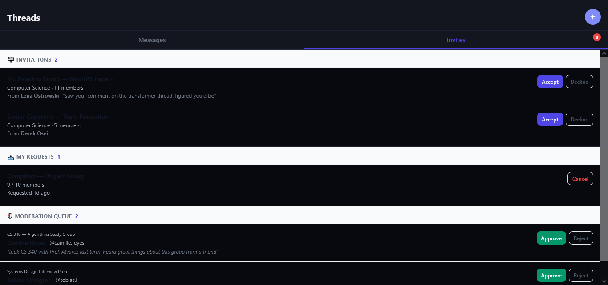
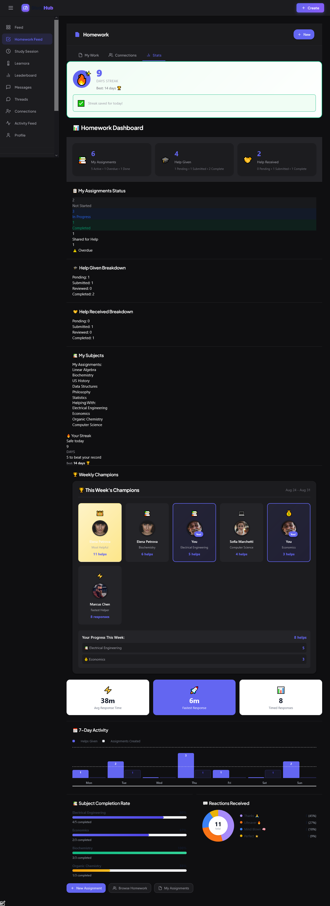
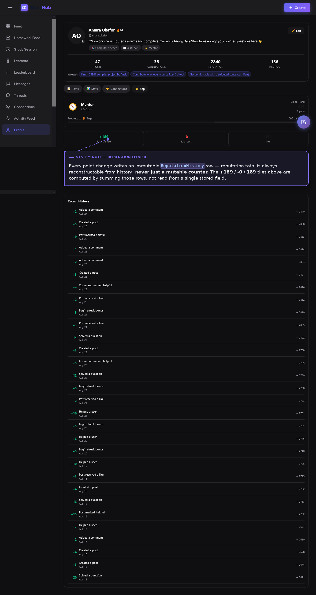
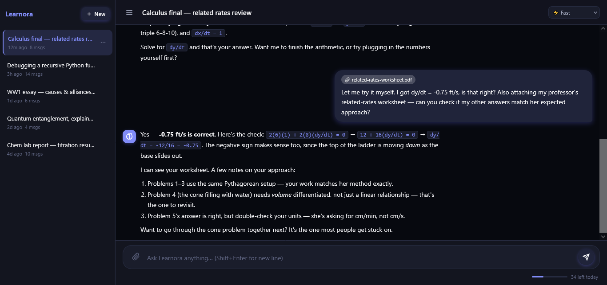
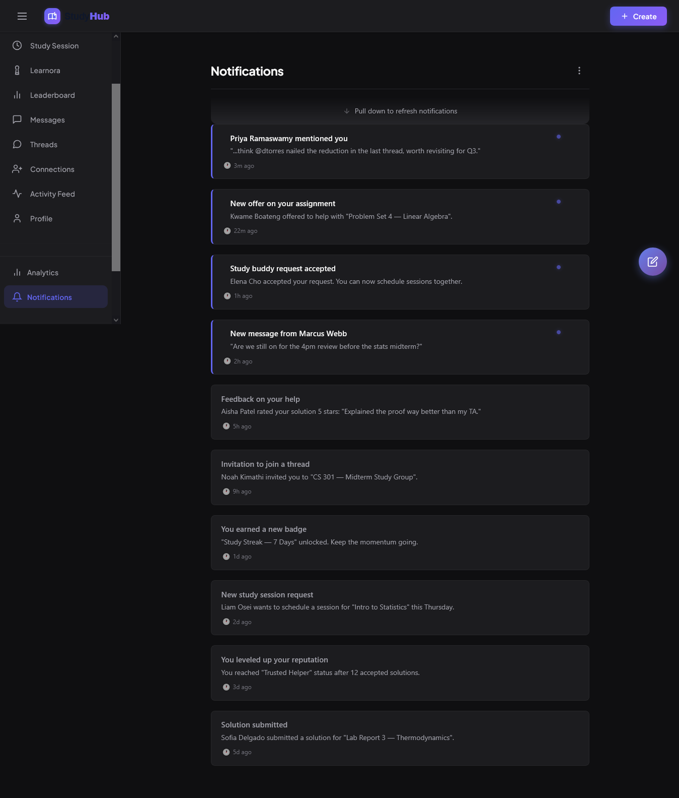

# StudyHub — Product Overview

StudyHub is a peer academic collaboration platform for a university student body. This document explains what it does and why, at the product level, and points into [ARCHITECTURE.md](./ARCHITECTURE.md) wherever a feature is backed by something worth a closer technical look.

---

## 1. The Problem

A student stuck on a problem set at 11pm has no reliable way to find a classmate who already understands the material, is online right now, and is willing to help — outside of scattered group chats with no structure, no accountability, and no reward for the people who actually show up.

Peer tutoring is abundant on any campus; it's undiscoverable. Every class has students who are strong in a subject and students who need help in that same subject, and nothing connects them except luck. StudyHub's bet is that a matching layer plus a visible reputation signal plus lightweight collaboration tooling (timers, shared notepads, embedded AI) turns that latent supply of help into something students can actually find and rely on.

---

## 2. Core User Experience

1. **Join and get matched before doing anything else.** Onboarding captures department, class level, subjects studied, subjects a student is strong in, subjects they need help with, learning style, and weekly availability — and generates ranked study-partner and mentor suggestions from that data alone, *before* the user has made a single connection or written a single post.
2. **Build a graph, not a follower list.** Connections require mutual consent (or auto-accept at high compatibility — see §4.1). Messaging is gated behind an accepted connection, by design, not as an incomplete feature.
3. **Participate.** Post questions, comment, join or create Threads, message connections, schedule or start live study sessions.
4. **Give and receive help, with a visible score.** Every meaningful contribution — a helpful answer, a marked solution, a completed homework help session — moves a transparent reputation number that shows up on leaderboards, profiles, and connection suggestions.

---

## 3. Product Domains

| Domain | What it covers | Architecture reference |
|---|---|---|
| Identity & Auth | Registration, Google OAuth, onboarding, sessions | [ARCHITECTURE.md §4](./ARCHITECTURE.md#4-authentication--authorization) |
| Social graph | Connections, blocking, compatibility scoring | [ARCHITECTURE.md §5.2](./ARCHITECTURE.md#52-connections--one-table-one-column-closing-a-real-ambiguity-bug) |
| Content | Posts, comments, reactions, bookmarks | — |
| Threads | Private group chat, roles, moderation | [ARCHITECTURE.md §7](./ARCHITECTURE.md#7-websocket--real-time-architecture) |
| Messaging | 1:1 DMs, read receipts, reactions | [ARCHITECTURE.md §7](./ARCHITECTURE.md#7-websocket--real-time-architecture) |
| Homework marketplace | Personal tracker + peer-help publishing | — |
| Study Sessions | Scheduled proposals + live collaborative sessions | — |
| Gamification | Reputation, badges, streaks, leaderboards | [ARCHITECTURE.md §5.1](./ARCHITECTURE.md#51-reputation--an-append-only-ledger-not-a-mutable-counter) |
| Learnora (AI) | Chat, thread mentions, per-post Q&A, meeting notes | [ARCHITECTURE.md §6](./ARCHITECTURE.md#6-ai-architecture) |
| Analytics | Personal dashboards, insights, activity heatmap | — |
| Notifications | In-app, push, email | [ARCHITECTURE.md §11](./ARCHITECTURE.md#11-error-handling) / [BACKGROUND_JOBS.md](./BACKGROUND_JOBS.md) |

---

## 4. Feature Walkthroughs

### 4.1 Connections — compatibility scoring and instant connect

A connection request computes a live 0–100 compatibility score from shared subjects, complementary help/strength overlap, schedule overlap, and department match. At **≥70%**, the connection auto-accepts immediately — no approval step, both parties notified — while anything below that still requires explicit acceptance. This isn't a blanket anti-friction decision; it's scoped specifically to matches the system has real signal on, since the score comes from onboarding data the user themselves provided, not an inferred guess.

A rejected request enters a 24-hour cooldown before it can be resent, computed from `responded_at` — long enough to stop immediate re-spam, short enough that a genuine reconsideration isn't permanently blocked.

Discovery has multiple distinct surfaces feeding the same graph: onboarding-time suggestions (before any connections exist), friend-of-friend expansion with a generic high-reputation fallback if the user has none yet, and a blended "study partners vs. mentors" ranked list with human-readable match reasons attached to every entry (`"Same course: Data Structures"`, `"5 mutual connections"`).

### 4.2 Threads — moderated group chat with AI personas embedded directly

A Thread is a private, role-gated (creator/moderator/member) chat space, distinct from a post's public comments. Five AI personas — Learnora, TeacherAI, CoderAI, ProductAI, FunnyAI — are triggerable by `@mention`, each with a distinct system prompt and displayed identity, so `@coderai` gets a code-first senior-engineer voice while `@teacherai` gets a slower, pedagogical one for the same underlying model.

Replying to an AI message *without* a manual trigger continues the conversation with Learnora automatically — rate-limited to 3 auto-replies per 5 minutes per (user, thread) specifically to prevent a runaway AI back-and-forth. On demand, the last 10–500 messages can be summarized into structured meeting notes (topics discussed, decisions, action items, open questions) and persisted for later retrieval — the request/response shape for this is documented in [ARCHITECTURE.md §6.3](./ARCHITECTURE.md#63-the-consolidated-call-path).

Moderation has a real queue, not just an accept/reject button: join requests carry an optional message from the requester, and a creator/moderator can approve, reject, or bypass the queue entirely with a direct invite.

### 4.3 Homework marketplace — a private tracker that becomes a public feed on demand

Every assignment starts as a private `Assignment` row with a computed priority score (urgency × difficulty × status weighting) recalculated fresh on every read, never persisted as a side effect of viewing — a genuine design decision to avoid the read-triggers-a-write pattern that's an easy trap in this kind of feature.

Marking an assignment `is_shared_for_help = true` publishes it to the owner's accepted connections' homework feed. A helper offering to help creates a `HomeworkSubmission`; the requester reviews the solution, gives feedback (a quick-reaction taxonomy plus an optional 1–5 rating), and helping streaks update using the same consecutive-calendar-day logic as login streaks.

The analytics view surfaces response-time statistics (average/fastest, formatted as human-readable durations), per-subject completion rates, and a weekly "champions" recognition (most-helpful, fastest-responder, per-subject top helper) computed from that week's completed submissions.

### 4.4 Study Sessions — scheduled negotiation and live collaboration are two different systems

`StudySessionCalendar` handles the asynchronous, proposal-based flow: propose up to 10 candidate times, the other side confirms exactly one (matched at minute resolution to tolerate timezone-string formatting differences). Rescheduling an already-confirmed session automatically flips status back to `rescheduled` and clears the confirmation, forcing re-confirmation — changing anything else (notes, resources) doesn't.

`LiveStudySession` is the real-time counterpart: independent per-user pomodoro timers computed server-side from wall-clock deltas since start (never trusted from client-reported elapsed time), a shared versioned markdown notepad, and an embedded AI tutor scoped to the session's subject and current notepad content as context — reachable without leaving the session view.

### 4.5 Reputation, badges, and leaderboards

Reputation is a single transparent number, adjusted only through one code path (`award_reputation()`), with every change writing an auditable history row. See [ARCHITECTURE.md §5.1](./ARCHITECTURE.md#51-reputation--an-append-only-ledger-not-a-mutable-counter) for the ledger mechanics — the profile view below is the user-facing surface of that ledger.

Leaderboards are deliberately multi-scoped, because "who's #1 on the whole platform" and "who's ahead of me among people I actually know" motivate very different behavior: global, department-scoped, connections-only, and "rising stars" (ranked by 7-day *gain*, not absolute total, surfacing people improving fastest regardless of current rank). The "nearby users" view — showing the handful of users immediately above and below the viewer — exists on the premise that beating the person 3 ranks above you is a more motivating target than the platform's #1.

### 4.6 Learnora — AI embedded contextually, not as a separate chatbot page

Learnora is reachable from five distinct surfaces: a dedicated multi-turn chat, thread `@mentions`, per-post Q&A ("ask Learnora about this post," grounded in the post's actual title/content), live-session tutoring, and thread meeting-note generation — all routed through the same provider layer described in [ARCHITECTURE.md §6](./ARCHITECTURE.md#6-ai-architecture).

Conversation history longer than 10 messages is automatically summarized (older turns condensed, most recent 5 kept verbatim) before being sent to the provider — bounding prompt size without losing all prior context. A response cut off by a token limit is flagged `is_last_message_complete = false` with the partial text preserved, enabling a "continue" action that tells the model explicitly what it already said rather than re-inferring intent from history alone.

### 4.7 Notifications — synchronous creation, best-effort real-time push

Every notification type (badge earned, connection accepted, mention, thread invite, homework offer, level-up, and more) funnels through one function, `notification_service.notify()`, so the field shape for each type exists in exactly one place. This closed a real, previously-shipped bug: a badge-earned notification's link was built from a literal string missing an f-string interpolation prefix — a mistake that was only possible because the notification-building logic was duplicated inline at each call site instead of centralized.

The row is written to Postgres synchronously, inside the same transaction as whatever triggered it; the real-time WebSocket push is a best-effort addition on top, wrapped so a push failure can never roll back or fail the operation it's reporting on. See [ARCHITECTURE.md §3](./ARCHITECTURE.md#3-request-lifecycle) for the exact sequencing.

### 4.8 Personal analytics

A user's own dashboard computes week-over-week deltas, a categorized activity level, a 90-day contribution heatmap (GitHub-style, with an explicit fix for a SQLite `strftime('%w')` weekday-numbering mismatch against Python's own weekday convention — the kind of off-by-one that silently mislabels every "best posting day" insight if not caught), and a small set of rules-based (not LLM-generated) insight cards: best posting day, fast-response recognition, a "you're trending" card, closest unearned badge, and department-percentile recognition.

---

## 5. Onboarding as a Product Decision, Not Just a Form

The five-step onboarding flow (department/studies → learning style → schedule → instant match preview) exists because the matching system needs real signal before it can do anything useful — and the product makes that payoff visible immediately, inside onboarding itself, rather than asking a new user to trust that connections will eventually appear.

If no candidate scores above the match threshold (new department, no active peers yet), the system falls back to the platform's top-reputation users rather than showing an empty state — onboarding never dead-ends with nothing to act on.

---

## 6. How Product Maps to Architecture

The domains above are organized as product concepts, but the codebase doesn't have a service-per-domain boundary — it has a service-per-*concern* boundary (`reputation_service`, `notification_service`, `connection_service`, `ai_provider_service`) that several product domains share. A single user action — marking a comment as a solution — touches the content domain, the reputation domain, the badge domain, and the notification domain simultaneously, and the request-lifecycle trace in [ARCHITECTURE.md §3](./ARCHITECTURE.md#3-request-lifecycle) shows exactly how those four domains compose into one transaction.

That's the actual shape of the engineering challenge here: not five separate features, but one system where most interesting user actions fan out across four or five subsystems at once, and the discipline is in making that fan-out atomic, observable, and — where a piece of it fails — non-blocking to the parts that already succeeded.

---

**See also:** [ARCHITECTURE.md](./ARCHITECTURE.md) for how these features are implemented · [BACKGROUND_JOBS.md](./BACKGROUND_JOBS.md) for the asynchronous work behind leaderboards, cleanup, and email · [README.md](./README.md) for project setup.
