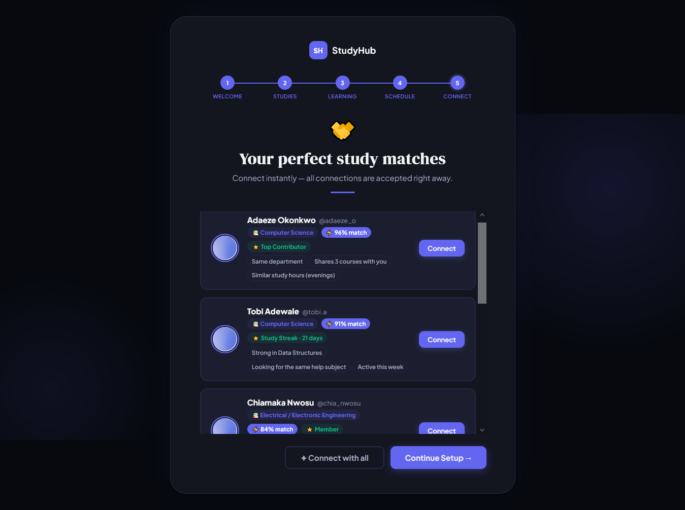
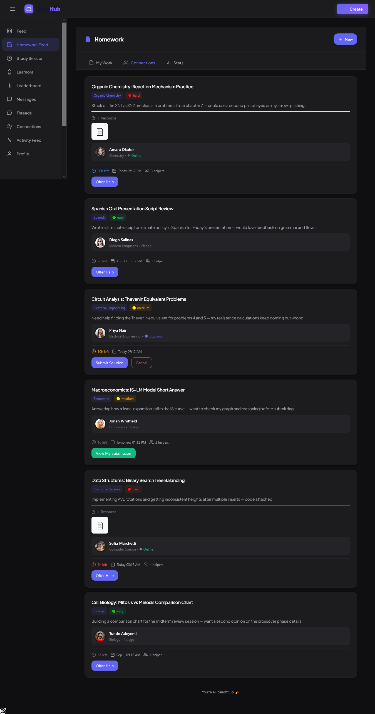
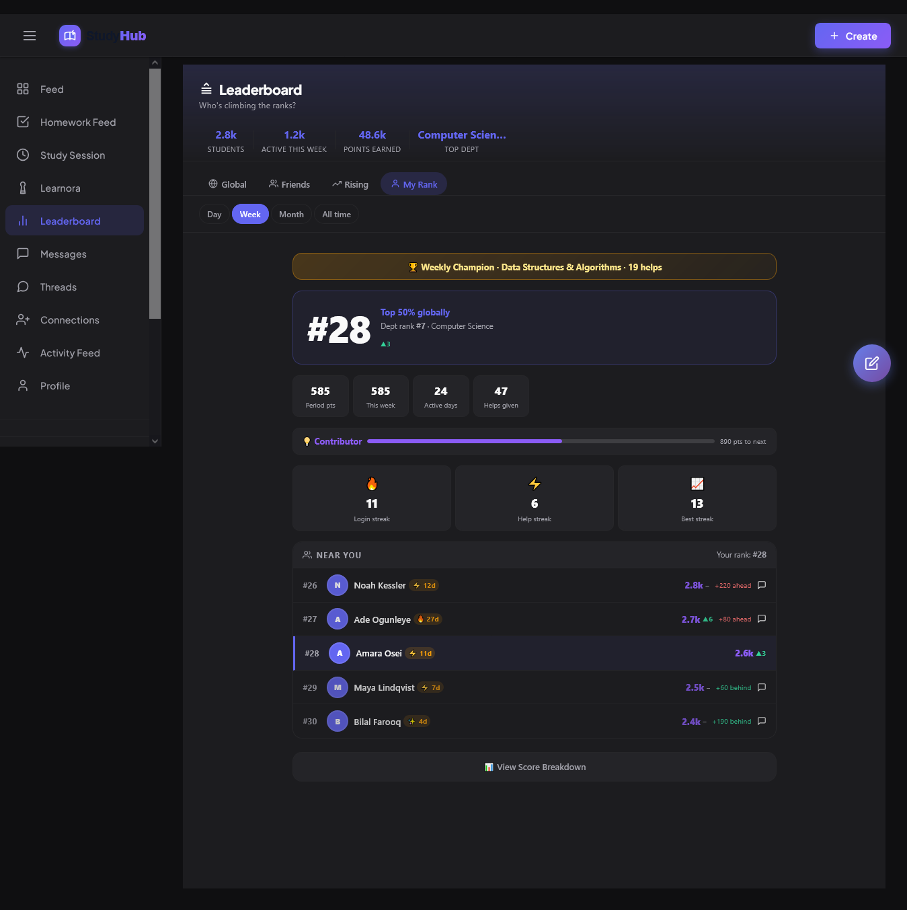
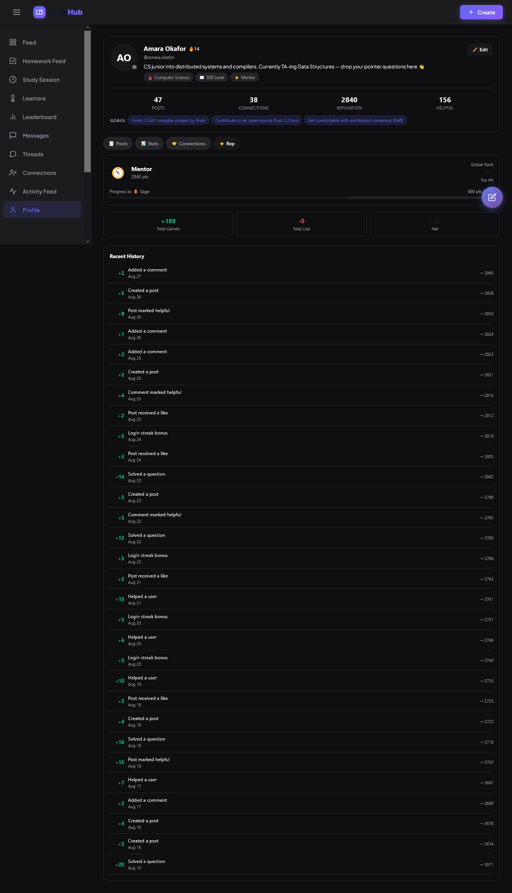

# StudyHub — Product Overview

**Scope:** What StudyHub does, how students actually use it, and what's happening underneath each feature. This is the product lens on the same system `ARCHITECTURE.md` describes from the engineering side — where a feature has real technical depth behind it, this document says so and points at the specific section that explains it.

---

## 1. What problem this solves

University students already have the raw ingredients for peer learning — classmates in the same course, people further along who've solved the same problem, study groups that form and dissolve every semester — but no single tool that connects "I'm stuck on this problem" to "someone nearby already solved it" in real time. Course forums are asynchronous and often dead by the time an answer would help. Group chats lose useful answers the moment the conversation scrolls past them. And AI chat tools have no idea what course you're in, who your study partners are, or what you already asked yesterday.

StudyHub is built around a narrower bet: peer help works best when it's *fast*, *contextual*, and backed by something that actually knows the platform's own state — not a generic chatbot bolted on the side, but an assistant that can see your thread's message history, your compatibility with a potential study partner, or the post you're asking about, and a social layer engineered so that asking for help, offering it, and getting credited for it are all low-friction.

---

## 2. Core user experience

A new student signs up, completes onboarding (department, subjects, learning style, availability), and is immediately shown ranked study-partner and mentor suggestions computed from that onboarding data — not an empty profile waiting to be filled in over weeks of usage. From there, the platform has three main gravitational pulls:

1. **The feed** — post a question, a resource, or a discussion; get help from peers, from an AI assistant, or both.
2. **Homework** — track your own assignments, optionally share the hard ones for peer help, and see who's currently the fastest/most active helper this week.
3. **People** — connections, threads, live co-study sessions, and direct messages, all gated by a real social graph rather than an open free-for-all.

Reputation, badges, and leaderboard rank accumulate as a byproduct of using the platform normally — asking good questions, giving helpful answers, showing up consistently — rather than as a separate gamified layer bolted on top.

---

## 3. Major product domains

| Domain | What it covers |
|---|---|
| **Identity & Auth** | Registration, Google OAuth, email verification, session management |
| **Onboarding & Matching** | Department/subject/schedule capture → compatibility-scored suggestions |
| **Social Graph** | Connections, blocking, compatibility scoring, mutual-connection discovery |
| **Content Feed** | Posts (questions/resources/discussions/announcements), comments, reactions, bookmarks |
| **Threads** | Persistent group chats — course study groups, project teams, spun off from a post or created standalone |
| **Direct Messages** | 1:1 chat, gated behind an accepted connection |
| **Homework** | Personal assignment tracking + a peer-help marketplace layered on top |
| **Live Study Sessions** | Synchronous, two-person co-study rooms with a shared timer and notepad |
| **Learnora (AI)** | The platform's AI assistant, threaded through five distinct surfaces |
| **Gamification** | Reputation, 18 badges, streaks, leaderboards, weekly champions |
| **Notifications** | Real-time + persisted, across every domain above |
| **Search** | Cross-domain lookup over users, posts, and threads |
| **Administration** | Moderation queue, scheduler/AI-provider health panel, manual reconciliation trigger |

---

## 4. Identity, onboarding, and matching

### Registration & auth

Sign-up supports both a traditional email/password flow and Google OAuth, converging on the same account model — a `google_id` distinct from `email` means an account created via Google and an account created via password with the same email address are never silently merged, which closes an account-hijack path a naive email-match would leave open (`ARCHITECTURE.md` §6).

New accounts go through email verification before becoming fully active (`User.is_active` requires `email_verified`, an `approved` status, and a real username — not just a row existing in the table). Sessions are cookie-based, with a short-lived access token and a longer-lived refresh token that rotates on every use and detects reuse — full mechanics in `ARCHITECTURE.md` §6.

### Onboarding → instant matches

Onboarding captures department, year, subjects, learning style, weekly availability, and — distinctly — subjects you need help with versus subjects you're strong in. That last split is what powers the "complementary skills" half of compatibility scoring (§5): matching isn't just "same interests," it's "you can help each other."

The onboarding flow ends by immediately surfacing ranked matches computed from that data, not a blank slate. A match scoring ≥70% compatible auto-accepts on the first connection request — the product decision being that forcing an accept step on an obviously strong match is friction without a real purpose.

### Rank & profile

A user's profile aggregates their posts, an activity heatmap (last-90-days contribution grid — the visual language is deliberately similar to GitHub's contribution graph, applied to helping activity instead of commits), reputation history, and connection graph in one place — a tab-organized surface rather than several disconnected pages.

---

## 5. Social graph — connections

Connections are the platform's actual trust boundary, not just a friends list. Two things gate on an accepted connection existing: **direct messaging** (`ARCHITECTURE.md` §9 — you cannot DM a stranger, and being in the same group thread as someone does not count as being connected) and, informally, the depth of profile detail shown before you've connected at all.

**Compatibility scoring** runs on four inputs — shared subjects, complementary skills (they can help with what you need help with, and vice versa), schedule overlap, and department match — combined into a single 0–100 score (`ARCHITECTURE.md` §9, `connection_service.calculate_compatibility_score`). This score drives both the ranked suggestions shown throughout the app and the auto-accept branch on new requests (`send_connection_request`, `crud.py`).

Blocking is a first-class, unambiguous state — `Connection.blocked_by_id` records exactly who initiated a block, rather than overloading the existing requester/receiver columns to also encode that, which is what makes "is this connection blocked, and by whom" answerable without ambiguity anywhere else in the codebase that reads a `Connection` row.

Discovery surfaces four distinct views — Suggestions (compatibility-ranked), Discovery (browse), Received/Sent requests, and connected — each pulling from the same underlying compatibility and mutual-connection-count machinery rather than four independently-maintained queries.

---

## 6. Content — the feed

Posts carry a type (Question, Resource, Discussion, Announcement, Problem), tags, optional file/image attachments, and can be pinned, marked solved, or spun off into a full group thread when a conversation in the comments outgrows what a comment thread can hold.

Every post can be **reacted to**, **bookmarked** (into user-organized folders, not just a flat saved list), **commented on** (with nested reply support and per-comment "mark helpful"), and **reported** — the reporting flow captures a specific reason (spam, harassment, inappropriate content, misinformation, other) rather than a bare flag, feeding the admin moderation queue.

**"Ask Learnora" is available directly from the post-creation flow and from any existing post** — one of the five AI entry points described in §9, letting a user get an AI-generated answer grounded in the specific post's content without leaving the feed. Every post also carries an **AI action menu** (Explain / Summarize / Translate / To Code / Fact Check), the same underlying mechanism used for thread messages (`ARCHITECTURE.md` §11.1).

Engagement counts shown on every post (comments, bookmarks, views, reactions) are maintained incrementally, not recomputed on every page load, with a weekly reconciliation pass as a correctness safety net — see `ARCHITECTURE.md` §8 for exactly which counters get silently auto-corrected versus flagged for review.

---

## 7. Threads — persistent group chat

A thread is a longer-lived space than a post's comment section — a course study group, a project team, a general-purpose discussion — with real membership (creator/moderator/member roles), join requests that can require moderator approval, pinned messages, and reply threading.

**Message delivery status is real, not simulated.** Every thread message shows a genuine sent/delivered/read indicator, computed at send time from live cross-instance presence data (is the recipient's socket connected? are they actively viewing this specific thread right now?) — not a fixed delay or a guess. Status is enforced to only ever move forward once set (`ARCHITECTURE.md` §5.3), so a delivery event racing against a read event for the same message can't visually downgrade something the recipient already saw.

**Learnora is a genuine thread participant, not a bolted-on command.** `@mention`ing Learnora inside a thread gets a response from one of five distinct AI personas the thread can be configured with, using the actual message history as context. A **meeting-notes generator** can summarize the last 10–500 messages of a thread's conversation on demand. Individual messages carry the same per-message AI action menu available on posts. All of this funnels through the same classified retry/failover engine described in `ARCHITECTURE.md` §11 — the thread surface is one of five entry points into one shared AI infrastructure, not a separate implementation.

Thread member counts are a case study in the platform's honest approach to data consistency: they're denormalized for read performance, but unlike most denormalized counters on the platform, a detected drift here is **never silently auto-corrected** — because this count gates a real `max_members` capacity check, auto-fixing it risks masking an active bug that's letting the thread over-admit members past its stated cap (`ARCHITECTURE.md` §8).

---

## 8. Direct messages

Straightforward 1:1 chat, gated entirely behind an accepted `Connection` (§5) — there is no path to messaging a stranger. Supports attachments, reactions, and read receipts, running on a WebSocket manager kept intentionally separate from the general-purpose one that handles threads and presence broadcasts (`ARCHITECTURE.md` §10's notification-service docstring notes this split explicitly), because DM delivery has its own real-time requirements distinct from thread/notification broadcast.

---

## 9. Learnora — the AI assistant

Learnora isn't a single chat window; it's one AI infrastructure surfaced through five different product moments, each suited to what a student is actually doing at that point:

1. **Standalone chat** — a dedicated, full conversation interface with streaming responses, conversation history, and titles auto-generated from the first message (an instant truncated title shown immediately, quietly upgraded to an AI-generated one once that call completes — never a blocking wait on the AI just to show a conversation title).
2. **Post-context Q&A** — ask Learnora about a specific post without leaving it; the post's content is the grounding context.
3. **Thread `@mentions`** — get help inside an ongoing group conversation, with the thread's message history as context and a choice of persona.
4. **Meeting-notes generation** — summarize a stretch of thread activity on demand.
5. **Per-message AI actions** — Explain, Summarize, Translate, To Code, or Fact Check any individual post or thread message.

### 9.1 A sixth path: replying without a mention

Inside a thread, Learnora doesn't strictly require an explicit `@mention` to respond — it can also pick up on being addressed conversationally in an ongoing exchange and reply without the trigger being spelled out every time, which is what makes a back-and-forth with it inside a thread feel like a normal conversation rather than a command you have to re-invoke on every turn. This auto-reply behavior sits behind its own rate limit, separate from the explicit-`@mention` path, specifically because an unprompted trigger carries a real risk a deliberate `@mention` doesn't: without a cap, a conversational back-and-forth between a user and the assistant — or, worse, between the assistant and itself if a reply happens to look like another trigger — could spiral into a rapid-fire loop of AI calls with no human re-triggering each one. This limiter is called out specifically in `ARCHITECTURE.md` §11.8 as the one piece of the AI-dispatch path that's still process-local rather than Redis-coordinated — a real, working limiter, just not yet migrated to hold its cap correctly if a user's connection happens to land on a different app instance between messages.

### 9.2 What makes this more than five separate integrations

What makes this more than "call an LLM API five times" is described in full in `ARCHITECTURE.md` §11: a single classified-failure retry engine sits behind all five surfaces, distinguishing a dead API key from a temporarily-down provider from a genuinely unusable model — so a provider outage doesn't waste an API key's cooldown window, and a bad request doesn't get retried against five different providers that were never going to succeed either. Six providers back the system, with automatic model discovery keeping the ranked model list current without a manual config update. Chat responses stream token-by-token, and if a provider fails mid-stream, the system switches providers **without the user noticing** — no dropped connection, no resubmitted message, just a brief provider-switch signal the client already knows how to display.

One feature in particular is worth calling out for its failure-mode design: the AI-generated "why you two might connect well" overview shown between two potential study partners has a fully-functional template fallback built from the exact same compatibility data the AI prompt would have used. If every AI provider is down at once, the feature still works — it just isn't AI-written that moment.

---

## 10. Homework — tracking plus a peer marketplace

Homework has two connected halves. **Personal tracking**: assignments with due dates, difficulty, estimated hours, and status, surfaced with a computed priority score that blends urgency, difficulty, and status into one sort order — not just "sort by due date." **The peer-help marketplace**: any assignment can be shared for help, at which point it becomes visible to connections, who can offer to help, submit a solution, and receive feedback — a full request → offer → submit → review loop, not a one-shot "post a question" flow.

Smart suggestions surface automatically based on a student's current assignment list — flagging an urgent-and-hard assignment due soon, suggesting an easy one as a quick win, nudging a hard-and-unshared assignment toward the peer-help flow, or calling out anything already overdue. This runs as a pure function over already-loaded data (`ARCHITECTURE.md` §8) rather than a separate query, so it's cheap to compute on every homework-feed load.

**Weekly Champions** — the homework dashboard surfaces a "This Week's Champions" panel (top helpers by subject, overall volume, and response speed) reading from a real `WeeklyChampion` table. Worth being precise about this one, in the same spirit as the search caveat below: `WeeklyChampion` has a genuine read path (`homework_system.get_current_champions`) and a real UI built around it, but nothing in this codebase's background-job layer currently writes a row into that table — it isn't one of the five scheduled jobs (`BACKGROUND_JOBS.md` §2.2), and no other write path populates it either. It's product-designed and UI-complete infrastructure waiting on the computation step that would make it live, not a working automated feature.

---

## 11. Live study sessions

A synchronous, two-person co-study room: a shared notepad both participants can edit, a server-authoritative Pomodoro-style focus/break timer (state and elapsed time live on the server, not each client's local clock — so refreshing a tab or having your laptop sleep doesn't desync the timer from what your study partner sees), session templates (exam prep, homework help, concept review, quick sprint) that pre-fill a sensible duration and goal, and an AI assistant reachable from inside the session with the session's own notepad content as grounding context.

Sessions can be scheduled in advance with multiple proposed times (a lightweight "does this time work" negotiation, not a full calendar integration) or started immediately. On completion, both participants can rate the session, and the full duration/notepad/topics-covered record persists for later reference.

---

## 12. Gamification — reputation, badges, streaks, leaderboards

**Reputation** is an append-only ledger, not just a number — every point change is backed by an auditable `ReputationHistory` row recording the before/after value and the action that caused it (`ARCHITECTURE.md` §7). This isn't a cosmetic detail: it's what makes "why did my reputation change" answerable after the fact, and it's what makes the reputation total trustworthy as something other than a bare mutable counter that could silently drift.

**18 badges** span engagement (first post, prolific writer), helpfulness (helped N users, solved N questions), and consistency (login/help streaks), each with explicit criteria checked against real activity counts — not manually awarded.

**Streaks** (login and help-giving) are tracked with both a current value and a longest-ever value, and can be "frozen" — a deliberate design choice that keeps a genuinely engaged user from losing a long streak over a single missed day, rather than the harsher all-or-nothing reset a naive streak counter would apply.

**Leaderboards** are global and department-scoped, viewable by day/week/month/all-time, and rendered from a pattern worth understanding on its own terms: the ranking itself is expensive to compute and identical for every viewer, so it's computed once and cached for 60 seconds — but *your* rank position, connection status to each name on the board, and "is this you" flag are viewer-specific and are layered on top of that shared cache on every single request, never cached themselves (`ARCHITECTURE.md` §13). The result is a leaderboard that's fast to load and never shows a viewer someone else's personalized overlay.

Every reputation change behind these numbers is individually auditable, not just a total that moves:

---

## 13. Notifications — synchronous UI, asynchronous reality

Nearly everything on the platform that happens to *you* — a connection request, a badge earned, a homework help offer, a thread `@mention`, a level-up — funnels through one notification service (`ARCHITECTURE.md` §10) that does three things every time, in the same call: writes a durable database row, atomically increments a Redis-backed unread counter, and attempts a best-effort real-time WebSocket push.

The product-facing guarantee this produces: **a notification is never lost because a real-time push failed.** If you're offline when something happens, the row and the counter both already exist by the time you're back — the live push is a nice-to-have on top of a durable write, never a requirement for the notification to exist at all. The unread counter itself is self-healing (`ARCHITECTURE.md` §10) — if it's ever wrong for any reason, the next read silently recomputes and repairs it, bounding how long any drift can persist.

---

## 14. Search

Cross-domain search over users, posts, and threads from one entry point, with results grouped by type. Worth stating plainly here rather than only in the architecture document: this runs on straightforward pattern matching (`ILIKE`) against the live tables, not a dedicated search index — a `SearchIndex` table exists in the schema but isn't populated or queried anywhere (`ARCHITECTURE.md` §5.6). It's an honest current limitation, not a hidden one.

---

## 15. Administration & moderation

An admin-only panel (gated by role, not by a hidden URL) surfaces platform health directly: current scheduler-lock status, AI provider health state, and a manual trigger for the denormalized-count reconciliation job outside its normal weekly schedule — genuinely useful for verifying a fix without waiting for the next scheduled tick. Reported posts and user warnings feed a real moderation queue, not a placeholder table.

---

## 16. How the product domains map onto the architecture

Most of what makes these features feel fast and reliable isn't visible in the product itself — it's the engineering underneath, documented in full in `ARCHITECTURE.md`:

- Every domain above that shows a **live status indicator** (thread delivery ticks, "who's online," typing indicators) is backed by Redis-coordinated presence tracking that's correct across multiple app server instances, not a single process's best guess (`ARCHITECTURE.md` §14).
- Every domain with a **denormalized count** (comments, bookmarks, thread members) has a weekly reconciliation job checking it against ground truth, with the auto-correct-vs-alert decision made per counter based on what the count actually gates (`ARCHITECTURE.md` §8, `BACKGROUND_JOBS.md` §2.2).
- Every **AI-touching surface** — posts, threads, standalone chat, live sessions — shares one failure-classified retry engine rather than five independent implementations (`ARCHITECTURE.md` §11).
- Every **notification-producing action** across every domain funnels through the same durable-write-plus-best-effort-push pattern (`ARCHITECTURE.md` §10).

The product surface is intentionally broad — social, content, homework, gamification, AI, real-time — but it's built on a comparatively small number of shared mechanisms reused consistently across domains, rather than each feature reinventing its own version of caching, notification delivery, or failure handling.

---

*For the engineering behind any of this, see [`ARCHITECTURE.md`](ARCHITECTURE.md). For background job specifics, see [`BACKGROUND_JOBS.md`](BACKGROUND_JOBS.md). For a fast orientation, see [`README.md`](README.md).*
