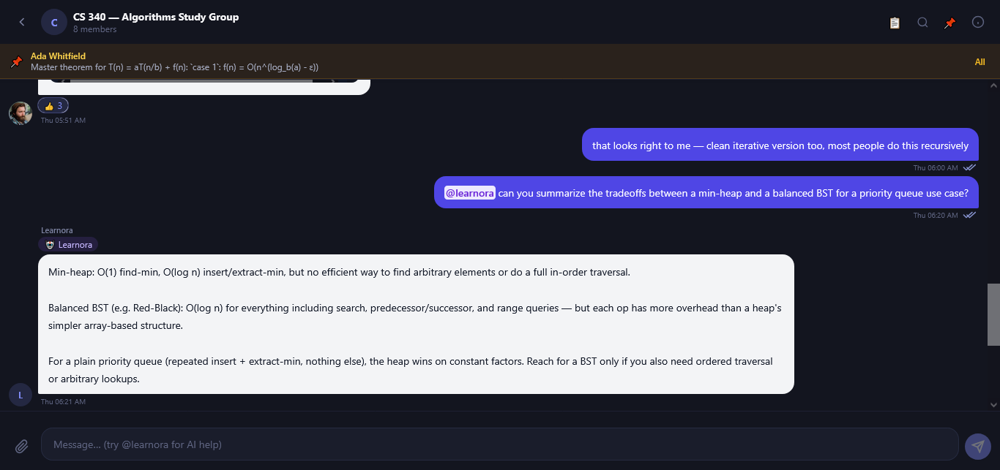
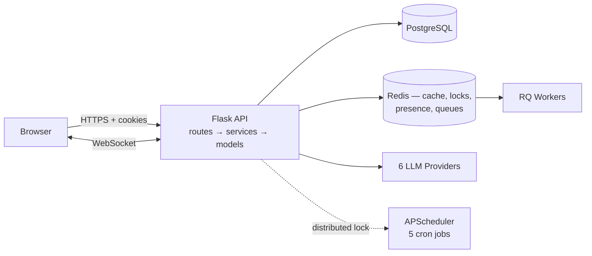

# StudyHub — Peer Academic Collaboration Platform

**Status:** Actively in development — core systems are functional and used daily while building, though the product is not yet feature-complete.

**Live:** [https://studyhub-two-psi.vercel.app/](https://studyhub-two-psi.vercel.app/)

StudyHub is a peer-to-peer academic platform for a university student body, built around one idea: reputation earned by helping other students should be the platform's actual currency, not a vanity number bolted onto a forum. It combines a Q&A/discussion feed, a connections-based social graph, private group chat (Threads), a homework help marketplace, live collaborative study sessions, and a multi-provider AI study assistant ("Learnora") into a single system where almost every feature either produces reputation, consumes it as a signal, or reinforces the behavior that generates it.

A student stuck on a problem set at 11pm has no reliable way to find a classmate who already understands the material, is online right now, and is willing to help — outside of scattered group chats with no structure, no accountability, and no way to reward the people who actually show up. StudyHub's bet is that peer tutoring is abundant but undiscoverable: every class has students who are strong in a subject and students who need help in that same subject, but there's no matching layer, no reputation signal for who's reliable, and no lightweight tooling to make an ad hoc study session productive. The product surfaces the right people to connect with (department, subject overlap, complementary skills, mutual connections), gives every helpful action a transparent point value, and wraps live collaboration — shared timers, a collaborative notepad, embedded AI tutoring — directly around the connections graph instead of leaving students to coordinate over unrelated tools.

The backend is a Flask monolith on PostgreSQL (SQLAlchemy), with real-time features over Socket.IO, Cloudinary for media, Flask-Mail for transactional email, Firebase Cloud Messaging for push, and a self-built multi-provider AI layer (Gemini, Groq, Cohere, Cloudflare Workers AI, Mistral, OpenRouter) with automatic classified failover. Redis backs four structurally different roles across the app — AI provider state, WebSocket presence, distributed job locking, and durable background job queues — following a horizontal-scaling pass that moved every piece of previously single-process state onto Redis (see [Status & Recent Changes](#status--recent-changes)). The frontend is vanilla JavaScript.



---

## Why I Built This

Every university has the same quiet inefficiency: the person who could explain a concept in two minutes is somewhere in the same building, and there's no way to find them. Group chats are ephemeral and low-signal. Nobody gets credit for being the person who always answers. I built StudyHub to see what a campus looks like when helping is legible — when a marked-helpful answer, a completed study session, or a login streak all roll up into something visible and comparable, and when an AI assistant is embedded directly in the places students are already working instead of living on a separate chatbot page.

I also used this project to go deep on things that don't show up in a typical CRUD app: a multi-provider AI layer resilient enough that a rate-limited key or a down provider degrades the feature instead of breaking it; a service/route architectural boundary enforced by CI rather than code-review convention; a reputation system with exactly one write path, after inheriting a version of the codebase where the same tier table existed in four places and quietly disagreed with itself at the boundaries; and, more recently, taking the app from a single-process assumption to something that runs correctly under multiple Gunicorn workers — closing the gap between "works locally" and "safe to actually scale horizontally."

---

## Highlights

- **A self-built multi-provider AI layer** — six LLM providers, four-way failure classification (bad key vs. down provider vs. bad model vs. non-retryable), Redis-shared cross-instance failover state, mid-stream provider switching, and a fully-functional non-AI fallback for one feature if every provider is down at once.
- **Horizontal scaling that's actually real**, not aspirational — WebSocket presence, distributed scheduler locking, and per-user rate limits all moved from process-local state to Redis-coordinated state, with `gunicorn -w N` now a safe deployment shape instead of requiring `-w 1`.
- **A CI-enforced architectural boundary** between HTTP concerns and business logic — not a convention, a static-analysis check that fails the build.
- **A reputation system with one write path and an immutable audit ledger** — every point change is independently reconstructable from history, not trusted as a bare mutable counter.
- **Three genuinely different background-processing mechanisms**, chosen deliberately per problem: APScheduler with a fail-closed distributed lock for scheduled work, RQ for durable retryable jobs, and a bounded thread pool for latency-sensitive AI dispatch that doesn't need to survive a crash.
- **A shared-cache-plus-per-viewer-overlay pattern** on the leaderboard — the expensive part is computed once and cached; the identity-specific part (your rank, your connection to each name shown) is never cached and always fresh.
- **Refresh-token rotation with reuse detection and a genuine multi-tab grace window** — not just "rotate on use," but a real distinction between a legitimate multi-tab race and an actual stolen-token replay.

---

## Architecture

Flask API process(es), RQ worker process(es), and an in-process APScheduler all sharing one PostgreSQL database and one Redis instance used for four distinct purposes (cache, distributed locks, presence tracking, job queue). Services carry zero Flask dependency and are called identically from HTTP routes, WebSocket handlers, and background jobs.



Full technical breakdown — request lifecycle, data model, AI pipeline, Redis roles, auth internals, and the horizontal-scaling refactor in detail — is in **[`ARCHITECTURE.md`](ARCHITECTURE.md)**.

## Background Processing

Five scheduled jobs (login streaks, denormalized-count reconciliation, leaderboard snapshots, weekly champions, activity-feed cleanup), each guarded by a Redis distributed lock so exactly one instance runs a given job on any tick — the one place in the app that deliberately fails *closed* rather than open, because duplicate execution is a worse outcome than a skipped tick. Two RQ-backed queues (`email_queue`, `maintenance_queue`) handle durable, retryable work off the request path. Full job-by-job detail, retry policy, and idempotency notes are in **[`BACKGROUND_JOBS.md`](BACKGROUND_JOBS.md)**.

## AI Architecture

Learnora is one AI infrastructure layer surfaced through five product moments (standalone chat, post Q&A, thread `@mentions`, meeting-notes generation, per-message actions), not five separate integrations. Every provider failure is classified — `KEY_FAULT`, `PROVIDER_TRANSIENT`, `BAD_MODEL`, or `NON_RETRYABLE` — before the system decides how to react, which is what stops a provider-wide outage from cooling a perfectly good API key for an hour. Failover state is Redis-shared across every running instance behind a fail-open kill switch. Full pipeline detail is in **[`ARCHITECTURE.md`](ARCHITECTURE.md#11-ai-architecture)**.

---

## Core Features

**Reputation & gamification as the connective layer.** Every meaningful contribution — a helpful answer, a marked solution, a completed homework help, a login streak — awards or deducts reputation through a single write path (`award_reputation()`), which also writes an auditable history row and can trigger a level-up notification. Reputation maps deterministically to one of five tiers (Newbie → Master) via one shared lookup table every other module reads from — replacing four independently-drifting copies of the same table that disagreed with each other at the boundaries. An 18-badge achievement system, weekly per-subject "champions," help streaks, and multi-scope leaderboards (global, department, connections-only, "rising stars") all sit on top of this same currency.

**A connections graph that gates messaging by design.** You cannot DM a stranger cold — a mutual-accept `Connection` is required first, enforced in the service layer rather than only the UI. High-compatibility requests (≥70% match score) auto-accept to reduce friction for good matches; lower-compatibility cold contact still clears a real request/accept flow. Blocking is encoded via an explicit `blocked_by_id` column rather than overloading requester/receiver, which is what keeps block state unambiguous.

**Threads — structured group chat with real moderation.** A thread can spawn from a post or stand alone, with roles (creator/moderator/member), join requests, and direct invites. Delivery status is three-state (sent → delivered → read), computed from live cross-instance presence, and only ever upgrades — never downgrades, even under concurrent races. A single shared authorization helper is the sole place that checks "is this membership privileged," used identically by the REST and WebSocket layers.

**A homework marketplace built on top of the connections graph.** A private `Assignment` becomes visible to a student's accepted connections the moment it's marked shared-for-help. Priority scoring (urgency × difficulty × status) is a pure function computed fresh on every read, never persisted as a side effect of simply viewing the list.

**Live study sessions with real collaborative state.** Two connected students can start an ad hoc session with a server-authoritative Pomodoro timer (elapsed time computed from wall-clock deltas, not trusted from the client), a shared notepad, live progress broadcasting, and an AI tutor scoped to the session's own notepad content. The session's real-time activity feed is not yet complete on the backend and is not wired up to the frontend — session state (timer, notepad) works end-to-end, but the activity feed is a known gap.

**Learnora, embedded rather than standalone.** Reachable from a dedicated chat surface, thread `@mentions` (five distinct personas), per-post Q&A, live-session tutoring, and on-demand AI meeting notes — all through the same underlying multi-provider layer.

---

## Engineering Highlights

**A CI-enforced architectural boundary.** Business logic lives in a `services/` layer with zero Flask dependency; a `routes/` layer handles HTTP concerns only. Not a documented convention — `check_layering.py` statically parses every service file's AST and fails the build if a service ever imports a Flask request-scoped object or reaches into `routes/`. This is also what makes background jobs and WebSocket handlers able to call the exact same service functions the HTTP routes call.

**One reputation write path.** `award_reputation()` is the only function that ever touches `User.reputation`. It floors at zero, recomputes the tier from a single shared lookup table, and writes an auditable before/after history row in the same operation.

**Real horizontal scaling, not a single-process app pretending to scale.** WebSocket presence (multi-device aware, self-healing on read), the scheduler (Redis distributed lock, fail-closed by design), and per-user WebSocket rate limits all moved from process-local memory to Redis-coordinated state. `gunicorn -w N` with `N > 1` is a genuinely safe deployment shape now, not just an untested one.

**Atomic, race-safe counters.** Member counts, unread-notification counts, and similar aggregates are updated via SQL-level atomic expressions or Redis `INCR`/`DECR` — never a Python-side read-modify-write that would lose updates under concurrent requests.

**Delivery status computed from live presence, never downgraded.** A thread message's `sent → delivered → read` status is computed at send-time from whether recipients are actively viewing the thread, merely online, or offline — and enforced to only move forward, even under concurrent race conditions.

**Batched queries where N+1 would otherwise creep in.** Connection health, mutual-connection counts, and leaderboard rank data are all batch-loaded via `IN`-clause and `GROUP BY` queries across a full page of results, not per-row.

**Indexes matched to actual query shapes**, not just foreign keys — partial indexes that skip the terminal "read" state most thread messages settle into, composite indexes built for the specific unread-count query pattern, and Postgres-only expression indexes (gated by dialect, since SQLite has no equivalent) that make a reverse-direction duplicate connection request impossible to insert at the database level.

**A typed exception hierarchy with one centralized error handler.** Services raise typed errors (`ValidationError`, `NotFoundError`, `ConflictError`, `RateLimitedError`, and others); one Flask error handler turns all of them into the same response envelope, so no API consumer can tell which code path actually failed — and errors ≥500 route to Sentry along the way, with a PII scrubber stripping auth cookies and password fields by name before any event leaves the process.

**Notification delivery that never blocks the operation it's reporting on.** Every notification write attempts a best-effort real-time WebSocket push, wrapped in its own try/except — a push failure is logged but never propagates, because the underlying row and unread-counter increment already succeeded regardless of whether the live push landed.

**Three background-processing mechanisms, chosen deliberately, not interchangeably.** APScheduler with a Redis distributed lock for scheduled work where duplicate execution is a real correctness bug; RQ for durable, retryable work that needs to survive a process restart (email delivery); a bounded `ThreadPoolExecutor` for AI dispatch that needs to not block a WebSocket event loop but doesn't need queue durability.

**File uploads validated by construction, not by trusting the extension.** Every image upload is opened with Pillow, structurally verified, fully decoded, and re-encoded into a fresh buffer before ever reaching storage — the re-encode step is what strips any embedded polyglot payload, since the output bytes are freshly generated from decoded pixels, not copied from the original file.

---

## Stack

| Layer | Technology |
|---|---|
| Backend | Flask (Python), two-layer `services/` + `routes/` architecture |
| Database | PostgreSQL via SQLAlchemy |
| Real-time | Flask-SocketIO (threading mode), Redis-backed message queue for cross-instance pub/sub |
| AI | Self-built multi-provider layer — Gemini, Groq, Cohere, Cloudflare, Mistral, OpenRouter (Redis-backed cross-instance failover state) |
| Background jobs | APScheduler (Redis distributed locking) + RQ (Redis-backed durable queues) |
| Media storage | Cloudinary |
| Email | Flask-Mail, dispatched via an RQ job |
| Push notifications | Firebase Cloud Messaging |
| Auth | JWT access tokens (PyJWT) + DB-backed, hashed, rotating refresh tokens; Google OAuth via Flask-Dance |
| Error tracking | Sentry (fail-open, PII-scrubbed) |
| Frontend | Vanilla JavaScript |
| Testing | pytest, fakeredis + lupa (Lua scripting support for distributed-lock tests), freezegun |

---

## Running Locally

```bash
# Install application dependencies
pip install -r requirements.txt

# Set required environment variables (see below)
cp .env.example .env  # if present — otherwise set the variables listed below directly

# Start the API (Flask + Socket.IO)
python app.py

# In a separate process: start an RQ worker
python worker.py

# Or, for a single combined process (API + in-thread worker + scheduler):
python start-all.py
```

The scheduler runs in-process inside `app.py`/`start-all.py` whenever `SCHEDULER_ENABLED=true`. `worker.py` refuses to start if `SCHEDULER_ENABLED` is also true in its own environment, to avoid a worker process silently joining the scheduler's distributed-lock race.

## Environment Variables

| Variable | Purpose |
|---|---|
| `SECRET_KEY` | Flask session/JWT signing secret |
| `DATABASE_NEW_URL` | PostgreSQL connection string (read as `DATABASE_URL`) |
| `REDIS_URL` | Redis connection string — backs cache, locks, presence, and RQ queues |
| `REDIS_SSL_INSECURE` | Opt-out flag to disable TLS cert verification for `rediss://` URLs behind a proxy that breaks hostname matching |
| `SCHEDULER_ENABLED` | Whether this process runs the APScheduler cron jobs |
| `RATE_LIMIT_ENABLED` | Toggles Flask-Limiter enforcement |
| `AI_PROVIDER_REDIS_STATE_ENABLED` | Kill switch for Redis-shared AI provider failover state — falls back to per-process in-memory state |
| `ACCESS_TOKEN_HTTPONLY` | Whether the access-token cookie is JS-readable; governs whether a separate CSRF cookie is issued |
| `CORS_ALLOWED_ORIGINS` | Required to be the real frontend origin(s) — `Access-Control-Allow-Credentials` cannot pair with a wildcard origin |
| `SENTRY_DSN` | Optional — error tracking is fully fail-open if unset |
| Provider API keys (Gemini, Groq, Cohere, Cloudflare, Mistral, OpenRouter) | Multiple keys per provider supported for rotation |
| Cloudinary / Flask-Mail / Firebase credentials | Media storage, email, and push notification integrations |

## Testing

```bash
pip install -r requirements-test.txt
pytest
```

The unit suite (`pytest.ini`: `testpaths = tests/unit`) runs against an in-memory SQLite database and `fakeredis`. A root-level `conftest.py` sets placeholder environment variables before test collection, since `config.py` validates `SECRET_KEY`/`DATABASE_NEW_URL` at import time. `distributed_lock.py`'s Lua-scripted release is tested against real Lua execution via `fakeredis` + `lupa`, not mocked around. `freezegun` backs deterministic time-dependent tests (streaks, token expiry, cooldown windows).

Test coverage is still growing — more tests, across both the unit and integration suites, are planned as coverage gaps are identified.

### Integration Tests

```bash
pip install -r requirements-test.txt
pytest tests/integration
```

An integration suite has recently been added alongside the existing unit suite, exercising flows across real service boundaries rather than mocking them out. As with the unit suite, it runs against an in-memory SQLite database and `fakeredis` rather than live PostgreSQL/Redis instances.

### CI

There's no GitHub Actions CI pipeline yet — tests currently run locally only. Wiring up GitHub Actions to run the suite automatically on push/PR is planned.

## Deployment

`Procfile` runs `python start-all.py` — the combined entry point (API + in-thread RQ worker + in-process scheduler) suited to a single-dyno-style deployment. For a topology with independent worker scaling, run `app.py` under Gunicorn and one or more standalone `worker.py` processes separately instead; both entry points share the same application factory and neither modifies the other's behavior.

---

## Status & Recent Changes

This project went through a deliberate horizontal-scaling pass: WebSocket presence tracking, the scheduler's execution guarantee, and per-user WebSocket rate limits all moved from process-local memory to Redis-coordinated state, and HTTP-layer rate limiting (previously scaffolded but unused) is now fully wired via Flask-Limiter. `gunicorn -w N` with `N > 1` is a supported deployment shape as a result — previously this required `-w 1` specifically to avoid the scheduler and presence-tracking bugs that state fragmentation would otherwise cause. The full before/after is documented in [`ARCHITECTURE.md` §20](ARCHITECTURE.md#20-what-changed-the-horizontal-scaling-refactor).

Two things remain process-local, and they're not the same case. Typing-indicator dedup bookkeeping and the raw thread/notification broadcast mechanics needed no migration at all — the broadcast is already cross-instance correct via Socket.IO's Redis-backed message queue, and typing dedup only suppresses a redundant client-side re-emit. Separately, and explicitly flagged as such in the code's own migration notes: the rate limiter gating Learnora's auto-reply-without-`@mention` behavior is still a genuine, working, process-local sliding-window limiter that hasn't been migrated yet — a real (if narrow) instance of the class of bug this whole refactor was meant to close, still outstanding for that one limiter. There's also a legacy general-purpose WebSocket manager that still handles some non-messaging broadcasts alongside a newer, purpose-built manager that owns all direct-message delivery — an intentional interim state from an in-progress migration.

An honest current gap: cross-domain search (`ARCHITECTURE.md` §5.6) runs on unindexed `ILIKE` pattern matching. A `SearchIndex` table exists in the schema but is not populated or queried anywhere — it's dead code, not hidden infrastructure.

Another honest current gap: the live study session's real-time activity feed is not implemented completely and is not wired up to the frontend yet.

---

## Project Links

- **Live:** [https://studyhub-two-psi.vercel.app/](https://studyhub-two-psi.vercel.app/)
- **Architecture:** [`ARCHITECTURE.md`](ARCHITECTURE.md)
- **Product Overview:** [`PRODUCT_OVERVIEW.md`](PRODUCT_OVERVIEW.md)
- **Background Jobs:** [`BACKGROUND_JOBS.md`](BACKGROUND_JOBS.md)

## License

MIT
